## Design Basis and Source List

The design basis falls into three classes. First, the organizer's official announcement and taskbook texts (scope, tasks, depth and submission-rule wording). Second, public materials: publicly available Jingzhang railway history and heritage-park documents, public information on universities and science-and-technology parks along the corridor, published wording of the Beijing master plan and district plans, publicly available control-plan and special-plan documents, and public reporting on past conferences and developer events. Third, general standards such as urban design, accessibility and event-safety common requirements. **This package uses no internal, non-public or controlled materials or data** - here "internal materials" means only unpublished, controlled or personally-identifying documents and data. Every actually used item is registered item-by-item in sources.json with source page, published and accessed dates, and reuse boundary. Field-survey records made by the participant in public places and self-drawn analysis sketches are registered as self-produced geometry and figure assets (PACKAGE-GEOMETRY and ASSET-SURVEY-NOTES/ASSET-* entries in sources.json) after removal of any personally identifiable fields; being publicly observable, de-identified records, they are not "internal materials", which is consistent with the statement that no internal or non-public data is used; they contain no non-public spatial data. The basis-to-scope relationships are:

| Basis class | Purpose (concept) | Source registration | Boundary |
|---|---|---|---|
| Organizer announcement & taskbook | Scope, tasks, depth, submission rules | [source:DATA-SRC-ANNOUNCEMENT] [source:DATA-SRC-AGENT-TASKBOOK] | Text wording citable; does not replace official geometry |
| Public history & park materials | Cultural narrative and coordination targets (concept) | registered in sources.json | directional reference only, not a fact chain |
| General standards | Method references | [source:DATA-SRC-MOHURD-URBAN-DESIGN-MEASURES] etc. | no project-level compliance conclusion |
| Self-collected survey (cleaned) | Site impressions and sketches (concept) | ASSET-* entries | de-identified, concept expression only |

> Evidence anchors: [source:DATA-SRC-ANNOUNCEMENT], [source:DATA-SRC-AGENT-TASKBOOK] (textual basis from the organizer's announcement and taskbook).

## Three-Level Scope Framework

Following the official announcement wording, the three scopes are: coordinated research area ~43.6 km2, overall design area ~11.4 km2, and key areas ~368.4 ha (three official key areas: Zhongzhiyuan AI Acceleration Area, Beijing AI Origin Community, Dazhongsi AI Industry Cluster). This package's three conceptual scopes and three node placements are conceptual sub-scopes (provisional) under those official scopes and do not replace official geometry. Results cascade level by level: the research level sets the pattern, the overall level sets the skeleton, the node level sets the experience; each level keeps machine-readable evidence anchors mapped to the taskbook sections. The taskbook's three positionings (Centennial Jingzhang Culture Belt, Urban AI Life Experience Belt, AI Fusion Innovation Belt) and five functions (full-stack autonomous AI innovation system; world-class AI innovation ecosystem; new AI+ scenario paradigm; smart AI vitality city; global AI governance voice) are mapped here into a "Three Districts & Two Wings synergy loop": three districts are the three official key areas; two wings are the north wing (toward Future Science City and Huairou Science City) and the south wing (E-Town and Beijing-Tianjin-Hebei coordination); the loop mechanism is "event flow -> district conversion -> community service -> talent return", keeping open interfaces to regional coordination concepts such as the Beiwei Community, Future Science City, Huairou Science City, E-Town and the Beijing-Tianjin-Hebei region along with community innovation units (all concept-level, subject to higher-level plans). The mapping is shown in the positioning-function-synergy figure.

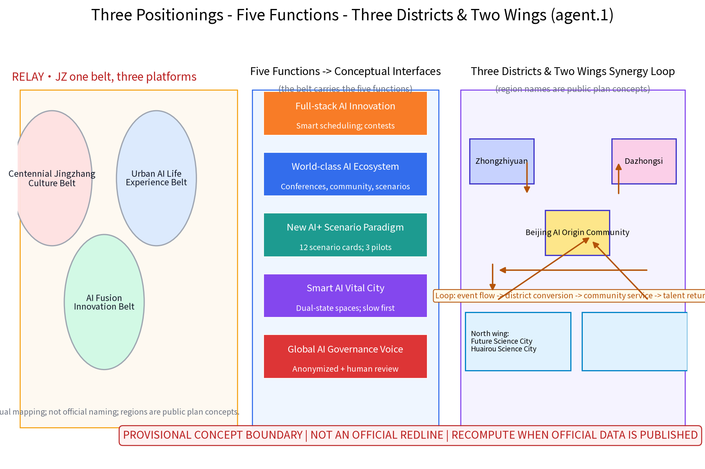

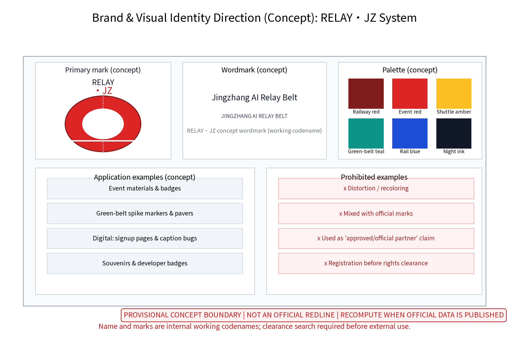

> Evidence anchors: [source:DATA-SRC-AGENT-TASKBOOK] (three scopes, positionings and functions per the official taskbook wording).

## Coordinated Research Area: Industry and Future City Research

Industry research identifies the corridor's "time-pulse" effect: annual events channel developer visits, accommodation, consumption and cooperation demand into public services and industry space along the corridor, forming a three-level linkage of "event belt - district - community" and moving from running events toward operating an urban innovation ecosystem. Future-city research is directional only and makes no land or investment commitment. The research covers eight factors (land, space, industry, capital, talent, compute, data, scenarios) and six actors (developers, universities and research institutes, enterprises, investors, open-source communities, residents) and their mechanism loops (see the ecosystem atlas): event flow becomes scenario demand; scenario demand draws compute and data services; services retain talent and communities; communities feed back into industry and capital. Six international benchmark cases are concept-level comparisons only, each registered with source, access time and reuse boundary (unverifiable or stale entries will be demoted to research hypotheses):

| Case | Organizer / city | Benchmark mechanism (concept) | Transferable insight | Source registration |
|---|---|---|---|---|
| SXSW (founded 1987) | Austin / SXSW LLC | City-wide dispersed venues, annual festival driving district revitalization, mature temporary facilities | One convertible facility system serves both festival economy and daily streets | CASE-SXSW |
| Tech Open Air (founded 2012) | Berlin / TOA team | Community self-organization, cross-disciplinary programming, asset-light events | Low-threshold open venues and volunteer networks are key to low-cost start-up | CASE-TOA |
| Dutch Design Week (founded 2002) | Eindhoven / Dutch Design Foundation | Old industrial district renewal living in symbiosis with an annual design week | Exhibition events become a durable driver of district renewal with very high venue reuse | CASE-DDW |
| MWC Barcelona (brand since 2008) | Barcelona / GSMA | Large convention aligned with urban renewal district, convention economy feeding innovation areas | Daily operation of convention facilities supports a professional convention brand | CASE-MWC |
| Yunqi Conference (originated 2009, renamed 2015) | Hangzhou / Alibaba Group and Hangzhou | Conference brand integrated with town operation; festival economy extends into daily industry ecology | Conference location coupled with industry-community space retains developer communities | CASE-YUNQI |
| WAIC (first edition 2018) | Shanghai / national ministries and Shanghai jointly | City-level AI convention with event-period city atmosphere; showcase and launch platform | Whole-city atmosphere building and multi-department co-organization | CASE-WAIC |

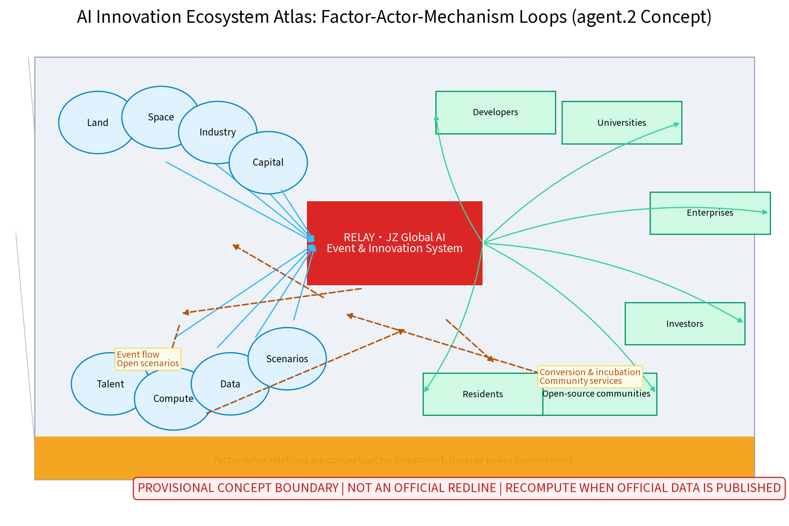

> Evidence anchors: [source:DATA-SRC-PROVISIONAL-BOUNDARIES] (provisional boundary; research scope schematic only); case entries CASE-* in sources.json.

## Overall Design Area: Urban Renewal and Regulatory-Plan-Level Urban Design

The overall design concept is a "green-belt-skeleton organization": the former Jingzhang railway green belt acts as a continuous skeleton linking nodes and places along the corridor, serving both as the slow-traffic and landscape spine and as buffer space for event circulation and crowd organization. Using regulatory-plan-depth methods, the concept checks land-use compatibility rules, street sections, green-belt continuity and event-facility siting guidelines, focusing on the conversion mechanism between "daily state" and "event state" so the same sites serve leisure on ordinary days and conferences and exhibitions during event periods. Surrounding context uses public-information schematics (Qinghuayuan-Wudaokou, Xueyuan Road, G6 Expressway, Shangdi-Xierqi, Zhichun Road-Dazhongsi directions); all maps carry a north arrow, scale bar and legend. Precise road, rail and existing-obstacle conditions around the nodes are governed by official publications. Control indicators are checked as suggestions only, with no preset numeric conclusions.

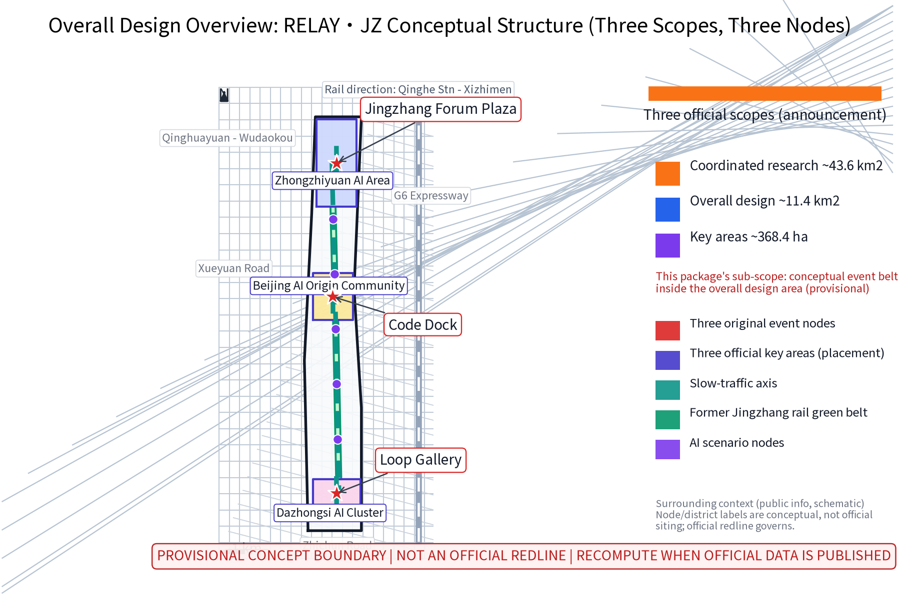

> Evidence anchors: [source:DATA-SRC-MOHURD-CONTROL-DETAILED-PLANNING], [source:DATA-SRC-PROVISIONAL-BOUNDARIES] (regulatory-plan-depth method reference and provisional boundary).

## Detailed Design of Key Areas

The three nodes' facility siting is conceptual and shall be re-located after planning, heritage and competent-authority review. Node 1, Jingzhang Forum Plaza: an open plaza themed on old-platform and station-sign imagery with retractable stands and an outdoor main stage for annual opening/closing ceremonies, product launches and public talks. Node 2, Code Dock: a developer-camp space with shared workstations and workshops by day, converting to hackathons and a co-creation base at night, modular and rapidly assembled/disassembled. Node 3, Loop Gallery: a linear pitch corridor along the green belt with convertible booths and mini-theatres hosting project pitches and an open-source market; its loop circulation metaphorizes the practice-contest-exhibit-invest cycle. The geometry layer holds 3 landmark nodes and 5 scenario nodes (8 spatial nodes in total). Scenario cards are laid out as tables, i.e. the scenario-space-operation matrix (12 cards, five columns: card, location, target users, operation mechanism, data & compliance boundary), to form a reviewable, iterable operation index:

| Scenario card | Location | Target users | Operation mechanism (concept) | Data & compliance boundary |
|---|---|---|---|---|
| "Forum scheduling" smart event scheduling | Jingzhang Forum Plaza | Attendees, professionals | Booking slots, annual public notice | Anonymous aggregates, human review |
| "Interpretation" multilingual captions & interpretation assist | Plaza and whole belt | International attendees | Volunteer desk, tiered captions | On-device; no voice retention |
| "Code co-pilot" AI co-pilot for coding contests | Code Dock | Developers, students, youth | Points promotion, rotating problems | Anonymized hints; anti-cheat by humans |
| "Heatmap" anonymized crowd heat & safety dispatch | Event venues | Operators, security | Live notice, monthly review | Aggregated density; no individual-identifying tracking |
| "Companion" accessible multimodal wayfinding | Nodes and green belt | Seniors, persons with disabilities | Volunteer desk, human backstop | On-device; no personal data retention |
| "Loop pitching" project pitch corridor | Loop Gallery | Startups, investors, visitors | Public pitches, open deliberation | Aggregate statistics only; one-click off |
| "Market" open-source market rotating booths | Loop Gallery | OSS community, public | Rotating booths, booking & filing | Minimal registration data, deleted at expiry |
| "Night lab" overnight hackathon mode | Code Dock | Developers, youth | Overnight zones, human staffed | Time-table notices, tiered sound levels |
| "Green gallery" green-belt care & booking | Whole belt | Residents, visitors | Volunteer patrols, points incentives | Anonymized patrol records |
| "Heritage" heritage culture tour | Heritage-park segment | Visitors, students, families | Booked tours, bilingual content | On-device location processing |
| "Youth camp" junior coding camp | Code Dock with universities | Students, teachers, parents | Volunteer mentors, community cooperation | Minimal data for minors with guardian rules |
| "Community" community co-creation workshops | Community spaces along the belt | Local residents, families | Deliberation sign-up, monthly notices | Joint-review publication, anonymized statistics |

The cards (the scenario-space-operation matrix body) and three industry test-verification pilots (protocols below) together form the complete visible evidence for that matrix:

| Test pilot | Venue / window (concept) | Protocol (concept) | Success metrics | Fail / pause thresholds | Human review |
|---|---|---|---|---|---|
| Multilingual interpretation stress test | Jingzhang Forum Plaza, pre-event pilot | Model evaluation & benchmark: caption accuracy, end-to-end latency, term coverage | Accuracy and human-intervention rate targets met | Two consecutive below-threshold rounds stop the test and roll back to human interpretation | Staffed throughout |
| Code co-pilot safety test | Code Dock, first hackathon | Data quality & error stratification: hint anonymization, false-positive rate, anti-cheat boundary | Controllable false-positive rate; no individual profiling | Disable on identifiable personal data or major misjudgment | Submissions and rulings decided by humans |
| Heatmap & egress drill | Nodes and belt, pre-event drill | Runtime monitoring: aggregate density, plan triggers, egress time | Plan hit rate and egress targets met | Abnormal density or failed drill degrades to manual crowd guidance | Dispatch decisions human-reviewed |

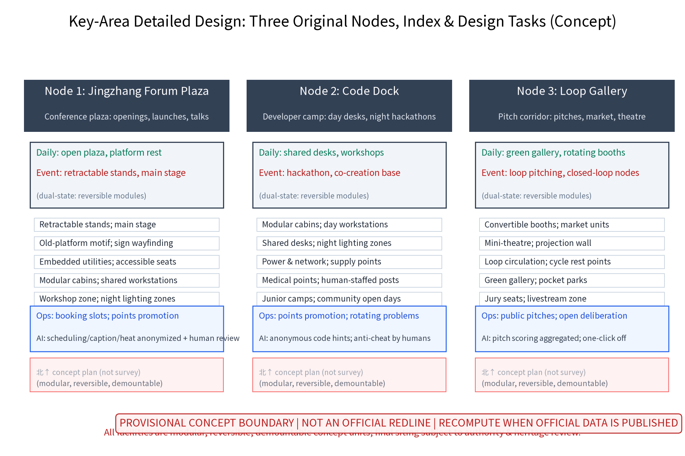

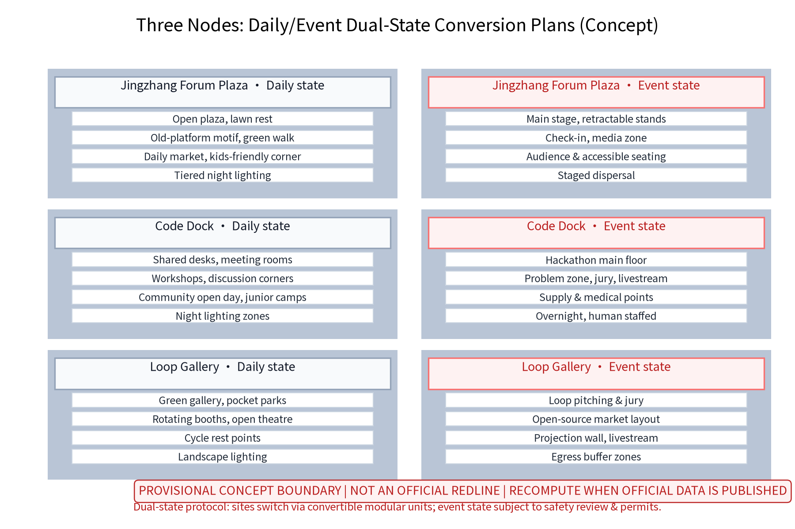

> Evidence anchors: [data:PACKAGE-GEOMETRY] (node polygons from geometry/key_areas.geojson), [metric:scenario_node_count] (3 landmarks + 5 scenario nodes).

## AI Innovation Ecosystem, Personas, and AI+ Scenarios

Annual events act as the engine that brings together developers, universities, enterprises, investors and open-source communities into a long-term community ecosystem. There are five AI+ scenario groups (smart event scheduling and registration aggregation; multilingual live captioning and interpretation assistance; AI co-pilot for developer coding contests; anonymized crowd heat-mapping and safety dispatch; accessible multimodal conference wayfinding) with a three-sentence boundary: anonymized aggregation only, key decisions human-reviewed, no over-surveillance. Data is used only for event-service improvement and disclosed in advance. AI scenario domains cover governance, public services, industry, space, culture and transport, each backed by human review. The AI+ scenario groups above correspond one by one to the scenario-space-operation matrix (12 cards with their locations, target users and operation mechanisms, see the key-areas chapter). Technical protocols (concept): model evaluation (benchmarks and scenario assessment), data quality (collection calibers and de-identification checks), error stratification (error attribution and impact grading), runtime monitoring (false-positive rate and alarm closure); any failed item enters the human-takeover process. Five persona groups:

1. Developers and tech-savvy youth (mainly 25-35): hackathon, coding-contest and open-source contributors; care about workstations, overnight venues, network quality and discussion space.
2. International participants and cross-border developers: overseas developers, CTF players and visiting researchers; need multilingual services, visa and shuttle convenience, and accessibility support.
3. University students, faculty and researchers: along the corridor; join academic forums and technical workshops; value knowledge flow and laboratory linkage.
4. Enterprise innovation teams and industry organizers: AI companies, incubators and investors; host events, exhibitions and pitches; care about venue slots, standardized support and long-term cooperation.
5. Local residents and city visitors: surrounding communities and citizens; use the green belt daily and join markets and festivities; need low-threshold, approachable participation.

The five groups cover youth, students, professionals, residents, visitors, seniors and persons with disabilities, with age-friendly, accessible, senior-adapted, child-friendly and inclusive design language; resident feedback channels, annual public notices and annual programmes run through the whole operation.

> Evidence anchors: [source:DATA-SRC-GENERATIVE-AI-INTERIM-MEASURES], [source:DATA-SRC-BARRIER-FREE-ENVIRONMENT-LAW] (references for AI-content governance wording and human-fallback accessibility).

## Land Use, Building Scale, and Retain-Renovate-Demolish Strategy

The concept follows "retain-renovate-demolish in parallel" with no preset numbers: retain - the heritage green belt, station buildings and industrial structures of historical value, continuing the railway memory; renovate - functional renewal of inefficient factory and park buildings into event, office, exhibition and support space; demolish - only scattered dilapidated buildings with demonstrated safety hazards, decided case by case, with no demolition conclusions. Land uses are compatible with conferences, exhibitions, offices, commerce and service support. **All areas are single-caliber conceptual geometry (union of all land_use.geojson features, EPSG:4548), low confidence, to be recomputed when official data is published.** The conceptual land-use structure is shown with national classification names: research ~27%, park and green ~28%, business and finance ~16%, commercial ~14%, cultural ~14%, residential ~1% (percentages total 100%, rounded), same-source and same-caliber as the verifiable area metrics in metrics.json; they are neither current nor planned official indicators. Conceptual building envelopes and public-space node areas are design-model outputs only, displayed rounded with source, formula, confidence and recompute trigger.

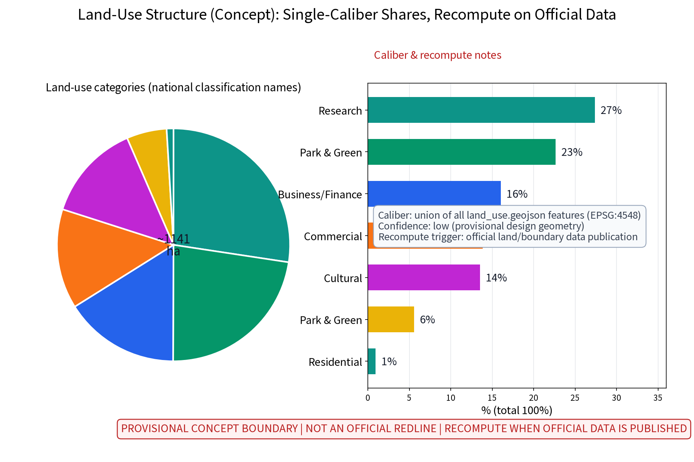

> Evidence anchors: [metric:site_area_sqm], [metric:green_ratio], [source:DATA-SRC-MNR-LAND-USE-CLASSIFICATION-202311] (classification names per the national guide).

## Transport, Rail, Municipal Infrastructure, and Public Services

Traffic organization is slow-traffic-first: a continuous green-belt slow axis links the nodes, connecting public space rather than being severed by vehicles, forming a north-south through spine (along the former Jingzhang railway line) with east-west stitch links (lateral slow connections between blocks, rail stations and communities). Major event traffic relies on rail transit plus shuttles: event shuttle routes, booked buses and shared-bike dispatch zones organized around existing rail stations, with staged zone-by-zone egress and buffer zones to minimize car dependence. Rail context is schematic public information (Qinghe Station-Xizhimen direction); exact stations and connectivity are governed by official publications. Municipal utilities are checked for "daily + event" two-tier loads for power, water supply/drainage, communications and temporary power interfaces, all with modular interfaces. Public services include relocatable standard units: mobile restrooms, nursing rooms, medical points and luggage storage. Accessibility baselines: continuous wheelchair routes, redundant audio-visual information, quiet spaces and human-service backstop, turned into verifiable terms: an accessibility checklist (continuous wheelchair routes, ramps and clear widths, audiovisual redundancy, quiet spaces, night lighting and patrols) enters the node detailed-design and acceptance deliverables; nursing rooms, children's play areas, senior rest areas and age-friendly aid points (all conceptual) are provided, with annual public notices verifying implementation during operation; night safety is guaranteed by tiered lighting, patrols and one-touch help (human staffed).

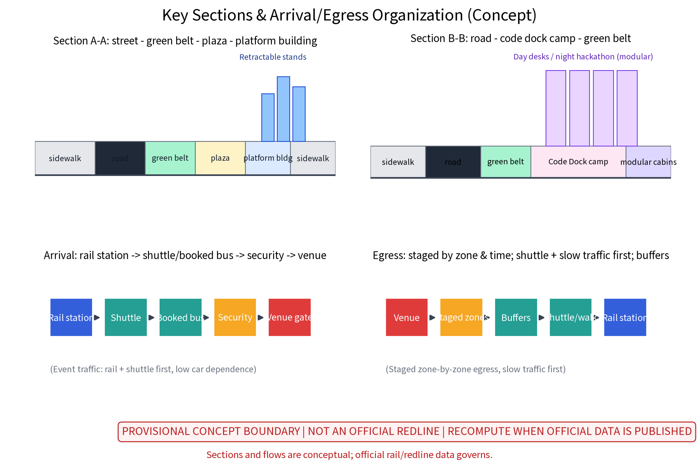

> Evidence anchors: [source:DATA-SRC-MOHURD-URBAN-DESIGN-MEASURES] (method reference for municipal and slow-traffic wording).

## Blue-Green Network, Public Space, and Urban Character

The blue-green system follows a "green belt as axis, node parks as beads": preserve existing tree belts and site texture, use rain gardens and permeable paving to strengthen ecological resilience. Public space emphasizes convertibility: plazas, lawns and platform-like sites switch between event venues, markets, camping and daily leisure. A public-space component library (concept) follows "identifiable, reversible, reusable": common components (seating, lighting, signage, greening modules), event components (stages, stands, booths, cabins), service components (restrooms, medical points, storage, accessibility aids), plus night-time and egress components (emergency lighting, evacuation signage) as mandatory event checks. A "Jingzhang Honor" display system (concept) at Loop Gallery and Forum Plaza: honor walls and an annual developer honor board for open-source contributions, community volunteering and innovation outcomes, published after public notice and joint review. Urban character continues restrained Jingzhang railway industrial vocabulary (spikes, sleepers, signals, locomotive motifs) without slogan-like packaging, supported by a cultural wayfinding system (concept): bilingual signage, railway cultural symbols and accessible multimodal guidance (audiovisual redundancy, tactile paving, on-device positioning) form one unified wayfinding system linked to the "Heritage" and "Companion" scenario cards, with accessibility and signage checks before each event period.

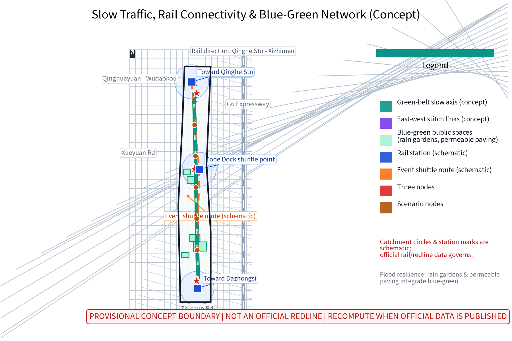

> Evidence anchors: [source:DATA-SRC-MOHURD-URBAN-DESIGN-MEASURES] (method reference for blue-green organization), [metric:green_ratio].

## Renewal Projects, Implementation Policy, and Phasing

Projects are listed in three classes: skeleton (green-belt connection and slow-traffic completion), nodes (three original event places) and support (shuttle, municipal and public-service facilities). Phasing: near term 1-3 years - connect the green belt, build the three nodes and launch the annual programme system (pilot zone: Code Dock; preconditions: compliance review, public notice, no-disturbance pledge, capacity thresholds); mid term 3-5 years - functional renewal around nodes and stronger rail connectivity; long term 5-10 years - corridor-wide linkage and north/south wing synergy. The annual programme system centers on three brands with monthly community events:

| Annual programme brand | Frequency | Main carrier (concept) | Operation mechanism | Data & compliance |
|---|---|---|---|---|
| AI Developer Conference | annual | Forum Plaza, Code Dock | Booking, schedule notices, multilingual interpretation | Anonymous aggregates, human review |
| Open-Source Co-Creation Week | annual | Code Dock, Loop Gallery | Rotating problems, points, volunteer mentors | On-device; human anti-cheat |
| Jingzhang Innovation Festival | annual | Three nodes and belt | Public pitches, market rotation, deliberation | Aggregate statistics only; one-click off |

Phasing and long-term operation matrix (responsible actors are advisory roles; nothing here is a confirmed arrangement):

| Phase | Suggested responsibility (RACI: lead-collaborate-support) | Pilot preconditions | Open procedure | Cost tier | KPI (concept) | Human takeover | Fail / pause thresholds | Public feedback | Annual review |
|---|---|---|---|---|---|---|---|---|---|
| Yr 1-3 (belt links; three nodes; annual launch) | Lead: district coordination dept and sub-district; collaborate: operator team, universities, enterprises, volunteers | Compliance review, public notice, no-disturbance pledge, capacity thresholds | Three steps: booking - filing - notice | Low-medium | Belt continuity rate, event count and engagement | Human staffing for event/crowd/security key posts | Two consecutive below-threshold rounds, failed compliance spot checks, or concentrated disturbance complaints -> pause & debrief | Feedback channel + monthly notices | Publish metrics and fix list |
| Yr 3-5 (renewal & connectivity) | Lead: district dept and rail operator (suggested); collaborate: design institutes, operators, property | Special studies and statutory approvals (by law) | Pilot review - expand or exit | Medium | Shuttle mode share, scenario test pass rates | Equipment failure rolls back to human service | Failing projects stop new investment | Annual notices + deliberation | Adjust project list |
| Yr 5-10 (corridor-wide synergy) | Lead: multi-party joint-review mechanism (suggested); collaborate: wing districts and community co-governance bodies | Alignment with higher-level plans and regulatory plans (by law) | Regional interface open list | Medium-high | Community retention, enterprise conversion, international communication indicators | Platform run keeps human takeover posts | Major safety incidents or negative review halt related arrangements | Annual notices + community deliberation | Full review and brand assessment |

Cost basis: all costs are qualitative tiers (low/medium/high), estimated by magnitude analogy with comparable projects, base period 2026 concept stage, scope is design plus construction (excluding O&M, taxes and land), low confidence, recompute trigger is project-budget approval and design development; this table is no investment commitment. Developer-community and long-term conversion mechanisms (concept): the developer community self-governs under a "compact + deliberation + points + notices + filing" framework; scenario release follows "booking - filing - testing - review"; the acquisition-conversion funnel is "event flow -> community retention -> scenario incubation -> enterprise cooperation", supported by an annual developer honor board and a founding-member system (rotating bookings, tiered participation); sustainable resourcing is suggested via consortium co-building with multi-actor sharing, subject to lawful deliberation. The governance responsibilities, open procedures, cost tiers, KPIs and pause/review triggers of these mechanisms follow the long-term operation sub-matrix below (all responsible actors are advisory):

| Long-term mechanism (concept) | Governance / responsibility (advisory) | Open procedure | Cost tier | KPI (concept) | Pause / review trigger |
|---|---|---|---|---|---|
| Developer community self-governance | Compact + deliberation + points + notices + filing; volunteer council | Enrol - membership - tiered participation | Low (volunteer-led) | Community retention, monthly activity | Two consecutive below-baseline activity periods -> review & adjust |
| Scenario open operation | Operator team (advisory) + rotating scenario leads | Booking - filing - testing - review (four steps) | Medium (temporary facility reuse) | Scenario test pass rate, reuse rate | Test failure or acceptance failure stops the pilot with human takeover |
| Acquisition-conversion funnel | Consortium co-building, multi-actor sharing (advisory) | Event flow -> community retention -> scenario incubation -> enterprise cooperation | Medium-high | Enterprise conversion count, incubated projects | Conversion below annual baseline -> adjust mechanism with public notice |
| Honor & membership system | Joint-review committee (advisory) + annual notices | Annual developer honor board; founding member rotating bookings, tiered participation | Low | Honor-board coverage, member retention | Unreviewed content is not published; disputes are re-reviewed with public notice |
| Annual review & brand assessment | Multi-party joint review (advisory) + resident feedback channels | Annual review report -> fix list -> next-year plan | Low | Review report completion, fix implementation | Major complaints or negative review trigger a special review |

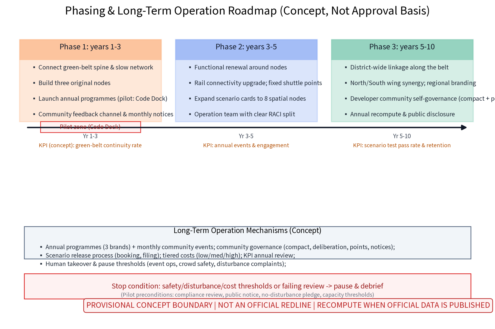

> Evidence anchors: [metric:phase_count], [metric:annual_program_count], [source:DATA-SRC-AGENT-TASKBOOK] (phasing and implementation items per the taskbook).

## Metrics, Area Recalculation, and Compliance Matrix

The goal-indicator-verification framework centers on five groups: event capacity, slow-traffic accessibility, green-belt continuity, temporary-facility reuse rate, community engagement; values are fixed at the regulatory-plan stage with no preset conclusions. **All areas and ratios are provisional conceptual model values**: source is geometry/*.geojson (EPSG:4548), formulas are polygon_area/union and corresponding ratios, confidence is low-medium, and the recompute trigger is overall recalculation upon publication of official boundary, land or rail data; display is rounded (e.g., total area ~11.4 km2, green ratio ~0.12, public-space share ~0.3% (about three per thousand)). Temporary design-model values are never presented as official current or planned indicators. The compliance matrix lists judgment - pending items - responsible stage item by item against higher-level plans, heritage protection, ecology and public safety, marking insufficient information as pending. Area recalculation keeps one caliber across the narrative, figures and the visual page.

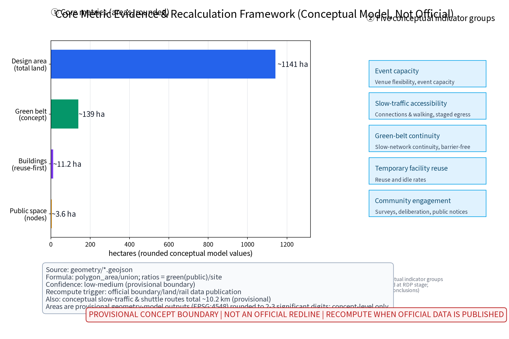

> Evidence anchors: [metric:site_area_sqm], [metric:green_ratio], [metric:public_space_ratio], [data:PACKAGE-GEOMETRY] (same geometry source, one caliber).

## Risk, Copyright, and Compliance

This proposal is conceptual research design; it is not an administrative approval basis and gives no FAR, building-height, retain-renovate-demolish or engineering-feasibility conclusions. Risks are registered in risk.json across dimensions including event-daily conflict, crowd safety, short-lived business formats and perceived AI over-surveillance, with response principles: anonymized aggregation only, key decisions human-reviewed, no over-surveillance; advance public notice, minimal necessity, human takeover when needed. **Brand prior-rights and use boundary**: all names and marks in this proposal (e.g., RELAY·JZ, one-belt-three-platforms, node names) are original concept-stage naming with no trademark or prior-rights search completed; until search and clearance are finished they are treated as internal working codenames, not to be registered or used in formal commercial, approval or publicity settings; resemblance to existing marks is coincidental and clearance must precede any formal use. Copyright and asset rights are registered item by item in sources.json (authors/tools, licenses, attribution and restrictions for fonts, images, maps, data, code, names and generated content); "original or public domain" applies only to this package's self-produced parts, and reuse boundaries for external content such as the organizer's announcement follow the source entries. International communication (concept copy): "RELAY·JZ - a global AI innovation relay on the centennial Jingzhang railway" is the English communication theme, with a bilingual glossary in the appendix of this English proposal, for concept display and international exchange only, not for formal external release. Public sources are cited with access times; implementation requires multi-department joint review, heritage and safety assessment; no conclusive numbers are given.

> Evidence anchors: [source:DATA-SRC-ANNOUNCEMENT] (base for ownership and compliance wording), [data:PACKAGE-GEOMETRY].

## References

Public materials: publicly available Jingzhang railway history and heritage-park documents; public information on universities, software parks and science parks along the corridor; published wording of the Beijing master plan and district plans; public reporting on past conferences and developer events; accessibility and event-safety common standards. **This package uses no internal, non-public or controlled materials.** Self-collected public field-survey records and sketches are registered under ASSET-* entries after de-identification. sources.json only holds verifiable entries with published/accessed dates and reuse boundaries; no official data or links are fabricated. Missing official data is registered as data gaps (risk.json and assumptions.json) and is never replaced by extrapolated values.

> Evidence anchors: [source:DATA-SRC-ANNOUNCEMENT] (first item of the source list is the organizer's public package).

## Appendix A: Bilingual Glossary and International Communication Copy

The glossary gives concept-stage Romanized (pinyin) equivalents only, as a working reference; the authoritative Chinese script appears in the Chinese proposal. All English terms are for concept display and international exchange, not for formal external release.

| English (communication) | Romanized concept equivalent (pinyin, reference) | Note |
|---|---|---|
| RELAY·JZ | Jingzhang AI Jie Li Dai (relay belt) | internal working codename; clearance required before external use |
| Jingzhang Forum Plaza | Jingzhang Luntan Guangchang | original concept node name |
| Code Dock | Daima Wu | original concept node name |
| Loop Gallery | Huilu Changlang | original concept node name |
| one belt, three platforms | Yi Dai San Tai | overall ordering concept |
| daily state / event state | Richang Zhuangtai / Huiqi Zhuangtai | dual-state conversion mechanism |
| anonymized aggregation, human review, no over-surveillance | Jin Ni Juhe, Gongren Fuhe, Jinzhi Guodu Jiankong | three-sentence AI governance boundary |
| centennial railway relay, event relay, community relay | Tielu Jieli - Huodong Jieli - Shequn Jieli | cross-cultural narrative for international exchange |