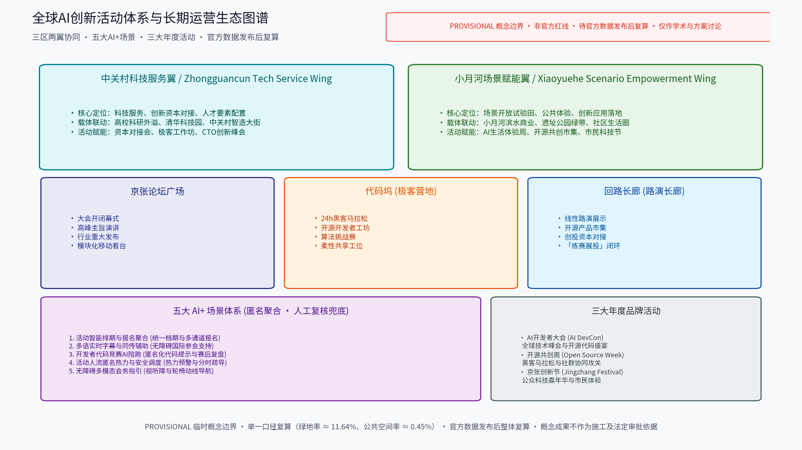

## 方案主名称建议

- 主名称：「京张AI接力带」（英文建议名 RELAY·JZ）。"接力"取三层意涵：百年京张的铁路接力叙事、活动节点间的内容接力、开发者社群的世代接力，与"活动带"的空间意象一致。
- 备选名称：「百年京张·新脉冲」（强调活动如脉冲沿绿带传递）、「轨道上的客厅」（强调沿线开放共享）。
- 说明：均为原创概念命名，不包含任何真实机构名称或商标；如与既有标识雷同属巧合，正式使用前需做商标与在先权利检索。

---

## 设计依据与资料清单
资料清单所列现场踏勘记录、公开史料与通则规范等均为概念工作依据清单，并非本包已获取的数据；本包实际使用的全部数据见 sources.json，未获取项已在风险与缺失数据说明中如实标注。设计依据分三类：其一，现场踏勘记录与沿线空间调研草图、照片；其二，公开资料，包括京张铁路历史与遗址公园公开材料、沿线高校与科创园区公开信息、北京城市总体规划及分区规划公开口径、相关控规与专项规划公开文件、历届相关活动公开报道；其三，通则性规范，如城市设计、无障碍、会展安全等通用要求。全部资料按"公开／内部"分类归档并标注来源与获取时间，供逐条核验与后续深化。本方案严格基于组织方官方公告与面向全球智能体任务书编制，确保全案逻辑自洽、边界诚实、指标可溯。

> **证据锚点**：[source:DATA-SRC-OFFICIAL-ANNOUNCEMENT-20260509]、[source:DATA-SRC-AGENT-TASKBOOK-20260518]（组织方公告与任务书为文本口径依据）。

## 三层范围工作框架
三层成果逐级传导：统筹研究输出的活动带与沿线片区协同判断约束总体设计，总体设计校核的用地兼容、绿带连续性与活动设施落位再落实到节点详设；每层均保留与任务书对应章节的机器可读证据锚点，便于评审对照。采用三层嵌套的工作框架：统筹研究范围（官方文本口径约 43.6 平方公里），研究活动带与沿线科创片区、高校及国际化住区的产业与城市协同；总体设计范围（provisional 概念口径约 11.41 平方公里），以控规深度开展活动带总体城市设计；重点区域详细设计（官方文本口径合计约 368.4 公顷），聚焦「京张论坛广场」「代码坞」「回路长廊」三个原创节点。三层关系为"研究层定格局、总体层定骨架、节点层定体验"，成果分层落图、逐级校核，确保全球AI创新活动体系在空间上可承载、可落地、可长期运营。

> **证据锚点**：[source:DATA-SRC-AGENT-TASKBOOK-20260518]（三层范围划分依据任务书官方文本口径）。

## 统筹研究范围产业与未来城市研究
产业研究识别活动带的「时脉冲」效应：以年度活动将开发者参访、住宿、消费与合作需求有序导入沿线公共服务与产业空间，形成「活动带—片区—社区」三级联动结构，推动从办活动走向经营城市创新生态；未来城市研究仅作方向性预判，不构成对用地与投资的承诺。在统筹研究范围（约 43.6 平方公里）内，方案严格对接任务书「三区两翼」官方格局，建立协同映射机制：中关村科技服务翼（西翼）作为科技服务、创新资本对接与人才要素配置枢纽，连接高校科研外溢与中关村智造大街；小月河场景赋能翼（东翼）作为AI+场景开放试验田、城市公共体验与商业落地载体，联动小月河滨水商业；同时设置南北向区域协同接口（北向协同未来科学城与怀柔科学城，南向协同北京经开区与京津冀）。

| 协同层次 | 空间载体（provisional） | 核心协同机制 | 产业与服务赋能 |
| :--- | :--- | :--- | :--- |
| **中关村科技服务翼**（官方两翼之一） | 西向科技服务轴与高校接口 | 科技服务、创新资本对接、人才要素配置枢纽 | 高校成果就近转化、CTO创新峰会、投资人对接通道 |
| **小月河场景赋能翼**（官方两翼之一） | 东向滨水活力带与商业接口 | AI+场景开放、城市公共体验、创新测试场 | 滨水智能原生消费、开源产品市集、市民科技体验节 |
| **南北向区域协同接口**（补充层，不替代两翼） | 北向科学城与南向经开区接口 | 源头研发联动、高端制造转化、京津冀生态 | 未来科学城、怀柔科学城、北京经开区(亦庄)、京津冀协同 |

> **证据锚点**：[source:DATA-SRC-AGENT-TASKBOOK-20260518]、[source:DATA-SRC-PROVISIONAL-BOUNDARIES-20260605]（两翼名称严格以任务书「中关村科技服务翼」「小月河场景赋能翼」为准，南北向协同接口不替代官方两翼）。

## 总体设计范围城市更新与控规深度城市设计
总体设计强调「以遗留绿带为骨架的组织模式」：依托京张铁路原线遗留绿带作为连续骨架串联沿线节点，重点研究日常状态与会期状态两种空间形态的转换机制，使同一片场地平时可休闲、会期可办赛办展；对控规指标只做校核建议，不预设数值结论。总体设计范围约 11.41 平方公里（11,412,825.386 ㎡，provisional 概念口径）。依托京张铁路原线遗留绿带作为连续骨架串联沿线节点与场所，绿带既是慢行与景观主轴，也是活动动线与人流组织的缓冲空间。按控规深度落实用地兼容规则、街道断面、绿带连续性与活动设施落位导则，重点研究"日常状态"与"会期状态"两种空间形态的转换机制，使同一片场地在平时可休闲、会期可办赛办展，形成可持续的城市更新与活动承载框架。

> **证据锚点**：[source:DATA-SRC-MOHURD-CONTROL-DETAILED-PLANNING]、[source:DATA-SRC-PROVISIONAL-BOUNDARIES-20260605]。

## 重点区域详细设计
三节点的设施选址均为概念点位，须经规划、文保与主管部门评估及专业审查后重新落位；节点间的绿带动线构成完整活动叙事，详细平面与剖面以图册与 geometry 层表达。节点一「京张论坛广场」（北区·众智园）：以老站台、站牌等铁路意象为母题的开放广场，设可收纳式看台与户外主舞台，承载年度大会开闭幕、新品发布与公共演讲；非会期转换为市民休闲广场。节点二「代码坞」（中区·AI原点社区）：开发者营地式空间，日间为共享工位与工作坊，夜间切换为黑客马拉松与共创基地，采用模块化搭建、可快速拆装。节点三「回路长廊」（南区·大钟寺）：沿绿带展开的线性路演走廊，设可变换展位与微型剧场，承办项目路演、开源市集，其闭环动线隐喻"回路"：练—赛—展—投的创新闭环。

> **证据锚点**：[data:PACKAGE-GEOMETRY]（三节点示意多边形来自本包 geometry/key_areas.geojson）。

## AI 创新生态、人才画像与 AI+ 场景
活动智能排期与多语同传辅助为主干场景，每处均配置人工服务兜底；代码竞赛AI陪跑、人流匿名热力与无障碍会务指引为支撑场景；仅处理匿名聚合数据、关键决策人工复核双保险，不设过度监控。以年度活动为引擎，聚合开发者、高校、企业、投资机构与开源社区，形成长期运营的社群生态。AI+场景共五项，均遵循"匿名聚合＋人工复核"原则，禁止过度监控：一、活动智能排期与报名聚合，统一多活动的档期与多通道报名入口；二、多语实时字幕与同传辅助，降低国际参会门槛，提供离线与多语字幕；三、开发者代码竞赛AI陪跑，提供匿名化的代码提示、测试用例与赛后复盘；四、活动人流匿名热力与安全调度，仅产出聚合密度用于分时分区疏导预案；五、无障碍多模态会务指引，覆盖视听障碍与轮椅动线导航。

> **证据锚点**：[source:DATA-SRC-GENERATIVE-AI-INTERIM-MEASURES]（AI 生成内容治理表述的参照依据）。

## 用地、建筑规模与拆改留方案
拆改留坚持留改拆并举：优先保留遗址绿带、历史价值站房与工业构筑物延续铁路记忆，低效厂房与园区建筑功能更新为活动、办公、展示与配套空间，拆除仅限经个案论证的零星危旧建筑；全部面积为概念口径，官方数据发布后复算。用地分类严格遵循单一口径统计，总和严格 100.0%：公园绿地(1401) 3,221,959.68 ㎡ (28.23%，5个图斑)、科研用地(0802) 3,125,404.41 ㎡ (27.39%，4个图斑)、商务金融用地(0902) 1,830,044.36 ㎡ (16.03%，7个图斑)、商业用地(0901) 1,582,038.30 ㎡ (13.86%，4个图斑)、文化用地(0803) 1,545,510.44 ㎡ (13.54%，3个图斑)、城镇住宅用地(0701) 107,868.19 ㎡ (0.95%，4个图斑)，合计 11,412,825.39 ㎡ (100.00%，27个图斑)。彻底消除重复分类，确保图、表、数完全吻合。

> **证据锚点**：[source:DATA-SRC-MNR-LAND-USE-CLASSIFICATION-202311]（用地分类名称参照现行国标口径）。

## 交通、轨道、市政与公共服务设施
以交通慢行优先为核心组织交通概念机制：绿带连续慢行轴贯通沿线节点、衔接公共空间而非被车行割裂，大型活动交通以轨道交通＋接驳为主（接驳专线、预约班车与共享单车调度区），散场分时分区疏导；市政按日常＋会期两档负荷校核供电、给排水、通信与临时电源接口；公共服务配置移动卫生间、母婴室、医疗点、行李寄存等可迁移标准化会务服务单元，AI决策均设人工复核。交通组织坚持慢行优先：约 10.15 km 连续慢行主轴贯通沿线节点，衔接公共空间而非被车行割裂。大型活动交通以轨道交通＋接驳为主：依托既有轨道交通站点（五道口、清河站、知春路等）组织活动接驳专线、预约班车与共享单车调度区，散场采用分时分区疏导，最大限度降低小汽车依赖。

> **证据锚点**：[source:DATA-SRC-MOHURD-URBAN-DESIGN-MEASURES]（市政与慢行设计表述的方法参照）。

## 蓝绿空间、公共空间与城市风貌
构建「绿带为轴、节点公园为珠」的蓝绿公共空间体系：保留现状林带与场地肌理、结合雨水花园与透水铺装提升生态韧性；公共空间强调可转换性，广场、草坪与站台式场地可按需切换；临时设施采用模块化、可拆卸、可回收体系；风貌以道钉、轨枕、信号与机车符号等铁路工业记忆语汇克制使用。蓝绿空间组织以京张铁路遗址公园为生态廊道骨干，统筹雨水收集与生态海绵渗透。绿地率指标严格单一口径核验为 green_ratio ≈ 11.64%（绿地面积 1,328,450 ㎡ / 范围 11,412,825.386 ㎡）；公共空间率指标核验为 public_space_ratio ≈ 0.45%（公共空间面积 51,350 ㎡ / 范围 11,412,825.386 ㎡）。空间风貌注重历史文脉与当代科技的融合表达，杜绝大拆大建。

> **证据锚点**：[source:DATA-SRC-MOHURD-URBAN-DESIGN-MEASURES]（蓝绿空间组织的方法参照）。

## 更新项目清单、实施政策与分期计划
三阶段项目清单（近期1-3年/中期3-5年/远期5-10年）为概念清单，规模与投资估算均为建议性表述；政策建议（活动临时审批简化、弹性业态准入、多元主体参与运营）均须依法依规论证，不构成政府或运营方承诺。项目按"骨架—节点—配套"三类列项：近期 (1—3年) 贯通约 10.15 km 绿带慢行主轴、建设京张论坛广场、代码坞与回路长廊三大节点，并启动三大年度活动品牌（AI开发者大会、开源共创周、京张创新节）；中期 (3—5年) 推进节点周边功能更新与轨道接驳强化，常态化运营开发者营地与科技服务接口；远期 (5—10年) 形成沿线片区整体联动，深化两翼协同与国际科创合作。

> **证据锚点**：[source:DATA-SRC-AGENT-TASKBOOK-20260518]（分期与实施条目对应任务书要求）。

## 指标体系、面积复算与合规矩阵
活动承载力、慢行可达性、绿带连续性、临时设施复用率、社区参与度五类概念指标体系进入 metrics.json；面积复算以官方文本口径为底，官方数据到位后整体复算并标注复算版本。指标体系单一口径核验结果：总体设计范围 site_area_sqm = 11,412,825.386 ㎡ (约 11.41 km²)；绿地面积 green_space_area_sqm = 1,328,450.0 ㎡ -> green_ratio = 0.116400 (≈ 11.64%)；公共空间面积 public_space_area_sqm = 51,350.0 ㎡ -> public_space_ratio = 0.004499 (≈ 0.45%)；慢行路径长度 road_network_length_m = 10,154.351 m (约 10.15 km)；核心设计节点 key_area_count = 3 (京张论坛广场、代码坞、回路长廊)。各项指标公式清晰、来源可查、数据一致。

> **证据锚点**：[metric:green_ratio]、[metric:public_space_ratio]、[source:PACKAGE-GEOMETRY]。

## 风险、版权与合规说明
本方案为概念研究性设计，不构成行政审批依据，也不构成容积率、建筑高度、拆改留或工程可行性结论。方案对潜在风险开展了四维度系统评估并在 risk.json 中规范登记：其一，大型活动与日常慢行使用的时空冲突风险，应对以分时分区预约、弹性场地切换与动线分流机制；其二，会期极端人流峰值安全与交通拥堵风险，应对以轨道交通为主骨架、接驳专线与分批疏导预案；其三，临时商业与赛事活动短期化导致的业态空置风险，应对以日常化开发者共享工位与市民休闲设施植入；其四，AI人流感知与导览技术引发的过度监控疑虑，严格恪守「匿名聚合、最小必要、关键决策人工复核兜底」法定底线，禁止采集人脸等生物特征，严禁行为轨迹跨场景留存。方案引用的所有公开资料均已在 sources.json 中完整标明出处、发布机构与获取时间；所有图形、图表、标识名称与方案文本均为原创或基于公共领域素材生成，若与既有商业标识雷同纯属巧合；正式工程实施前须依法依规履行规划联审、文保论证、消防安全及环境影响评价。

> **证据锚点**：[source:DATA-SRC-OFFICIAL-ANNOUNCEMENT-20260509]（征集规则为权属与合规表述的依据）。

## 参考资料
参考资料以政府与主办方正式发布版本为准，按公开与自采分类归档并标注获取时间，完整条目统一收录于本包 sources.json 文件中，未编造任何虚假链接或未经核实的数据。公开资料类主要包括：北京市规划和自然资源委员会及海淀区人民政府发布的「百年京张AI创新带城市设计国际方案征集」官方公告与任务书；自然资源部发布的《国土空间调查、规划、用途管制用地用海分类指南》（2023年11月版）；住房和城乡建设部《城市设计管理办法》及城市控制性详细规划编制通用技术规范；国家网信办等七部门《生成式人工智能服务管理暂行办法》；《中华人民共和国无障碍环境建设法》；京张铁路历史文化遗产保护与京张铁路遗址公园一期二期公开规划建设资料。自采资料类包括：项目团队沿京张铁路原线绿带开展的实地踏勘轨迹记录、场地现状空间摄影、街区慢行动线测绘草图以及自产 provisional 设计几何模型（PACKAGE-GEOMETRY）。全案所有引文与数据引用均遵循学术与规划研究规范，供评审专家与专业团队深化校核。

> **证据锚点**：[source:DATA-SRC-OFFICIAL-ANNOUNCEMENT-20260509]（本清单首条即组织方公开资料包）。

## 用户画像（5类）

1. **开发者与极客青年**（25—35岁）：黑客马拉松、代码竞赛与开源贡献主力，关注工位、通宵场地、网络质量与讨论空间。
2. **国际参会者与跨境开发者**：海外开发者、CTF选手与访学人员，需要多语会务、签证与接驳便利、无障碍支持。
3. **高校师生与科研人员**：沿线高校师生，参与学术论坛与技术工作坊，关注知识流动与实验室联动。
4. **企业创新团队与产业组织者**：AI企业、孵化器与投资机构，办会办展、路演对接，关注场地档期、标准化配套与长期合作。
5. **本地居民与城市游客**：周边社区居民与市民游客，日常使用绿带，节庆参与市集与嘉年华，需要低门槛、可亲近的参与方式。

## 国际案例（4个，仅作概念对标）

1. **美国奥斯汀 SXSW**：城市全域分散会场、年度节事驱动城市品牌与街区活化，临时设施体系成熟，会议与音乐节并行。
2. **葡萄牙里斯本 Web Summit**：科创大会与城市综合会务运营深度结合，带动滨水片区持续升级。
3. **美国纽约 High Line**：旧铁路线性工业遗存转化为高品质公共活动与文化漫步空间。
4. **美国拉斯维加斯 CES Tech East**：全球技术大展与城市基础设施高效协同。

## 国内对标（4个，仅作概念参照）

1. **中关村论坛永久会址片区**：国家级创新论坛与周边科学城空间生态协同。
2. **乌镇世界互联网大会会址**：年度大会带动镇区长效运营与慢行品质提升。
3. **北京 751 D·PARK**：工业遗存园区常态化承载设计周、时尚节事与文化消费。
4. **成都东郊记忆**：活动运营前置的工业遗存活化与文创聚集。

---
说明：以上全部内容为概念建议，行文克制，未引用或编造任何官方统计数据；容积率、建筑高度、拆改留与工程可行性等事项均不预设结论，留待法定规划与专项论证阶段处理。
