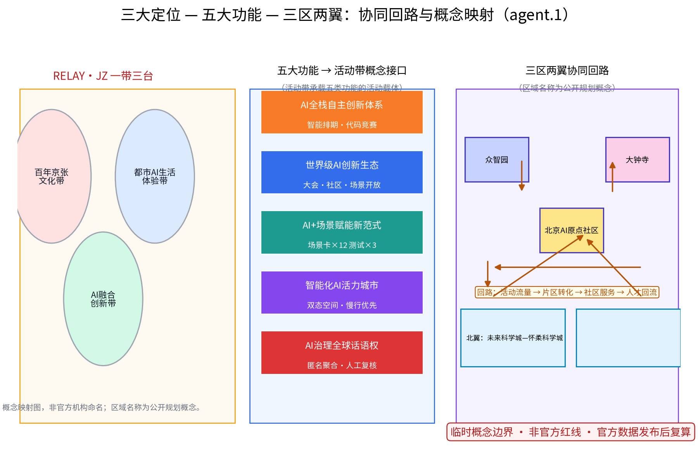
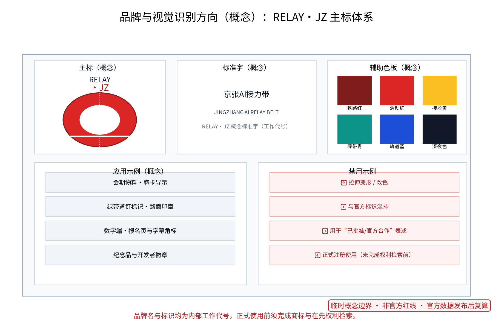
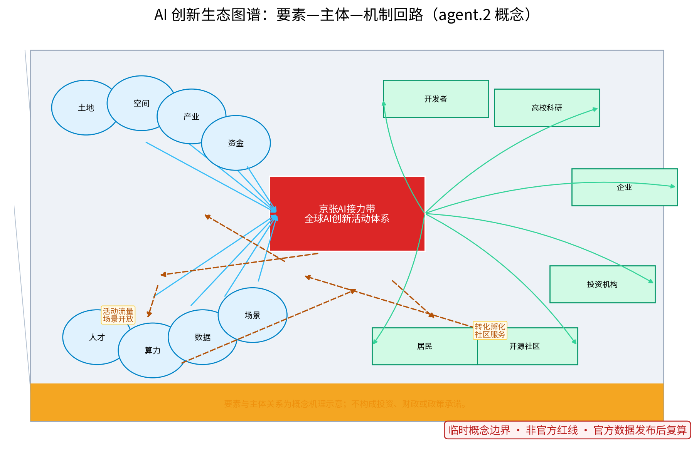
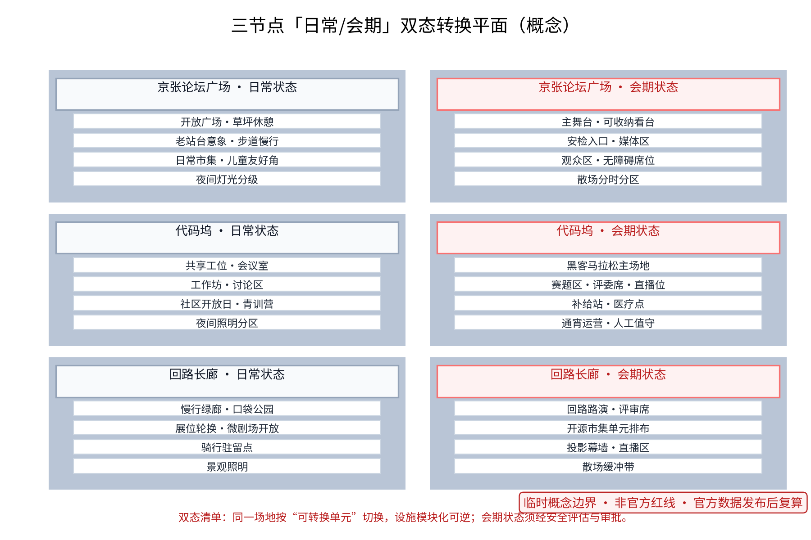
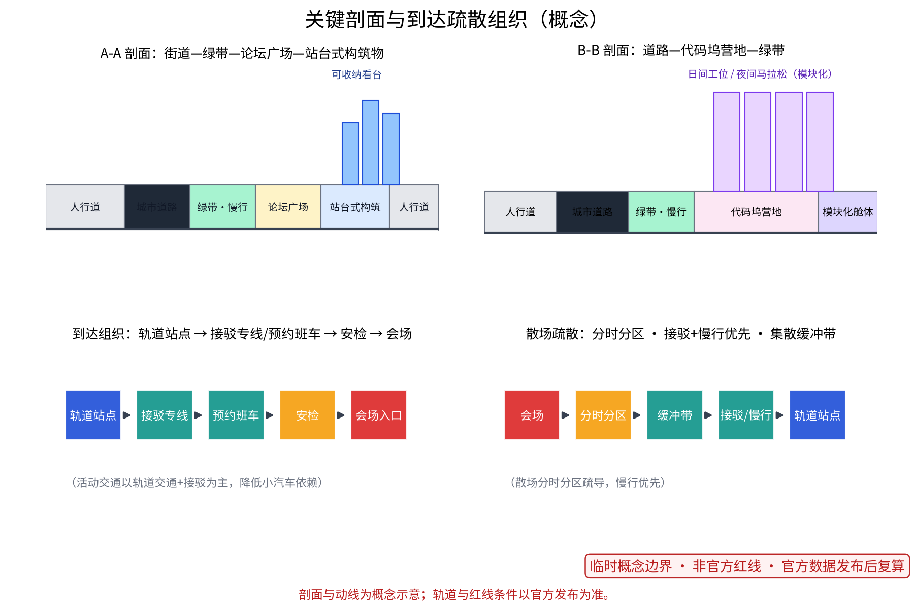
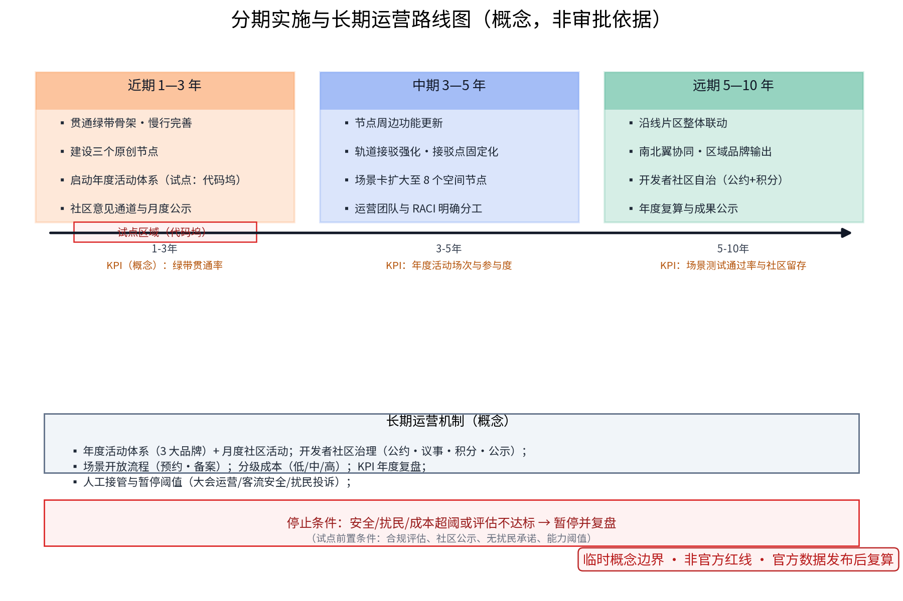

## 设计依据与资料清单

设计依据分三类：其一，组织方公开公告与任务书文本（范围、任务、深度与征集规则口径）；其二，公开资料，包括京张铁路历史与遗址公园公开材料、沿线高校与科创园区公开信息、北京城市总体规划及分区规划公开口径、相关控规与专项规划公开文件、历届相关大会与开发者活动的公开报道；其三，通则性规范，如城市设计、无障碍与会展安全等通用要求。**本包未采用任何内部、未经公开或受控的资料与数据**——此处所称内部、未公开或受控，指未公开发布、受使用控制或含个人隐私的文档与数据；资料清单所列内容均为可公开核验的来源类型，全部实际使用条目已逐项登记于 sources.json（含来源页、发布与获取时间、复用边界）。参与方自行采集的公开场所现场踏勘记录与自绘分析草图，在清理任何可能的个人可识别信息后，作为自产几何与图件资产登记（见 sources.json 中 PACKAGE-GEOMETRY 及 ASSET-SURVEY-NOTES、ASSET-* 条目）——此类记录为公开可观察信息且已去标识化，不属于上述范畴，与「未使用内部或非公开数据」的陈述口径一致；不包含未经公开的空间数据。设计依据与概念范围的关系如下：

| 依据类别 | 用途（概念） | 来源登记 | 边界说明 |
|---|---|---|---|
| 组织方公告与任务书 | 范围、任务、深度、征集规则口径 | [source:DATA-SRC-ANNOUNCEMENT] [source:DATA-SRC-AGENT-TASKBOOK] | 文本口径可引用，不替代官方红线与几何 |
| 公开历史与园区资料 | 文化叙事与协同对象（概念） | 按条目登记于 sources.json | 仅作方向性参照，不构成事实链结论 |
| 通则规范 | 方法参照 | [source:DATA-SRC-MOHURD-URBAN-DESIGN-MEASURES] 等 | 不构成项目级合规结论 |
| 自采集调研记录（已清理） | 现状感受与草图（概念） | ASSET-* 条目 | 已去标识化，仅用于概念表达 |

> **证据锚点**：[source:DATA-SRC-ANNOUNCEMENT]、[source:DATA-SRC-AGENT-TASKBOOK]（组织方公告与任务书为文本口径依据）。

## 三层范围工作框架

按官方公告口径，三层范围依次为：统筹研究范围约43.6平方公里、总体设计范围约11.4平方公里、重点区域约368.4公顷（三处重点区：众智园AI自主创新加速区、北京AI原点社区、大钟寺AI产业聚集区）。方案面向海淀区京张铁路原线沿线展开，与中关村科创氛围及沿线高校、软件园形成概念协同语境。本方案的三层概念范围与三节点落位均为上述官方范围之下的概念性子范围（provisional），不替代官方几何。成果逐级传导：研究层定格局（统筹研究）、总体层定骨架（总体设计）、节点层定体验（重点区域详设），每层均保留与任务书对应章节的机器可读证据锚点。任务书三大定位（百年京张文化带、都市AI生活体验带、AI融合创新带）与五大功能（AI全栈自主创新体系、世界级AI创新生态、AI+场景赋能新范式、智能化AI活力城市、AI治理全球话语权）在本方案中映射为「三区两翼协同回路」：三区即众智园、北京AI原点社区、大钟寺三处重点区，两翼即北翼（未来科学城—怀柔科学城方向）与南翼（经开区与京津冀协同方向），回路机制为「活动流量→片区转化→社区服务→人才回流」，并保持与北纬社区、未来科学城、怀柔科学城、经开区及京津冀等区域与沿线社区创新单元协同概念的开放性接口（区域协同均属概念建议，待上位规划确认）。本包的定位与功能对应关系见「三大定位—五大功能—三区两翼协同回路图」。

> **证据锚点**：[source:DATA-SRC-AGENT-TASKBOOK]（三层范围与三大定位、五大功能依据任务书官方文本口径）。

## 统筹研究范围产业与未来城市研究

产业研究识别活动带的「时脉冲」效应：以年度活动将开发者参访、住宿、消费与合作需求有序导入沿线公共服务与产业空间，形成「活动带—片区—社区」三级联动结构，推动从办活动走向经营城市创新生态；未来城市研究仅作方向性预判，不构成对用地与投资的承诺。研究同时覆盖土地、空间、产业、资金、人才、算力、数据、场景八类要素与开发者、高校科研、企业、投资机构、开源社区、居民六类主体之间的机制回路（见生态图谱）：活动流量转化为场景需求，场景需求牵引算力与数据服务，服务沉淀人才与社群，社群再反哺产业与资金。国际对标案例六项仅作概念对标，逐项登记来源、获取时间与复用边界（失实或失效条目将降级为研究假设）：

| 案例 | 主办/城市 | 对标机制（概念） | 可迁移启示 | 来源登记 |
|---|---|---|---|---|
| SXSW（1987年创立） | 奥斯汀 / SXSW LLC | 城市全域分散会场、年度节事驱动街区活化、临时设施体系成熟 | 会期经济与日常街区共用一套可转换设施 | CASE-SXSW |
| Tech Open Air（2012年创立） | 柏林 / TOA团队 | 社群自组织、跨界内容编排、轻资产办会 | 低门槛开放场地与志愿者网络是低成本启动的关键 | CASE-TOA |
| Dutch Design Week（2002年创立） | 埃因霍温 / Dutch Design Foundation | 旧工业区更新与年度设计周长期共生 | 展事成为片区更新持续动力，场地复用率极高 | CASE-DDW |
| MWC Barcelona（品牌2008年确立） | 巴塞罗那 / GSMA | 大型会展与城市更新片区协同、会展经济反哺创新区 | 会展设施日常化运营与专业会展品牌相互支撑 | CASE-MWC |
| 云栖大会（2009年起源，2015年更名） | 杭州 / 阿里巴巴集团与杭州市 | 大会品牌与小镇运营一体化，会期经济延伸为日常产业生态 | 大会选址与产业社区空间耦合，沉淀开发者社群 | CASE-YUNQI |
| 世界人工智能大会WAIC（2018年首届） | 上海 / 国家部委与上海市共同主办 | 城市级AI会展与会期城市氛围营造，展示发布平台并重 | 城市整体氛围营造与多部门协同办会机制 | CASE-WAIC |

> **证据锚点**：[source:DATA-SRC-PROVISIONAL-BOUNDARIES]（边界为 provisional，研究范围仅作概念示意）；各案例条目见 sources.json 的 CASE-* 登记。

## 总体设计范围城市更新与控规深度城市设计

总体设计概念为「以遗留绿带为骨架的组织模式」：依托京张铁路原线遗留绿带作为连续骨架串联沿线节点与场所，绿带既是慢行与景观主轴，也是活动动线与人流组织的缓冲空间；按控规深度方法校核用地兼容规则、街道断面、绿带连续性与活动设施落位导则，重点研究「日常状态」与「会期状态」两种空间形态的转换机制，使同一片场地平时可休闲、会期可办赛办展。周边语境采用公开信息示意（清华园·五道口、学院路、G6京藏高速、上地·西二旗、知春路·大钟寺等方向），图面均配指北针、比例尺与图例；节点周边道路、轨道站点与现状障碍等精确条件以官方发布为准。对控规指标只做校核建议，不预设数值结论。总平面与语境关系见图件：

> **证据锚点**：[source:DATA-SRC-MOHURD-CONTROL-DETAILED-PLANNING]、[source:DATA-SRC-PROVISIONAL-BOUNDARIES]（控规深度方法参照与 provisional 边界）。

## 重点区域详细设计

三节点的设施选址均为概念点位，须经规划、文保与主管部门评估及专业审查后重新落位；节点间的绿带动线构成完整活动叙事。其一，「京张论坛广场」：以老站台、站牌等铁路意象为母题的开放广场，设可收纳式看台与户外主舞台，承载年度大会开闭幕、新品发布与公共演讲；其二，「代码坞」：开发者营地式空间，日间为共享工位与工作坊，夜间切换为黑客马拉松与共创基地，采用模块化搭建、可快速拆装；其三，「回路长廊」：沿绿带展开的线性路演走廊，设可变换展位与微型剧场，承接项目路演与开源市集，其闭环动线隐喻「练—赛—展—投」循环。几何层现有 3 处地标节点与 5 处场景节点（共 8 个空间节点）。场景卡以表格形式落地，即「场景—空间—运营」矩阵（12 张：场景卡、落点、面向人群、运营机制与数据合规边界五列），形成可评审、可迭代的运营索引：

| 场景卡 | 落点 | 面向人群 | 运营机制（概念） | 数据与合规边界 |
|---|---|---|---|---|
| 「论坛排期」活动智能排期 | 京张论坛广场 | 参会者、从业者 | 预约档期、年度公示 | 匿名聚合，人工复核 |
| 「同传」多语字幕与同传辅助 | 论坛广场及全线 | 国际参会者 | 志愿者值守、字幕分级 | 端侧处理，不留存语音 |
| 「代码陪跑」竞赛AI陪跑 | 代码坞 | 开发者、学生、青年 | 积分晋级、轮换赛题 | 匿名化提示，防作弊人裁 |
| 「热力」人流匿名热力与安全调度 | 活动场地 | 运营方、安保 | 实时公示、月度评估 | 聚合密度，不进行个体识别式追踪 |
| 「伴行」无障碍多模态会务指引 | 三节点及绿带 | 老年人、残障人士 | 志愿者值守、人工兜底 | 端侧处理，不留存个体信息 |
| 「回路路演」项目路演走廊 | 回路长廊 | 创业者、投资人、游客 | 公开路演、议事评议 | 仅聚合统计，可一键关闭 |
| 「集市」开源市集轮换展位 | 回路长廊 | 开源社区、公众 | 轮换展位、预约备案 | 报名信息最小必要，到期删除 |
| 「夜研」黑客马拉松夜研模式 | 代码坞 | 开发者、青年 | 通宵分区、人工值守 | 时段公示，音量分级 |
| 「绿廊」绿带养护与预约 | 绿带全线 | 居民、游客 | 志愿巡护、积分激励 | 巡护记录匿名聚合 |
| 「纪念」遗址文化导览 | 遗址公园段 | 游客、学生、家庭 | 预约讲解、双语内容 | 定位信息端侧处理 |
| 「青训」青少年编程营地 | 代码坞及高校联动 | 学生、教师、家长 | 志愿导师、社区合作 | 未成年人信息最小必要并设监护人规则 |
| 「社区」社区共创工作坊 | 沿线社区空间 | 本地居民、家庭 | 议事报名、月度公示 | 联审发布，匿名聚合统计 |

以上场景卡（即「场景—空间—运营」矩阵主体）与三个产业测试验证场景（测试协议见下）共同构成该矩阵的完整可见证据：

| 测试场景 | 测试地点/窗口（概念） | 测试协议（概念） | 成功指标 | 失败/暂停阈值 | 人工复核 |
|---|---|---|---|---|---|
| 多语同传压力测试 | 京张论坛广场，会期前试点 | 模型评测与基准测试：字幕准确率、端到端时延、术语覆盖 | 准确率与复核介入率达标 | 连续两轮低于阈值即停测并回滚人工同传 | 全程人工值守 |
| 代码陪跑安全测试 | 代码坞，首场黑客马拉松 | 数据质量与误差分群：提示匿名化、误报率、防作弊边界 | 误报率可控、无个体画像 | 出现可识别个体信息或重大误判即停用 | 提交与判罚人工裁定 |
| 热力与疏散演练 | 三节点及绿带，会期前演练 | 运行监测：聚合密度、预案触发、疏散时间 | 预案命中率与疏散达标 | 密度阈值异常或演练不合格即降级为人工疏导 | 调度决策人工复核 |

> **证据锚点**：[data:PACKAGE-GEOMETRY]（三节点示意多边形来自本包 geometry/key_areas.geojson）、[metric:scenario_node_count]（3 地标+5 场景节点）。

## AI 创新生态、人才画像与 AI+ 场景

以年度活动为引擎，聚合开发者、高校、企业、投资机构与开源社区，形成长期运营的社群生态；AI+场景共五类（活动智能排期与报名聚合、多语实时字幕与同传辅助、开发者代码竞赛AI陪跑、活动人流匿名热力与安全调度、无障碍多模态会务指引），遵循「仅匿名聚合、关键决策人工复核、禁止过度监控」三句式边界，数据仅用于会务改善并明示告知。AI场景域覆盖治理、公共服务、产业、空间、文化、交通六域，各域均以人工复核兜底。上述 AI+ 场景组与「场景—空间—运营」矩阵（12 张场景卡索引及其落点、人群与运营机制，见重点区域章节）逐项对应。技术协议（概念）：模型评测（基准测试与场景化评估）、数据质量（采集口径与脱敏校验）、误差分群（错误归因与影响分级）、运行监测（误报率与告警闭环），任何一项未通过即进入人工接管流程。五类人才画像如下：

1. **开发者与极客青年**（以25—35岁为主）：黑客马拉松、代码竞赛与开源贡献主力，关注工位、通宵场地、网络质量与讨论空间。
2. **国际参会者与跨境开发者**：海外开发者、CTF选手与访学人员，需要多语会务、签证与接驳便利、无障碍支持。
3. **高校师生与科研人员**：沿线高校师生，参与学术论坛与技术工作坊，关注知识流动与实验室联动。
4. **企业创新团队与产业组织者**：AI企业、孵化器与投资机构，办会办展、路演对接，关注场地档期、标准化配套与长期合作。
5. **本地居民与城市游客**：周边社区居民与市民游客，日常使用绿带，节庆参与市集与嘉年华，需要低门槛、可亲近的参与方式。

五类人才画像覆盖青年、学生、从业者、居民、游客、老年人与残障人士等群体，并落实全龄、无障碍、适老、儿童友好与包容性设计语言；居民意见通道（意见箱与线上入口）、年度公示与年度活动机制贯穿运营全程。

> **证据锚点**：[source:DATA-SRC-GENERATIVE-AI-INTERIM-MEASURES]、[source:DATA-SRC-BARRIER-FREE-ENVIRONMENT-LAW]（AI生成内容治理与无障碍人工兜底的表述参照）。

## 用地、建筑规模与拆改留方案

遵循「留改拆并举」的概念口径，不预设数值：留，优先保留遗址绿带、具有历史价值的站房与工业构筑物，延续铁路记忆；改，对低效厂房与园区建筑进行功能更新，置换为活动、办公、展示与配套空间；拆，仅针对经个案论证存在安全隐患的零星危旧建筑，以个案论证为准，不形成拆改结论。用地兼容会议、展览、办公、商业与服务配套；**全部面积为概念几何单一口径（land_use.geojson 全部要素面积集合，EPSG:4548），置信度低，官方数据发布后复算**；概念用地结构按国标分类名称展示为：科研用地约27%、公园绿地约28%、商务金融用地约16%、商业用地约14%、文化用地约14%、城镇住宅用地约1%（占比合计100%，四舍五入取整），该结构与 metrics.json 中可核查面积指标同源同口径，不构成现状或规划指标。概念建筑体量（留改优先）与公共空间节点面积仅为设计模型输出，展示时取整并标注来源、公式、置信度与复算触发条件。

> **证据锚点**：[metric:site_area_sqm]、[metric:green_ratio]、[source:DATA-SRC-MNR-LAND-USE-CLASSIFICATION-202311]（用地分类名称参照现行国标口径）。

## 交通、轨道、市政与公共服务设施

交通组织坚持慢行优先：绿带连续慢行轴贯通沿线节点，衔接公共空间而非被车行割裂，形成南北贯通主轴（沿京张铁路原线方向）与东西缝合联系（两侧街区、轨道站点与社区之间的横向慢行联系）；大型活动交通以轨道交通＋接驳为主，依托既有轨道站点组织活动接驳专线、预约班车与共享单车调度区，散场采用分时分区疏导与集散缓冲带，最大限度降低小汽车依赖；周边轨道语境按公开信息示意（清河站—西直门方向），精确站址与接驳条件以官方发布为准。市政按「日常＋会期」两档负荷校核供电、给排水、通信与临时电源接口，均预留模块化接口。公共服务配置移动卫生间、母婴室、医疗点、行李寄存等可迁移设施，形成标准化会务服务单元；无障碍以连续轮椅路径、视听信息冗余、安静空间与人工服务兜底为基线要求，并落实为可核验条款：无障碍专项检查清单（轮椅连续路径、坡道与净宽、视听冗余、安静空间、夜间照明与巡逻）纳入节点详设与验收交付物，配置母婴室、儿童活动区、老年人休息区与适老助行点位（均为概念点位），运营期以年度公示核查落实情况；夜间安全由照明分级、巡逻与一键求助（人工值守）共同保障。关键剖面与到达疏散组织见图件：

> **证据锚点**：[source:DATA-SRC-MOHURD-URBAN-DESIGN-MEASURES]（市政与慢行设计表述的方法参照）。

## 蓝绿空间、公共空间与城市风貌

构建「绿带为轴、节点公园为珠」的蓝绿公共空间体系，保留现状林带与场地肌理，结合雨水花园与透水铺装提升生态韧性；公共空间强调可转换性：广场、草坪与站台式场地可按需切换为会场、市集、露营与日常休闲空间。公共空间**组件库**（概念）按「可识别、可逆、可复用」原则分类：通用组件（座椅、照明、标识、绿化模块）、活动组件（舞台、看台、展位、仓体）、服务组件（卫生间、医疗点、寄存、无障碍辅具）；减灾与夜间接驳组件（应急照明、疏散标识）列入会期强检项。设立「京张荣誉」展示体系（概念）：在回路长廊与论坛广场设置荣誉墙与年度开发者荣誉榜，展示开源贡献、社区志愿与创新成果，内容经公示与联审后发布。风貌延续京张铁路工业记忆语汇——道钉、轨枕、信号与机车符号等，克制使用、避免标语化包装；并配套**文化导视系统**（概念）：以双语标识、铁路文化符号与无障碍多模态指引（视听冗余、触觉铺装、端侧定位）构成统一导视体系，与「纪念」「伴行」场景卡联动，会期前完成可达性与标识核查。慢行与蓝绿网络见图件：

> **证据锚点**：[source:DATA-SRC-MOHURD-URBAN-DESIGN-MEASURES]（蓝绿空间组织的方法参照）、[metric:green_ratio]。

## 更新项目清单、实施政策与分期计划

项目按「骨架—节点—配套」三类列项：骨架为绿带贯通与慢行完善，节点为三个原创活动场所，配套为接驳、市政与公共服务设施。分期：近期1—3年，贯通绿带、建设三个节点并启动年度活动体系（试点区域为代码坞，前置条件：合规评估、社区公示、无扰民承诺、能力阈值；**停止条件**：任一试点连续两个评估周期低于阈值、合规抽检不合格或扰民投诉集中，即触发停止条件并进入复盘，执行试点—评估—扩展或退出闭环）；中期3—5年，推进节点周边功能更新与轨道接驳强化；远期5—10年，形成沿线片区整体联动与南北翼协同。年度活动体系以三大品牌为核心，辅以月度常规社区活动：

| 年度活动品牌 | 频次 | 主要载体（概念） | 运营机制 | 数据与合规 |
|---|---|---|---|---|
| AI开发者大会 | 年度 | 京张论坛广场、代码坞 | 预约报名、档期公示、多语同传 | 匿名聚合，人工复核 |
| 开源共创周 | 年度 | 代码坞、回路长廊 | 轮换赛题、积分晋级、志愿导师 | 端侧处理，防作弊人裁 |
| 京张创新节 | 年度 | 三节点及绿带 | 公开路演、市集轮换、议事评议 | 仅聚合统计，一键关闭 |

分期实施与长期运营矩阵（责任主体为建议性角色，不构成任何已确认安排）：

| 阶段 | 建议责任（RACI：牵头—协作—配合） | 试点前置条件 | 开放流程 | 成本等级 | KPI（概念） | 人工接管 | 失败/暂停阈值 | 公众反馈 | 年度复盘 |
|---|---|---|---|---|---|---|---|---|---|
| 近期1—3年（绿带贯通·三节点·年活动启动） | 牵头：区政府统筹部门与街道；协作：运营团队、高校、企业、志愿组织 | 合规评估、社区公示、无扰民承诺、能力阈值 | 预约—备案—公示三步开放 | 低—中 | 绿带贯通率、活动场次与参与度 | 会务/客流/安保关键岗位人工值守 | 连续两轮评估低于阈值、合规抽检不合格、扰民投诉集中即暂停复盘 | 意见通道+月度公示 | 公布指标与整改清单 |
| 中期3—5年（功能更新与接驳强化） | 牵头：区级部门与轨道运营主体（建议）；协作：设计院、运营商、物业 | 专项评估与行政审批（依法） | 试点评估—扩展或退出 | 中 | 接驳分担率、场景测试通过率 | 设备故障即回滚人工服务 | 未达KPI或评估不合格的项目停止新增投入 | 年度公示+议事会 | 调整项目清单 |
| 远期5—10年（片区整体联动） | 牵头：多方联审机制（建议）；协作：南北翼片区与社区共治组织 | 上位规划与控规衔接（依法） | 区域接口开放清单 | 中—高 | 社区留存率、企业转化数、品牌国际传播指标 | 平台运行设人工接管岗 | 重大安全事件或负面评估即中止相关安排 | 年度公示+社区议事 | 全景复盘与品牌评估 |

成本口径：所有成本均为定性等级（低/中/高），估算方法为同类项目量级类比，价格基期统一为2026年概念阶段，包含范围为设计与建设环节（不含运维、税费与土地），置信等级低，复算触发为项目立项估算与设计深化完成；本表不构成投资承诺。开发者社区与长期运营转化机制（概念）：开发者社区以「公约+议事+积分+公示+备案」自治框架运营，场景开放流程为「预约—备案—测试—复盘」四步，招引转化漏斗为「活动流量→社区沉淀→场景孵化→企业合作」，配套「年度开发者荣誉榜」与「创始会员制」（预约轮换、分级参与），稳定资源机制建议以「联盟共建＋多元主体分担」实现，均待依法论证；上述机制的治理责任、开放流程、成本等级、KPI 与暂停复盘触发条件按以下长期运营子矩阵落实（责任均为建议性角色）：

| 长期运营机制（概念） | 治理/责任（建议性） | 开放流程 | 成本等级 | KPI（概念） | 暂停/复盘触发 |
|---|---|---|---|---|---|
| 开发者社区自治 | 公约+议事+积分+公示+备案；志愿理事会 | 注册—入会—分级参与 | 低（志愿为主） | 社区留存率、月度活跃度 | 连续两期活跃度低于基线即复盘调整 |
| 场景开放运营 | 运营团队（建议）＋场景主理人轮换 | 预约—备案—测试—复盘四步 | 中（临时设施复用） | 场景测试通过率、复用率 | 测试未过或验收不合格即停测并人工接管 |
| 招引转化漏斗 | 联盟共建＋多元主体分担（建议） | 活动流量→社区沉淀→场景孵化→企业合作 | 中—高 | 企业转化数、孵化项目数 | 转化未达年度基线即调整机制并公示 |
| 荣誉与会员体系 | 联审委员会（建议）＋年度公示 | 年度开发者荣誉榜；创始会员预约轮换、分级参与 | 低 | 荣誉榜覆盖率、会员留存 | 联审未过不发布，争议事项公示复核 |
| 年度复盘与品牌评估 | 多方联审（建议）＋居民意见通道 | 年度复盘报告→整改清单→下年度计划 | 低 | 复盘报告完成率、整改落实率 | 重大投诉或负面评估即启动专项复盘 |

> **证据锚点**：[metric:phase_count]、[metric:annual_program_count]、[source:DATA-SRC-AGENT-TASKBOOK]（分期与实施条目对应任务书要求）。

## 指标体系、面积复算与合规矩阵

目标—指标—校验概念指标体系围绕五类构建：活动承载力、慢行可达性、绿带连续性、临时设施复用率、社区参与度，数值于控规阶段校核后确定，不预设结论。**面积与比率全部为 provisional 概念模型值**：来源为 geometry/*.geojson（EPSG:4548），公式为 polygon_area/union 及对应比率，置信度为低—中，**复算触发条件为官方边界、用地、轨道等数据发布后整体复算**，展示均为取整精度（如总面积约11.4平方公里、绿地率约0.12、公共空间占比约0.3%（约千分之三）），不把临时设计模型值写成正式现状或规划指标。合规矩阵对照上位规划、历史文化保护、生态与公共安全等要求，逐条列出「符合性判断—待核事项—责任阶段」，对信息不足项如实标注待核；面积复算在正文、图件与 visual 页均保持同一口径。

> **证据锚点**：[metric:site_area_sqm]、[metric:green_ratio]、[data:PACKAGE-GEOMETRY]（同一 geometry 来源，口径一致；public_space_ratio 与其余指标见 metrics.json）。

## 风险、版权与合规说明

本方案为概念研究性设计，不构成行政审批依据，也不构成容积率、建筑高度、拆改留或工程可行性结论；风险已按活动与日常使用冲突、客流安全、业态短期化与AI过度监控观感等维度如实登记于 risk.json（应对原则：仅匿名聚合、关键决策人工复核、禁止过度监控；事前公示预案、最小必要、必要时人工接管）。**品牌在先权利与使用边界**：本方案所有名称与标识（如 RELAY·JZ、一带三台、各节点名）为概念阶段原创命名，未完成任何商标或在先权利检索；在完成检索与确权前，一律按内部工作代号处理，不得对外注册或用于正式商业、审批与宣传场合；如与既有标识雷同属巧合，正式使用前须完成检索并调整。版权与资产权利逐项登记于 sources.json（字体、图像、地图、数据、代码、名称与生成内容的作者/工具、许可证、署名与限制），「图形、名称与文字为原创或公共领域」仅指本包自产部分，组织方公告等外部内容的复用边界均按来源条目执行。国际传播（概念文案）：以「RELAY·JZ——京张百年铁路上的全球AI创新接力」作为英文传播主张，配套中英术语表（见 proposal.en.md 附录），用于概念展示与国际交流，不用于任何正式对外发布。引用公开资料均已标注来源与获取时间；正式实施前须完成多部门联审、文物保护与安全评估，本方案不给出任何结论性数字。

> **证据锚点**：[source:DATA-SRC-ANNOUNCEMENT]（征集规则为权属与合规表述的依据）、[data:PACKAGE-GEOMETRY]。

## 参考资料

公开资料类：京张铁路历史与遗址公园公开材料；沿线高校、软件园与科创园区公开信息；北京城市总体规划及分区规划公开口径；历届相关大会与开发者活动的公开报道；无障碍设计与会展安全等通则规范。**本包未采用任何内部、未经公开或受控资料**；参与方自行采集的公开现场调研记录与自绘草图已清理个人可识别信息后登记于 ASSET-* 条目。sources.json 仅收录可查证条目并标注发布与获取时间、复用边界，未虚构任何官方数据或链接；官方数据未发布项已如实登记为数据缺口（见 risk.json 与 assumptions.json），不以外推值替代。

> **证据锚点**：[source:DATA-SRC-ANNOUNCEMENT]（本清单首条即组织方公开资料包）。