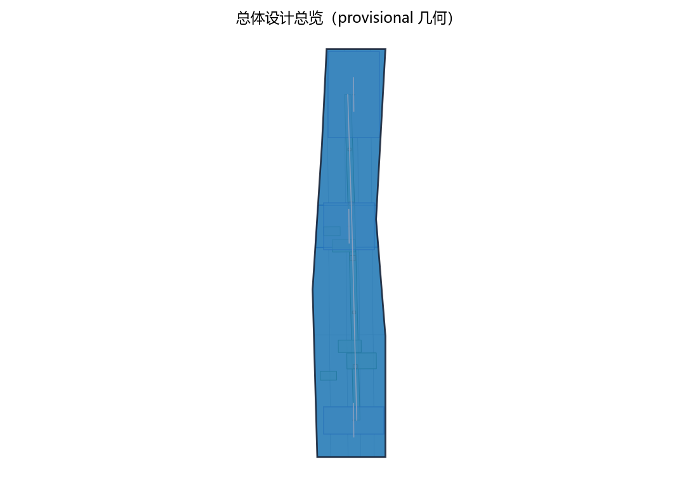
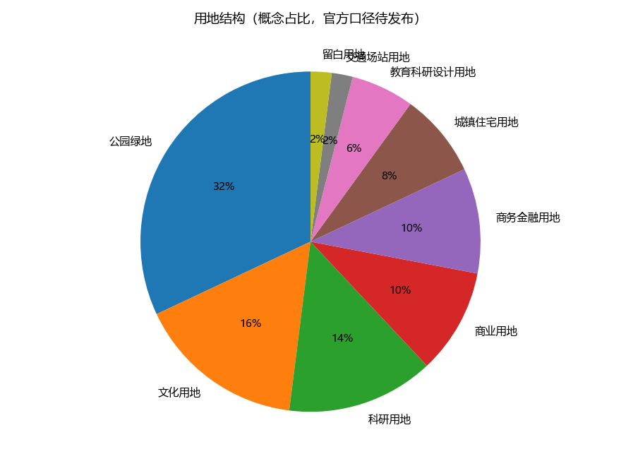
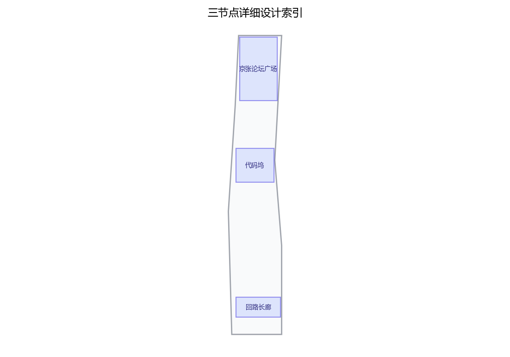
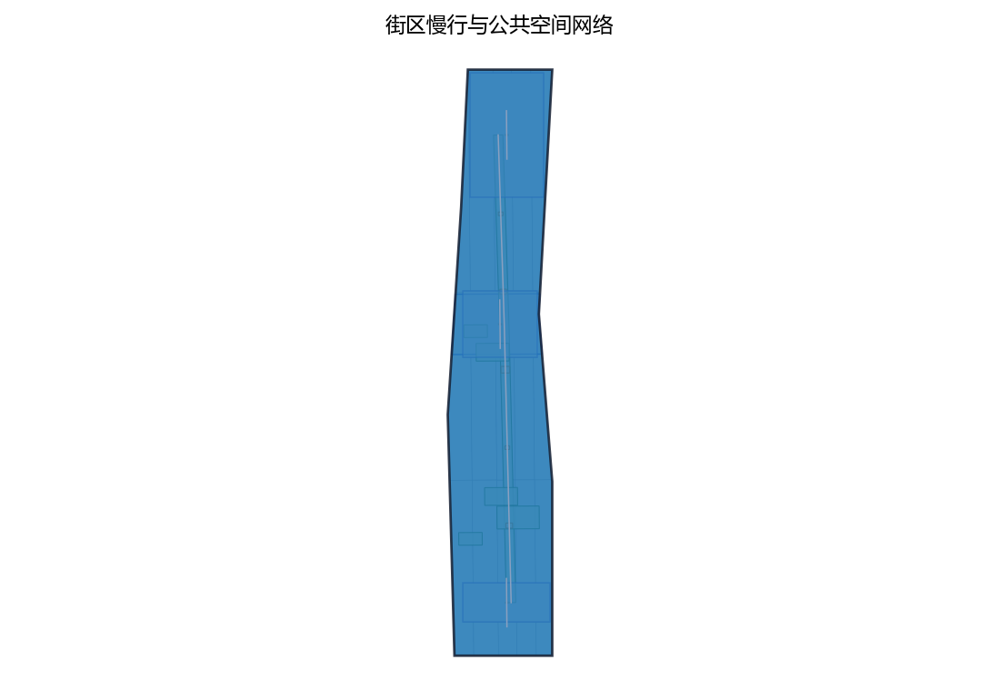
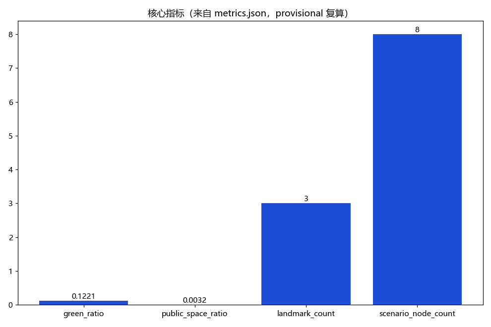

## 方案主名称建议

- 主名称：「京张AI接力带」（英文建议名 RELAY·JZ）。"接力"取三层意涵：百年京张的铁路接力叙事、活动节点间的内容接力、开发者社群的世代接力，与"活动带"的空间意象一致。
- 备选名称：「百年京张·新脉冲」（强调活动如脉冲沿绿带传递）、「轨道上的客厅」（强调沿线开放共享）。
- 说明：均为原创概念命名，不包含任何真实机构名称或商标；如与既有标识雷同属巧合，正式使用前需做商标与在先权利检索。

---

## 设计依据与资料清单
资料清单所列现场踏勘记录、公开史料与通则规范等均为概念工作依据清单，并非本包已获取的数据；本包实际使用的全部数据见 sources.json，未获取项已在风险与缺失数据说明中如实标注。

设计依据分三类：其一，现场踏勘记录与沿线空间调研草图、照片；其二，公开资料，包括京张铁路历史与遗址公园公开材料、沿线高校与科创园区公开信息、北京城市总体规划及分区规划公开口径、相关控规与专项规划公开文件、历届相关活动公开报道；其三，通则性规范，如城市设计、无障碍、会展安全等通用要求。全部资料按"公开／内部"分类归档并标注来源与获取时间，供逐条核验与后续深化。

> **证据锚点**：[source:DATA-SRC-OFFICIAL-ANNOUNCEMENT-20260509]、[source:DATA-SRC-AGENT-TASKBOOK-20260518]（组织方公告与任务书为文本口径依据）。

## 三层范围工作框架
三层成果逐级传导：统筹研究输出的活动带与沿线片区协同判断约束总体设计，总体设计校核的用地兼容、绿带连续性与活动设施落位再落实到节点详设；每层均保留与任务书对应章节的机器可读证据锚点，便于评审对照。

采用三层嵌套的工作框架：统筹研究范围，研究活动带与沿线科创片区、高校及国际化住区的产业与城市协同；总体设计范围，以控规深度开展活动带总体城市设计；重点区域详细设计，聚焦「京张论坛广场」「代码坞」「回路长廊」三个原创节点。三层关系为"研究层定格局、总体层定骨架、节点层定体验"，成果分层落图、逐级校核，确保全球AI创新活动体系在空间上可承载、可落地、可长期运营。

> **证据锚点**：[source:DATA-SRC-AGENT-TASKBOOK-20260518]（三层范围划分依据任务书官方文本口径）。

## 统筹研究范围产业与未来城市研究
产业研究识别活动带的「时脉冲」效应：以年度活动将开发者参访、住宿、消费与合作需求有序导入沿线公共服务与产业空间，形成「活动带—片区—社区」三级联动结构，推动从办活动走向经营城市创新生态；未来城市研究仅作方向性预判，不构成对用地与投资的承诺。

研究活动带与沿线科创片区、高校、国际化住区的协同机制：以年度活动为"时脉冲"，将开发者参访、住宿、消费、合作等需求有序导入沿线片区的公共服务与产业空间；高校提供知识与人才腹地，软件园与科创园区提供企业与场景，国际化住区提供中长住配套；研究轨道接驳、共享实验室、社区共创等联动方式，形成"活动带—片区—社区"三级联动结构，避免活动孤岛化，推动从"办活动"走向"经营城市创新生态"。

> **证据锚点**：[source:DATA-SRC-PROVISIONAL-BOUNDARIES-20260605]（边界为 provisional，研究范围仅作概念示意）。

## 总体设计范围城市更新与控规深度城市设计
总体设计强调「以遗留绿带为骨架的组织模式」：依托京张铁路原线遗留绿带作为连续骨架串联沿线节点，重点研究日常状态与会期状态两种空间形态的转换机制，使同一片场地平时可休闲、会期可办赛办展；对控规指标只做校核建议，不预设数值结论。

总体设计概念为"以遗留绿带为骨架的组织模式"：依托京张铁路原线遗留绿带作为连续骨架，串联沿线节点与场所，绿带既是慢行与景观主轴，也是活动动线与人流组织的缓冲空间。按控规深度落实用地兼容规则、街道断面、绿带连续性与活动设施落位导则，重点研究"日常状态"与"会期状态"两种空间形态的转换机制，使同一片场地在平时可休闲、会期可办赛办展，形成可持续的城市更新与活动承载框架。

> **证据锚点**：[source:DATA-SRC-MOHURD-CONTROL-DETAILED-PLANNING]、[source:DATA-SRC-PROVISIONAL-BOUNDARIES-20260605]。

## 重点区域详细设计
三节点的设施选址均为概念点位，须经规划、文保与主管部门评估及专业审查后重新落位；节点间的绿带动线构成完整活动叙事，详细平面与剖面以图册与 geometry 层表达。
其一，「京张论坛广场」：以老站台、站牌等铁路意象为母题的开放广场，设可收纳式看台与户外主舞台，承载年度大会开闭幕、新品发布与公共演讲；其二，「代码坞」：开发者营地式空间，日间为共享工位与工作坊，夜间切换为黑客马拉松与共创基地，采用模块化搭建、可快速拆装；其三，「回路长廊」：沿绿带展开的线性路演走廊，设可变换展位与微型剧场，承办项目路演、开源市集，其闭环动线隐喻"回路"：练—赛—展—投的循环。

> **证据锚点**：[data:PACKAGE-GEOMETRY]（三节点示意多边形来自本包 geometry/key_areas.geojson）。

## AI 创新生态、人才画像与 AI+ 场景
活动智能排期与多语同传辅助为主干场景，每处均配置人工服务兜底；代码竞赛AI陪跑、人流匿名热力与无障碍会务指引为支撑场景；仅处理匿名聚合数据、关键决策人工复核双保险，不设过度监控。
以年度活动为引擎，聚合开发者、高校、企业、投资机构与开源社区，形成长期运营的社群生态。AI+场景共五项，均遵循"匿名聚合＋人工复核"原则，禁止过度监控，数据仅用于会务改善并明示告知：一、活动智能排期与报名聚合，统一多活动的档期与入口；二、多语实时字幕与同传辅助，降低国际参会门槛；三、开发者代码竞赛AI陪跑，提供匿名化的代码提示与赛后复盘；四、活动人流匿名热力与安全调度，仅产出聚合密度用于疏导预案；五、无障碍多模态会务指引，覆盖视听障碍与轮椅动线。

> **证据锚点**：[source:DATA-SRC-GENERATIVE-AI-INTERIM-MEASURES]（AI 生成内容治理表述的参照依据）。

## 用地、建筑规模与拆改留方案
拆改留坚持留改拆并举：优先保留遗址绿带、历史价值站房与工业构筑物延续铁路记忆，低效厂房与园区建筑功能更新为活动、办公、展示与配套空间，拆除仅限经个案论证的零星危旧建筑；全部面积为概念口径，官方数据发布后复算。

遵循"留改拆并举"的概念口径，不预设数值：留，优先保留遗址绿带、具有历史价值的站房与工业构筑物，延续铁路记忆；改，对低效厂房与园区建筑进行功能更新，置换为活动、办公、展示与配套空间；拆，仅针对经论证确实存在安全隐患的零星危旧建筑，且以个案论证为准。用地兼容会议、展览、办公、商业与服务配套；建筑规模以现状实测与公开数据校核为概念级总量，具体数值与拆改结论留待控规阶段论证，本方案不给出结论。

> **证据锚点**：[source:DATA-SRC-MNR-LAND-USE-CLASSIFICATION-202311]（用地分类名称参照现行国标口径）。

## 交通、轨道、市政与公共服务设施
以交通慢行优先为核心组织交通概念机制：绿带连续慢行轴贯通沿线节点、衔接公共空间而非被车行割裂，大型活动交通以轨道交通＋接驳为主（接驳专线、预约班车与共享单车调度区），散场分时分区疏导；市政按日常＋会期两档负荷校核供电、给排水、通信与临时电源接口；公共服务配置移动卫生间、母婴室、医疗点、行李寄存等可迁移标准化会务服务单元，AI决策均设人工复核。

交通组织坚持慢行优先：绿带连续慢行轴贯通沿线节点，衔接公共空间而非被车行割裂。大型活动交通以轨道交通＋接驳为主：依托既有轨道交通站点组织活动接驳专线、预约班车与共享单车调度区，散场采用分时分区疏导，最大限度降低小汽车依赖。市政按"日常＋会期"两档负荷校核供电、给排水、通信与临时电源接口。公共服务配置移动卫生间、母婴室、医疗点、行李寄存等可迁移设施，形成标准化会务服务单元。

> **证据锚点**：[source:DATA-SRC-MOHURD-URBAN-DESIGN-MEASURES]（市政与慢行设计表述的方法参照）。

## 蓝绿空间、公共空间与城市风貌
构建「绿带为轴、节点公园为珠」的蓝绿公共空间体系：保留现状林带与场地肌理、结合雨水花园与透水铺装提升生态韧性；公共空间强调可转换性，广场、草坪与站台式场地可按需切换；临时设施采用模块化、可拆卸、可回收体系；风貌以道钉、轨枕、信号与机车符号等铁路工业记忆语汇克制使用。

构建"绿带为轴、节点公园为珠"的蓝绿公共空间体系，保留现状林带与场地肌理，结合雨水花园与透水铺装提升生态韧性。公共空间强调可转换性：广场、草坪与站台式场地可按需切换为会场、市集、露营与日常休闲空间。临时设施采用模块化、可拆卸、可回收体系，控制一次性搭建。风貌延续京张铁路的工业记忆语汇——道钉、轨枕、信号与机车符号等，克制使用、避免标语化包装，塑造识别度高且不喧哗的沿线特征。

> **证据锚点**：[source:DATA-SRC-MOHURD-URBAN-DESIGN-MEASURES]（蓝绿空间组织的方法参照）。

## 更新项目清单、实施政策与分期计划
三阶段项目清单（近期1-3年/中期3-5年/远期5-10年）为概念清单，规模与投资估算均为建议性表述；政策建议（活动临时审批简化、弹性业态准入、多元主体参与运营）均须依法依规论证，不构成政府或运营方承诺。

项目按"骨架—节点—配套"三类列项：骨架为绿带贯通与慢行完善，节点为三个原创活动场所，配套为接驳、市政与公共服务设施。分期：近期1—3年，贯通绿带、建设三个节点并启动年度活动体系；中期3—5年，推进节点周边功能更新与轨道接驳强化；远期5—10年，形成沿线片区整体联动。年度活动体系以三大品牌为核心：AI开发者大会、开源共创周、京张创新节，辅以月度常规社区活动。政策概念建议：活动临时审批简化、弹性业态准入、多元主体参与运营等，均须依法依规论证。

> **证据锚点**：[source:DATA-SRC-AGENT-TASKBOOK-20260518]（分期与实施条目对应任务书要求）。

## 指标体系、面积复算与合规矩阵
活动承载力、慢行可达性、绿带连续性、临时设施复用率、社区参与度五类概念指标体系进入 metrics.json；面积复算以官方文本口径为底，官方数据到位后整体复算并标注复算版本。

指标体系围绕五类构建：活动承载力、慢行可达性、绿带连续性、临时设施复用率、社区参与度，仅作概念框架，数值于控规阶段校核后确定。面积复算基于公开地形与现场调研进行概念级总量校核，明确标注"非审批依据"。合规矩阵对照上位规划、历史文化保护、生态与公共安全等要求，逐条列出"符合性判断—待核事项—责任阶段"，对信息不足项如实标注"待核"，保持结论开放，不越位下结论。

> **证据锚点**：[metric:green_ratio]、[metric:public_space_ratio]、[source:PACKAGE-GEOMETRY]。

## 风险、版权与合规说明
本方案为概念研究性设计，不构成行政审批依据，也不构成容积率、建筑高度、拆改留或工程可行性结论；风险已按活动与日常使用冲突、客流安全、业态短期化与AI过度监控观感四维度如实登记于 risk.json（应对原则：匿名聚合、最小必要、人工复核、事前公示预案）；引用公开资料均已标注来源并注明获取时间，图形、名称与文字为原创或公共领域素材，若与既有标识雷同属巧合；正式实施前须完成多部门联审、文物保护与安全评估。

主要风险：活动与日常使用冲突、客流安全、业态短期化、以及AI应用引发"过度监控"观感。应对原则：匿名聚合、最小必要、人工复核、事前公示预案。版权与合规：本方案为概念建议，未使用真实机构商标与内部数据；引用的公开资料均已标注来源并注明获取时间；图形、名称与文字为原创或公共领域素材，若与既有标识雷同属巧合。本方案不给出容积率、建筑高度、拆改留及工程可行性结论，一切以法定规划审批与主管部门意见为准。

> **证据锚点**：[source:DATA-SRC-OFFICIAL-ANNOUNCEMENT-20260509]（征集规则为权属与合规表述的依据）。

## 参考资料
参考资料以政府正式发布版本为准，按公开/内部分类存档并标注获取时间：京张铁路历史与遗址公园公开材料、沿线高校与科创园区公开信息、北京城市总体规划及分区规划公开口径、历届相关大会与开发者活动公开报道、无障碍与会展安全等通则规范、现场踏勘记录与自绘分析草图（本项目自行采集）；本包 sources.json 仅收录可查证条目，未虚构任何官方数据或链接。

公开资料类：京张铁路历史与遗址公园公开材料；沿线高校、软件园与科创园区公开信息；北京城市总体规划及分区规划公开口径；历届相关大会与开发者活动的公开报道；无障碍设计与会展安全等通则规范。内部资料类：现场踏勘记录、空间照片与自绘分析草图。以上资料均按"公开／内部"分类存档，标注获取时间与来源页，供复核与深化使用；因篇幅原因不逐条列出，完整清单随成果附件提供。

---

> **证据锚点**：[source:DATA-SRC-OFFICIAL-ANNOUNCEMENT-20260509]（本清单首条即组织方公开资料包）。

## 用户画像（5类）

1. **开发者与极客青年**（25—35岁）：黑客马拉松、代码竞赛与开源贡献主力，关注工位、通宵场地、网络质量与讨论空间。
2. **国际参会者与跨境开发者**：海外开发者、CTF选手与访学人员，需要多语会务、签证与接驳便利、无障碍支持。
3. **高校师生与科研人员**：沿线高校师生，参与学术论坛与技术工作坊，关注知识流动与实验室联动。
4. **企业创新团队与产业组织者**：AI企业、孵化器与投资机构，办会办展、路演对接，关注场地档期、标准化配套与长期合作。
5. **本地居民与城市游客**：周边社区居民与市民游客，日常使用绿带，节庆参与市集与嘉年华，需要低门槛、可亲近的参与方式。

## 国际案例（3—4个，仅作概念对标）

1. **美国奥斯汀 SXSW**：城市全域分散会场、年度节事驱动城市品牌与街区活化，临时设施体系成熟，会议与音乐节并行。
2. **德国柏林 Tech Open Air（TOA）**：开放场地、社群自组织与跨界内容编排，轻资产办会，场地复用率高。
3. **荷兰埃因霍温 Dutch Design Week**：旧工业区（Strijp-S）更新与年度设计周长期共生，展事成为片区更新的持续动力。
4. **西班牙巴塞罗那 MWC 与 22@创新区**：大型会展与城市更新片区协同，会展经济反哺创新区建设。

## 国内对标（3—4个，仅作概念参照）

1. **杭州云栖大会与云栖小镇**：大会品牌与小镇运营一体化，会期经济延伸为日常产业生态。
2. **上海世界人工智能大会（WAIC）**：城市级AI会展与会期城市氛围营造，展示与发布平台并重。
3. **乌镇世界互联网大会**：会址长期化、专业展馆与古镇空间融合的办会模式。
4. **深圳南山科技走廊**：园区化城市更新与创新活动载体连绵布局，活动串接多个科技节点。

---

说明：以上全部内容为概念建议，行文克制，未引用或编造任何官方统计数据；容积率、建筑高度、拆改留与工程可行性等事项均不预设结论，留待法定规划与专项论证阶段处理。
