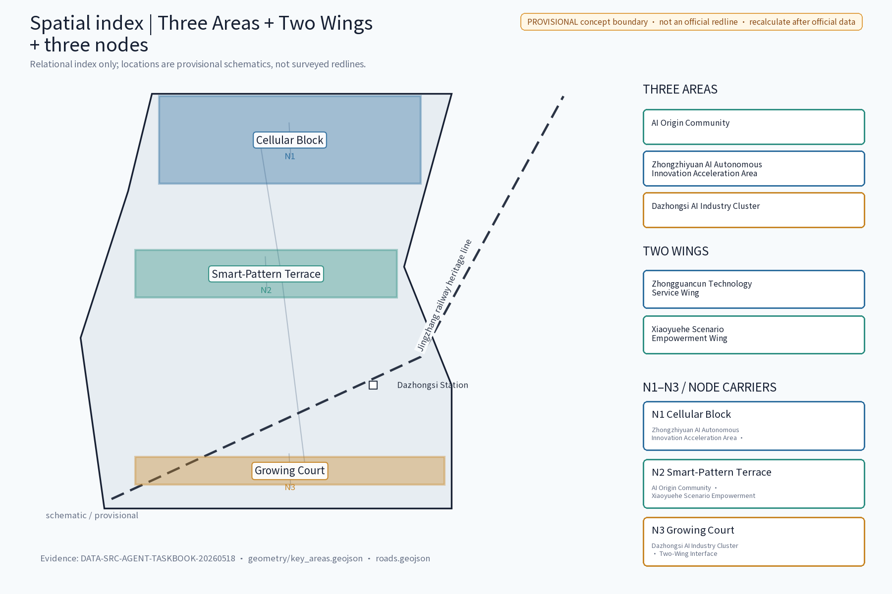
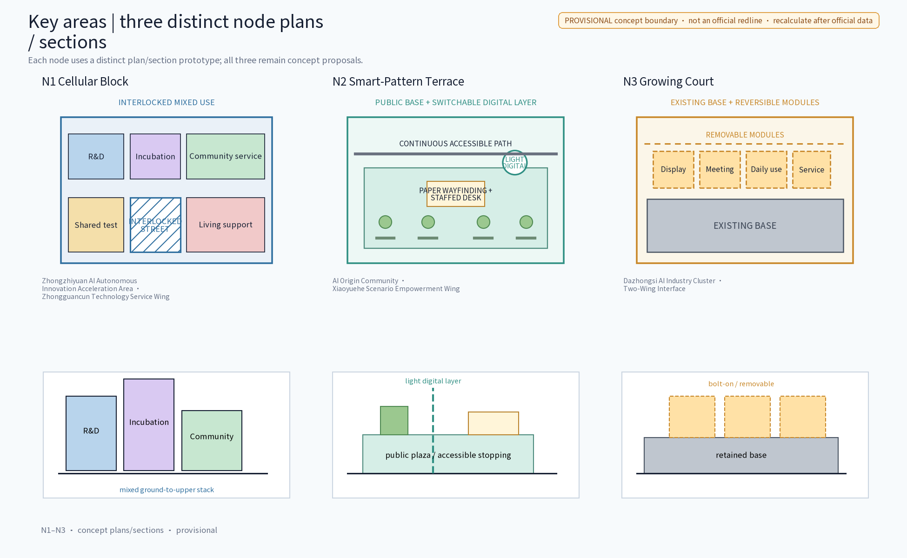
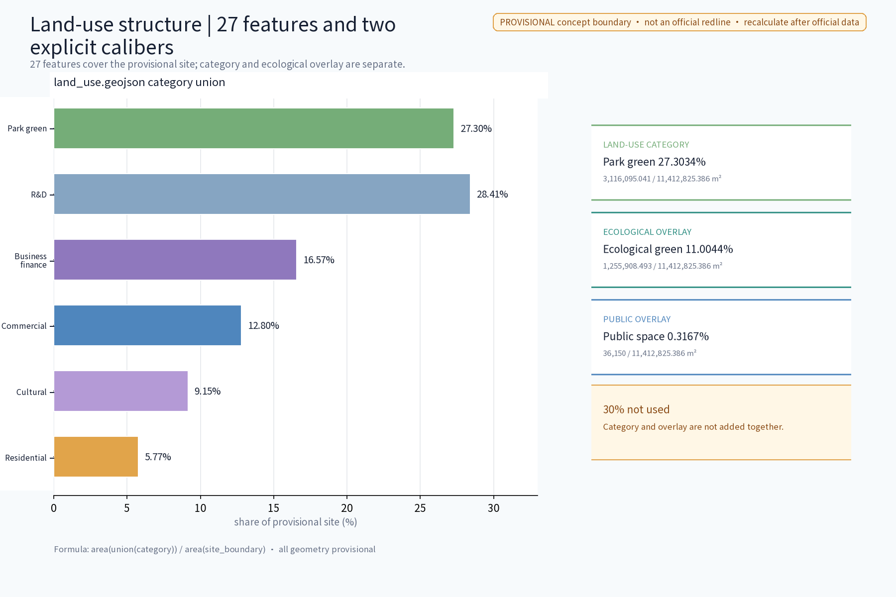
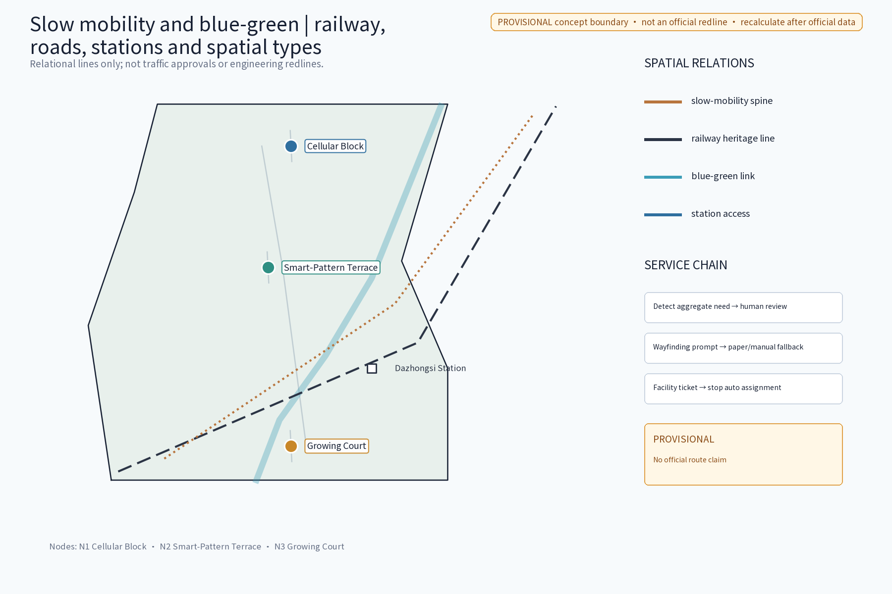
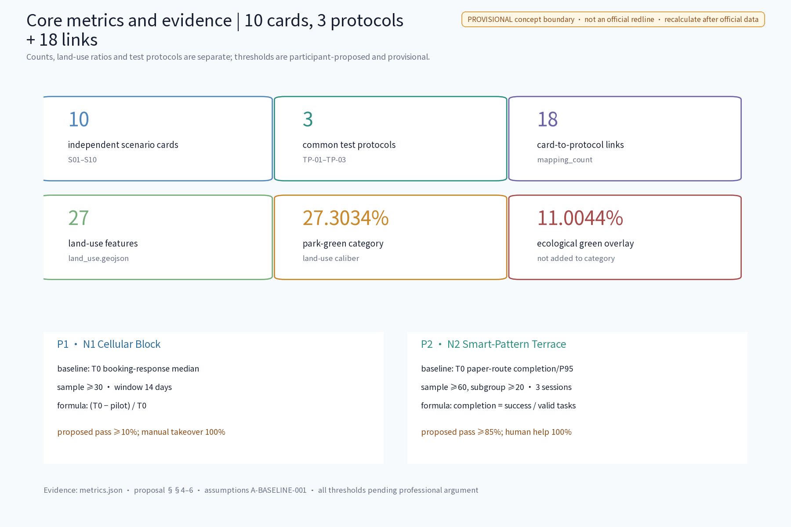

# CELL·JZ: AI-Native Urban Form for the Jingzhang Belt (Concept)

## Design Basis and Source List

This proposal keeps the core idea of a **Cellular Block, Hybrid Reality Platform and Reversible Growing Court**, using **CELL·JZ** as the concept system name. It is not a statutory plan, construction commitment, official endorsement or validated operating result. All boundaries, areas, scenario thresholds and operating parties are marked `provisional`, `participant-proposed` or `verification pending`.[source:DATA-SRC-OFFICIAL-ANNOUNCEMENT-20260509] [source:DATA-SRC-AGENT-TASKBOOK-20260518]

All figures are author-drawn concept diagrams. Roads, railway, stations, nodes and boundaries retain provisional status and do not replace official GIS, planning redlines or engineering drawings.

## Three-Level Scope Framework

The taskbook geography uses the five names below. CELL·JZ is a proposal system name and does not replace the taskbook names; the three nodes are design carriers and are not administrative-area names.

| Taskbook structure | Official label | Proposal role |
| :--- | :--- | :--- |
| Area 1 | AI Origin Community | Living experiments, public participation and low-barrier AI services |
| Area 2 | Zhongzhiyuan AI Autonomous Innovation Acceleration Area | Innovation incubation, mixed research and prototyping |
| Area 3 | Dazhongsi AI Industry Cluster | Industry translation, display, business and consumption interface |
| Wing 1 | Zhongguancun Technology Service Wing | Technology services, R&amp;D incubation and translation interface |
| Wing 2 | Xiaoyuehe Scenario Empowerment Wing | Everyday scenarios, green public space and experience feedback |

The three scales follow the taskbook: Coordinated Study Scope about 43.6 km²; Overall Design Scope about 11.4 km²; and Key Areas about 368.4 ha. The provisional polygon in this package recalculates to 11,412,825.386 m². Roads, railway, stations and place names are relational locators only, not redlines, property evidence or approved traffic organization.[metric:site_area_sqm] [data:PACKAGE-GEOMETRY]

## Coordinated Research Area: Industry and Future City Research

At the coordinated scale, the Centennial Jingzhang Culture Belt, Urban AI Living Experience Belt and AI Integrated Innovation Belt are research propositions. Innovation resources, talent services, cultural narrative and public interest are connected as mechanisms only; regional partners, investments, policies and targets remain pending verification and are not written as commitments.[source:DATA-SRC-AGENT-TASKBOOK-20260518]

The design intent at this scale is to turn the taskbook’s three positioning themes and five functional roles into a discussable flow of resources: the Zhongguancun Technology Service Wing organizes research, incubation and translation; the Xiaoyuehe Scenario Empowerment Wing receives resident experience, public-space use and feedback; and the AI Origin Community, Zhongzhiyuan AI Autonomous Innovation Acceleration Area and Dazhongsi AI Industry Cluster operate as different service contexts rather than three isolated projects. The current geometry supplies only an approximately 11.4 km² provisional site polygon and cannot infer the statutory boundary of the 43.6 km² coordinated study scope. The 27 land-use features, `site_area_sqm`, `green_ratio` and `public_space_ratio` in metrics support package recalculation only; they do not establish industrial scale or public investment. Official coordinates, partners, supply-chain data, talent demand and policy funding are not supplied, so this layer remains a research hypothesis and interface list until planning, industry, community and public-service parties add source, date, spatial scope and permission records.[source:DATA-SRC-OFFICIAL-ANNOUNCEMENT-20260509] [data:PACKAGE-GEOMETRY] [metric:site_area_sqm]

## Overall Design Area: Urban Renewal and Regulatory-Depth Urban Design

At the overall scale, the 11.4 km² provisional design scope is translated into a reviewable structure of task areas, wing interfaces, node carriers and operating responsibility. This package makes no FAR, height, road-redline, retain/modify/demolish or engineering conclusion; recalculate after official controls arrive.[data:PACKAGE-GEOMETRY] [metric:site_area_sqm]

The purpose of the overall design is not to settle an unapproved form, but to place the three scales, Three Areas and Two Wings, three nodes, six agent tasks and ten scenario cards on one traceable work surface. Spatial relations are carried by GeoJSON; metrics by `metrics.json`; and scenarios, protocols, owners and exit conditions by the narrative and `risk.json`. Site, roads, railway and stations indicate relationships only; they do not create conclusions about density, road sections, rail protection, fire safety, municipal capacity or ownership. The current site union of 11,412,825.386 m² is calculated from a provisional polygon; 27.3034% is the park-green land-use category, while 11.0044% is a separate ecological overlay and the two cannot be added. Official GIS/CAD, controls, road redlines, green/blue lines, rail protection, heritage, fire, utility, ownership and operating permissions are data gaps. Medium- and long-term actions therefore remain conditional gates that can proceed only after review.[data:PACKAGE-GEOMETRY] [metric:land_use_green_ratio] [metric:green_ratio]

## Key Detailed Design Areas

### Three Areas and Two Wings — three nodes — agent.1-agent.6

This is the package-wide crosswalk. The same node IDs and task-area labels are used in the prose, GeoJSON, figures, HTML and matrices.

| Node ID / original node | Primary task area | Wing interface | Spatial, scenario and operating role | Main agents |
| :--- | :--- | :--- | :--- | :--- |
| N1 Cellular Block | Zhongzhiyuan AI Autonomous Innovation Acceleration Area | Zhongguancun Technology Service Wing | Mixed research, incubation and community services; jointly reviewed by innovation-park operations and community services, parties pending verification | agent.1, agent.2, agent.3 |
| N2 Smart-Pattern Terrace | AI Origin Community | Xiaoyuehe Scenario Empowerment Wing | Public platform for residents, students and visitors; light digital layer uses aggregate prompts only and a staffed fallback | agent.1, agent.3, agent.4, agent.5 |
| N3 Growing Court | Dazhongsi AI Industry Cluster | Zhongguancun Technology Service Wing ↔ Xiaoyuehe Scenario Empowerment Wing | Existing-base setting for removable display, business and consumption modules; reviewed in tiers by industry, venue and public representatives | agent.1, agent.2, agent.4, agent.6 |

The three nodes are conceptual locations. `geometry/key_areas.geojson` carries `N1`, `N2`, `N3`, `task_area_en`, `wing_interface_en`, `agent_refs` and evidence fields. The polygons are provisional and cannot replace official GIS/CAD.[data:PACKAGE-GEOMETRY]

### Core form: three genuinely different spatial prototypes

### N1 Cellular Block: interlocked mixed functions

The Cellular Block is not a single park box. Housing support, research desks, incubation meetings, shared equipment and ground-floor community services interlock as small cells in one block. It serves research and prototyping by day while retaining community use in the evening. Compute, energy and data interfaces are directional concepts, not engineering capacities. Reversible components attach to existing interfaces first; failure returns to manual booking and paper wayfinding.

### N2 Smart-Pattern Terrace: public space with a light digital layer

The Smart-Pattern Terrace starts with continuous seating, shade, accessible stopping surfaces and legible paper wayfinding. A switchable layer adds booking prompts, environmental prompts and aggregate flow displays. It does not identify people or retain individual trajectories. If the digital layer is disabled, the terrace still works through a staffed desk, notice board and visible on-site guidance.

### N3 Growing Court: existing base with reversible modules

The Growing Court retains an identifiable existing building or site base and adds bolt-connected, removable canopies, movable display tables and light service cabinets over time. Modules can be moved, reduced or removed. This is not a demolition or engineering conclusion. Industry display, business meetings and everyday consumption switch by time period.

The three plan/section treatments are visible in `assets/figures/key-areas.png` and `assets/figures/key-areas.en.png`: N1 shows interlocked mixed use, N2 shows a public base plus light digital layer, and N3 shows an existing base plus removable modules rather than one repeated template.

## AI Innovation Ecosystem, User Personas and AI+ Scenarios

The package separates the counts: **10 independent scenario cards, 3 common test protocols and 18 scenario-to-protocol links**. `design_node_count=3` means the three original spatial nodes; `scenario_node_count=8` means the 3 landmarks plus 5 relational scenario locations in GeoJSON. Neither is the scenario-card count.[metric:scenario_card_count] [metric:common_test_protocol_count] [metric:mapping_count]

| Card | Node / task area | Independent scenario and spatial type | Applicable protocol(s) |
| :--- | :--- | :--- | :--- |
| S01 | N1 / Zhongzhiyuan Area | Shared prototype table; mixed research block | TP-01, TP-03 |
| S02 | N1 / Zhongzhiyuan Area | Incubation meeting pod; adaptable shared room | TP-01 |
| S03 | N1 / Zhongguancun Wing | Technology-service matching table; public ground interface | TP-02, TP-03 |
| S04 | N2 / AI Origin Community | Accessible walking prompt; public route | TP-02 |
| S05 | N2 / AI Origin Community | Community assembly and event scheduling; open platform | TP-01, TP-02 |
| S06 | N2 / Xiaoyuehe Wing | Outdoor comfort prompt; shaded stopping surface | TP-02, TP-03 |
| S07 | N2 / AI Origin Community | Paper plus digital wayfinding; entry node | TP-03 |
| S08 | N3 / Dazhongsi Cluster | Existing-base display cabinet; industry interface | TP-01, TP-03 |
| S09 | N3 / Dazhongsi Cluster | Business/consumption time switch; reversible service module | TP-01, TP-02, TP-03 |
| S10 | N3 / Two-Wing Interface | Facility inspection and human ticket; street/court edge | TP-02, TP-03 |

Each card uses anonymous aggregates, public fields or authorized summary fields only. No face, biometric or individual-trajectory collection is proposed. AI outputs are prompts only; safety, accessibility, content publication and resource decisions receive human review. Users can choose the manual/paper route and switch off the digital layer.

## Metrics, Area Recalculation and Compliance Matrix

The three protocols and two near-term pilots bind scenarios, data, owners, thresholds and failure exits to <code>metrics.json</code>, <code>assumptions.json</code>, <code>risk.json</code> and the compliance matrix. Participant-proposed values are not measured results.

### Three common test protocols and two near-term pilots

The following are reproducible concept-level protocols. Every number is `participant-proposed`, `provisional` and **pending professional argument**; none is a measured or validated result and none is official. A T0 baseline must be collected by the owner under the same definition. If sample or permission conditions fail, the pilot cannot claim passage.

| Protocol | Baseline / sample / window | Formula and numeric threshold | Data source and owner | Acceptance / failure exit |
| :--- | :--- | :--- | :--- | :--- |
| TP-01 Slow movement and arrival | T0 median arrival time on the same route; ≥30 anonymous accompanied trials including ≥6 wheelchair/stroller trials; 2 weekdays + 1 weekend, morning and evening windows | `improvement=(baseline-median_test)/baseline`; proposed pass ≥10%, with no priority-group P95 worsening >5% | Manual timing sheets and route logs; mobility and accessibility lead, to be assigned | Two windows below 10% or P95 worsening closes AI advice, restores human guidance and triggers review |
| TP-02 Public space and access | T0 paper-wayfinding task completion; ≥60 person-trials including at least 20 older, mobility-limited or low-digital-literacy participants; 3 comparable sessions | `completion_rate=completed_tasks/valid_tasks`; proposed pass ≥85%, misleading rate ≤5% | De-identified task logs, observation and paper feedback; public-realm/accessibility lead, to be assigned | Completion <85%, misleading rate >5% or any safety event disables digital prompts and keeps paper plus staff service |
| TP-03 Tickets and human fallback | T0 median response time for existing facility tickets; ≥30 anonymous simulated or authorized real tickets; 14 consecutive days | `timely_close=closed_within_24h/valid_tickets`; proposed pass ≥90%, false-alert rate ≤10% | Authorized ticket ledger and human-review log; venue operations lead, pending verification | Two days below 90%, false alerts >10% or failed handover stops automatic assignment and switches to manual logging |

### Near-term pilot P1: N1 Cellular Block shared prototype table (S01)

`baseline`: before the pilot, record the median booking-response time for two weekdays and one weekend, with at least 30 valid bookings; `window`: 14 consecutive days summarized daily; `formula`: `(T0_median - pilot_median) / T0_median`; `participant-proposed` acceptance is ≥10% response-time improvement, cancellation/mismatch ≤5% and 100% response to manual takeover requests. Data comes from authorized booking logs and paper registration, without individual profiling. The owner is the innovation-park operations lead plus community-services lead, both pending verification. Any authorization, fact, privacy or queue-safety failure disables matching prompts and returns to manual scheduling and paper registration.

### Near-term pilot P2: N2 Smart-Pattern Terrace dual-channel wayfinding (S04/S07)

`baseline`: T0 paper-map success rate and P95 time for the same accessible-route task; `sample`: at least 60 person-trials, with at least 20 older, mobility-limited or low-digital-literacy participants; `window`: 3 field sessions, covering both weekday and weekend; `formula`: `completion_rate=successes/valid_tasks`, `p95_change=(pilot_P95-baseline_P95)/baseline_P95`; `participant-proposed` acceptance is ≥85% completion, P95 not worsening by >5% and 100% response to human help. Data comes from anonymous task records, paper returns and observation. The owner is the public-realm/accessibility lead, to be assigned. If a threshold fails, guidance misleads or staff cannot take over, digital prompts go offline and paper maps, the staffed desk and visible help signs remain.

## Land Use, Building Scale and Retain/Modify/Demolish Strategy

`geometry/land_use.geojson` contains **27 features**. Its six land-use unions cover the provisional site polygon, totaling 11,412,825.386 m². Under the formal land-use category caliber, park green land is 3,116,095.041 m² / site area = **27.3034%**; this replaces the undefined “30%” concept percentage.[metric:land_use_feature_count] [metric:land_use_green_ratio]

The `geometry/green_space.geojson` ecological overlay is 1,255,908.493 m² / site area = **11.0044%**. It is not a land-use category and is not added to 27.3034%. The public-space overlay is 36,150 m² / site area = 0.3167%. All are provisional structural calculations and will be recomputed after official boundary, ownership and classification data arrive; the same labels appear in metrics, figures, HTML and PDFs.[metric:green_ratio] [metric:public_space_ratio]

## Transport, Rail, Municipal and Public-Service Facilities

The railway heritage line, roads, rail stations and walking network shown in `site-overview` and `mobility-bluegreen` are relational clues: railway/stations explain continuity and interchange direction, roads explain slow movement and service access, and spatial types explain node function. They are not surveys, traffic approvals or engineering redlines. Paper wayfinding, a staffed desk and manual tickets remain public-service fallbacks when the digital layer fails.

The implementation intent here is a sequence of “relational clue — field verification — human service”, not treating a diagram line as a transport or municipal design. The walking chain must verify pedestrian continuity, accessible gradients, crossing safety, night lighting, railway and rail-protection boundaries and public-service access on site. Stations are interchange prompts only; names and locations still require cross-checking against dated public sources. The three participant-proposed protocol thresholds can test service experience but cannot replace transport engineering, fire, rail, utility or accessibility review. Roads, railway, stations and public-space layers use the same provisional site as a relational base; if the official boundary changes, route coverage, public-space ratio and node connections must be recalculated and the discrepancy recorded in figures and matrices. If a digital prompt fails, misleads or triggers a safety event, stop automated advice and use paper maps, visible help signs, a staffed desk and manual tickets. This is the minimum service boundary for people with different digital access, limited mobility and temporary visitor needs.[data:PACKAGE-GEOMETRY] [metric:public_space_ratio] [source:DATA-SRC-MOHURD-URBAN-DESIGN-MEASURES]

## Blue-Green Space, Public Space and Urban Character

Public-space expression across the three nodes prioritizes accessible stopping, blue-green continuity, paper wayfinding and reversible fixtures; diagnostic language can become an existing-condition claim only after itemized evidence is obtained.

The blue-green and public-space intent is a public base that can be occupied, recognized and reverted: N2 Smart-Pattern Terrace prioritizes shade, seating, accessible stopping, paper wayfinding and a switchable light digital layer; N3 Growing Court limits intrusion into the existing setting through a retained base and removable modules; N1 Cellular Block checks public access where shared prototyping, community services and research interfaces meet. The current 1,255,908.493 m² / site union = 11.0044% is only the `green_space` overlay, and 36,150 m² / site union = 0.3167% is only the `public_space` overlay; neither is a statutory green ratio, open-space ratio or design-compliance result. Vegetation, drainage, thermal comfort, accessibility, lighting, heritage and ownership records have not been itemized. At T0, professionals must resurvey them under one boundary, classification and date and leave uncertainties in `assumptions` and `risk`. If a continuous safe route or human service cannot be provided, the digital layer and reversible fixtures cannot pass the next gate; paper and human routes must be restored first.[metric:green_ratio] [metric:public_space_ratio] [source:DATA-SRC-MOHURD-URBAN-DESIGN-MEASURES]

### Three-node diagnosis and evidence boundary

“Industrial heritage”, “community severance”, “aging facilities” and “vacant warehouses” do not have itemized site surveys, protection registers or ownership archives in this package. Unless supported by the announcement or taskbook, they are written only as **verification-pending design assumptions / concept scenarios**, not existing conditions. A T0 review by planning, heritage, transport, ownership and community representatives must add a `source_id`, date, spatial scope and permitted survey record before any item can be upgraded. The figures use “existing base”, “relational severance” and “facility renewal need” as design language, not as proven facts.

## Update Projects, Implementation Policy and Phasing Plan

| Agent | Deliverable and package evidence |
| :--- | :--- |
| agent.1 | Belt concept, Three Areas and Two Wings crosswalk, three nodes and working scales; `proposal.md §§1-3`, `site-overview`, `key-areas` |
| agent.2 | AI-native spatial/infrastructure interfaces and N1 pilot; `proposal.md §§4-6`, `metrics.json`, `land-use-structure` |
| agent.3 | Ten cards, three protocols, aggregate-only processing and human fallback; `proposal.md §§4-5`, `metrics-evidence`, HTML/visual |
| agent.4 | N2 public space, N3 reversible modules and inclusive routes; `proposal.md §§3,5`, `key-areas`, `mobility-bluegreen` |
| agent.5 | Jingzhang heritage, Zhongguancun service and AI-culture bilingual narrative; `proposal.md §§7,9`, `sources.json`, English deliverables |
| agent.6 | Phasing, events, operating responsibility, exit and human takeover; `proposal.md §8`, `risk.json`, matrices |

Near term (1–3 years) is limited to reversible, low-load, human-takeover-ready P1/P2 pilots. Medium term (3–5 years) depends on official boundary, ownership, transport, fire, heritage and data-permission checks. Long term (5–10 years) depends on those checks and pilot results. Every phase has stop, rollback, paper replacement and human service entry points.[source:DATA-SRC-AGENT-TASKBOOK-20260518] [data:PACKAGE-GEOMETRY] [metric:common_test_protocol_count]

### Eight case references: mechanism comparison with traceable source IDs

Eight international and domestic cases are individually registered in `sources.json`. The case table uses no third-party images with unconfirmed reuse rights; all package figures are author-drawn concept diagrams. Each case currently has `review_status=needs_human_verification` and `usable_for_formal=no`; a human must verify the page, publication date, license and reuse boundary before formal use.

| Case | source_id | Transferable mechanism |
| :--- | :--- | :--- |
| New York High Line | CASE-INT-HIGH-LINE | Linear heritage public space and phased operations |
| Seoul Seoullo 7017 | CASE-INT-SEOULLO-7017 | Station-side pedestrian stitching and elevated public layer |
| Paris Promenade Plantée | CASE-INT-PROMENADE-PLANTEE | Railway walking continuity and planted overlap |
| Chicago 606 | CASE-INT-CHICAGO-606 | Multi-community connection and activity operations |
| Beijing Shougang Park | CASE-CN-SHOUGANG-PARK | Existing industry translated into innovation and public space |
| Shanghai West Bund | CASE-CN-WEST-BUND | Industrial waterfront, culture and public interface |
| Shenzhen Dasha River Ecological Corridor | CASE-CN-DASHA-RIVER | Linear blue-green corridor and community connection |
| Chengdu Mengzhuiwan | CASE-CN-MENGZHUIWAN | Small-scale incremental renewal and everyday operations |

Cases do not prove CELL·JZ technical or policy feasibility and do not imply partnership, permission, performance transfer or investment commitment.

## Risk, Rights and Compliance Statement

The full ledger is `report/copyright_statement.md`. It covers the proposal name/logo, font, pictures/maps, data, code and generation method, date, URL, license, allowed/prohibited use and verification-pending fields. `CELL·JZ`, Cellular Block, Smart-Pattern Terrace and Growing Court are original concept names; CELL·JZ is not claimed as an official brand. Figures are drawn by the author with local Noto Sans SC and Matplotlib/ReportLab. Cases are text-only mechanism references; no third-party case image is embedded.[source:DATA-SRC-AGENT-TASKBOOK-20260518] [data:PACKAGE-GEOMETRY]

The boundary language describes evidence status and reuse boundaries; it does not claim that citation alone resolves rights. Any source, ownership, permission, privacy, heritage, fire, transport or data condition that is not verified must stay out of implementation publicity. A rights or safety failure removes the asset or service and keeps the manual alternative.

### Bilingual delivery and QA contract

Chinese and English narratives, five core figure pairs, A0, A3, report HTML and visual HTML use the same IDs, node names, metrics, warnings and evidence anchors. The English package contains no Chinese residual text; all four HTML pages embed a redistributable Noto Sans SC subset and use no network dependency. Release QA checks:

- figure titles, node names, task-area names, counts, ratios, thresholds and provisional warnings are item-by-item equivalent;
- `proposal.en.md` and `proposal.en.html` contain no Chinese residual text, tofu boxes, unresolved template tokens, broken words or overflow;
- PDFs are parseable, A0/A3 margins are safe, and figures have no overlap, crop, crowding or unreadably small body text;
- manifest, matrices, sources/rights ledger, `self_check.json` and actual file inventory agree;
- the four local gates test package form and structure only; they do not replace CocoSgt review or field/statutory validation.

## References

Task scope and names follow `DATA-SRC-OFFICIAL-ANNOUNCEMENT-20260509` and `DATA-SRC-AGENT-TASKBOOK-20260518`. Professional method references are `DATA-SRC-MOHURD-URBAN-DESIGN-MEASURES`, `DATA-SRC-MOHURD-CONTROL-DETAILED-PLANNING` and `DATA-SRC-MNR-LAND-USE-CLASSIFICATION-202311`. Each case uses its own `CASE-*` source ID; a single aggregate case label is not a substitute for traceability.

These sources serve different evidence duties: the announcement and taskbook support the project scope, task names, three positioning themes, five functions, Three Areas and Two Wings and agent.1-agent.6 requirements; professional references define planning, accessibility, land-use and evidence-expression boundaries; provisional geometry supports package recalculation only; and CASE-* records are mechanism references, not formal facts at present. Each source’s publication date, access date, review status, formal usability, allowed/prohibited uses and reuse boundary is recorded in `sources.json`. Unconfirmed case dates and permissions are not written as verified. Any new fact, image, map, model or dataset must first receive a source ID, date, spatial scope, generation method and rights fields before entering the narrative, figures, HTML or PDFs.[source:DATA-SRC-OFFICIAL-ANNOUNCEMENT-20260509] [source:DATA-SRC-AGENT-TASKBOOK-20260518] [data:PACKAGE-GEOMETRY]
