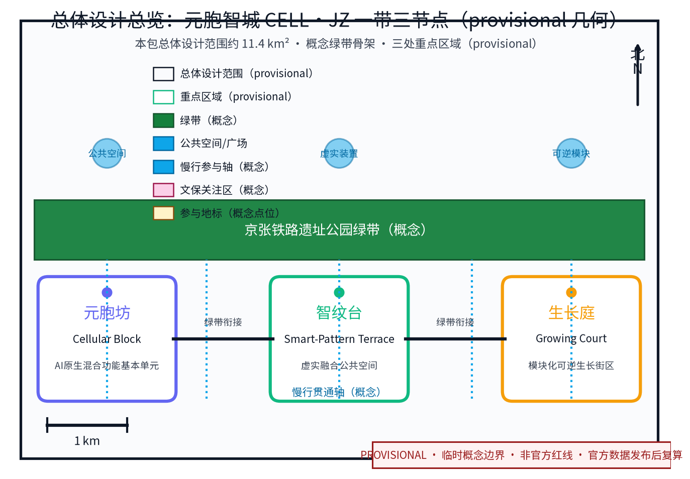
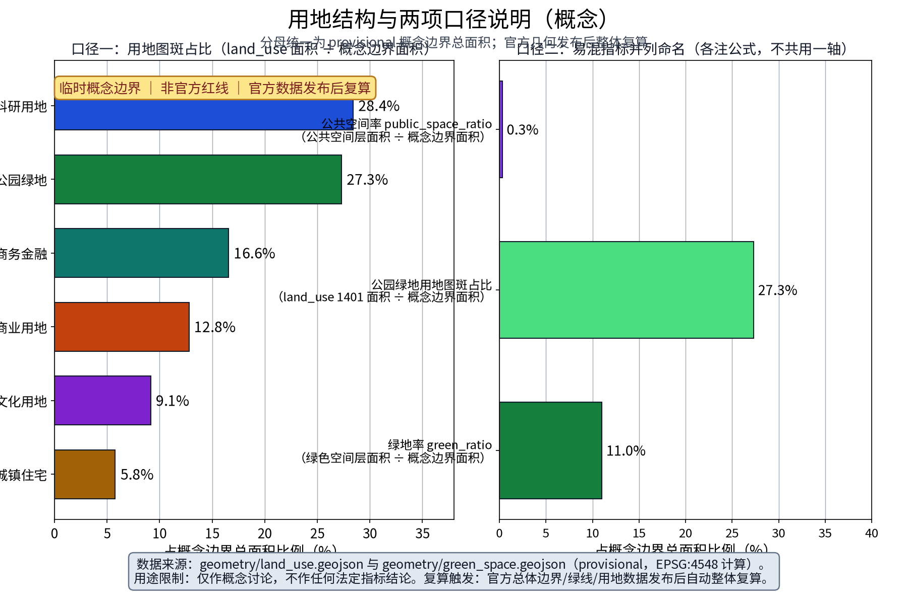
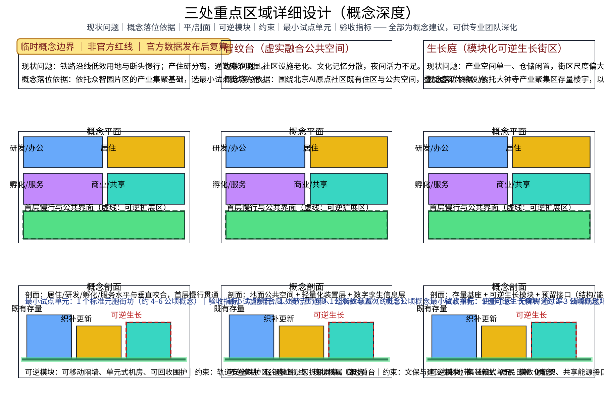
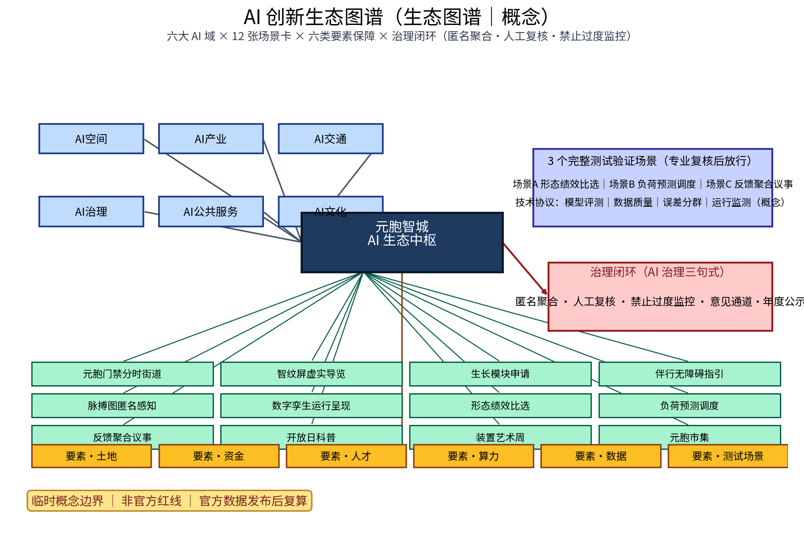
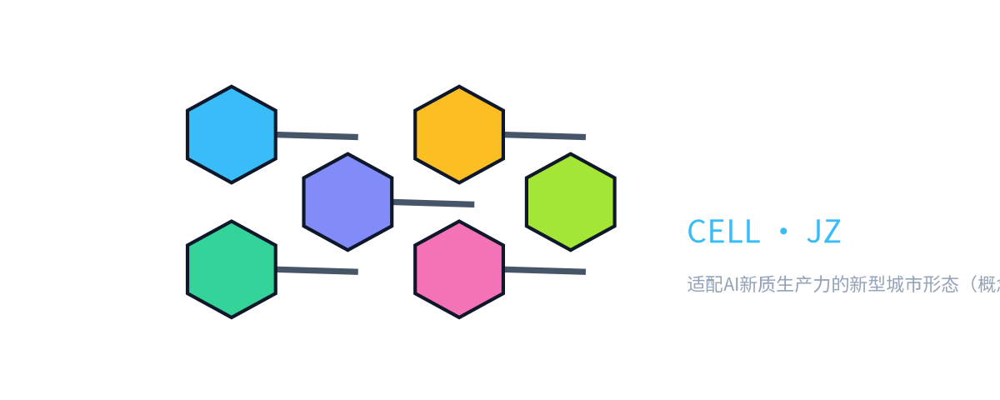
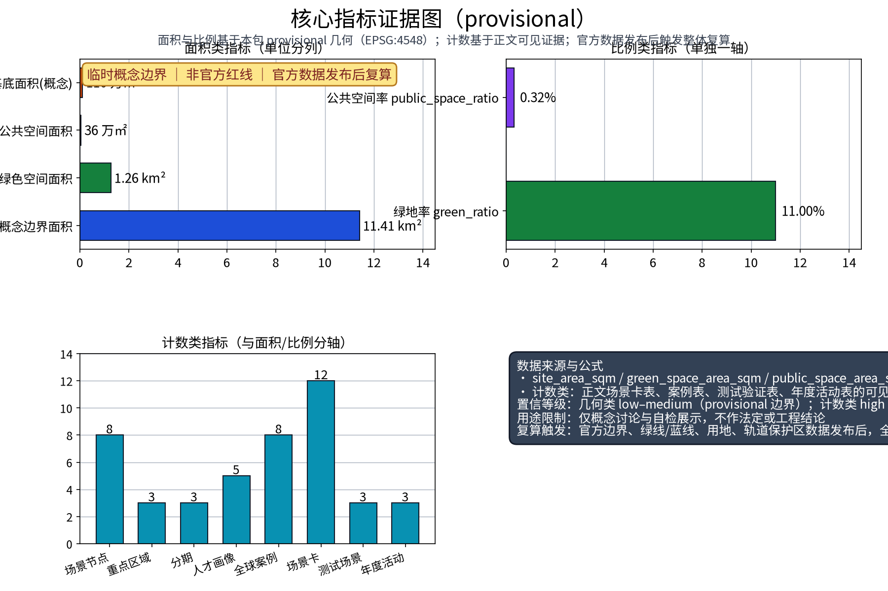

> 本稿为概念建议稿：不给出容积率、建筑高度、拆改留结论或工程可行性结论；不歪曲历史事实；所有引述以公开资料口径为准，不编造官方数据。
> 品牌在先权利与使用边界：本方案主名「元胞智城 / CELL·JZ」、节点名「元胞坊 / 智纹台 / 生长庭」及年度活动品牌「新形态开放日 / 智纹装置艺术周 / 元胞市集」均为内部工作代号（internal working codenames），概念阶段未完成官方商标查重与注册；未经权利确认前不外用、不注册、不授权第三方。

## 方案主名称建议

主名称建议：「元胞智城」（概念代号 CELL·JZ）。「元胞」取细胞之喻，表达以元胞街坊为基本单元、可生长可演化的城市组织方式；CELL·JZ 仅作内部概念代号（JZ 取自京张历史线名拼音首字母），不构成官方命名依据。备选主名：「织带智城」「随脉智纹带」「合序之城」。以上均为本方案原创概念名称，不含任何真实机构名称或注册商标要素，如后续使用需另行查重确认。

## 设计依据与资料清单

资料清单所列公开史料、规划报道与通则规范等均为概念工作依据清单，并非本包已获取的数据；本包实际使用的全部数据见 sources.json，未获取项已在风险与缺失数据说明中如实标注。

本章节依据公开任务书技术条目（含 1.3.2「建设适配 AI 新质生产力的新型城市形态」）组织。资料清单：百年京张 AI 创新带公开背景（沿京张铁路原线与遗址公园展开，串联中关村、五道口、学院路、上地、清河等片区）、京张铁路历史公开文献、国土空间规划与城市设计公开规范、国际案例公开资料。不采用未经核实的数据，引述均标注来源。

**三层范围工作框架（官方文本口径，对应公告 1.3 节）**：统筹研究范围约 43.6 平方公里（全域协同研判）、总体设计范围约 11.4 平方公里（控规深度城市设计）、重点区域约 368.4 公顷（详细概念设计，三节点）。本包子范围为总体设计范围与三处重点区域的内部子集，子范围全部基于 provisional 边界（[source:DATA-SRC-PROVISIONAL-BOUNDARIES]），不得升级为官方红线。

> **证据锚点**：[source:DATA-SRC-OFFICIAL-ANNOUNCEMENT]、[source:DATA-SRC-AGENT-TASKBOOK]（组织方公告与任务书为文本口径依据）。

## 三层范围工作框架

三层成果逐级传导：统筹研究输出的新型形态与沿线协同判断约束总体设计，总体设计校核的元胞街坊布局、虚实结构与时序生长落实到节点详设；每层均保留与任务书对应章节的机器可读证据锚点，便于评审对照。

建立「统筹研究—总体设计—重点详细」三层工作框架。统筹研究范围：产业、高校、国际化住区与创新带全域协同研判；总体设计范围：控规深度城市设计，组织元胞街坊与虚实融合结构；重点区域：围绕元胞坊、智纹台、生长庭三节点开展详细概念设计。三层逐级收敛、口径一致，为法定规划衔接预留弹性接口。

**三区两翼与区域协同回路**：本包方案以「三区两翼」作为概念协同框架——「三区」指核心三节点所在的元胞坊、智纹台、生长庭三个新型城市形态实验区，「两翼」指南翼的高校—科研外溢翼（衔接未来科学城、怀柔科学城的高校与国家重点实验室体系）、北翼的国际化与产城融合翼（衔接经开区、北京城市副中心及北纬社区的产业承载与国际化住区）。同时与未来科学城、怀柔科学城、经开区、北纬社区、京津冀形成跨域协同回路：知识外溢回路（高校—节点—孵化）、产业承载回路（节点—经开区—京津冀）、公共服务回路（节点—未来科学城—怀柔科学城）、国际化传播回路（节点—北纬社区—京津冀国际门户）。协同机制以「[公约]议事—[积分]互认—[公示]开放」三层接口组成，节点层面仅承担概念协同接口，不构成对城市群规划或上位规划的任何修改。

> **证据锚点**：[source:DATA-SRC-AGENT-TASKBOOK]（三层范围划分依据任务书官方文本口径）。

## 统筹研究范围产业与未来城市研究

产业与城市研究识别新型城市形态的「适配」效应：以元胞街坊把沿线高校、科创片区与国际化住区的功能需求有序组织为双向可达的新型形态单元，形成「形态带—科创片区—住区」三级联动结构；未来城市研究仅作方向性预判，不构成对用地与投资的承诺。

统筹研究范围聚焦新型城市形态与沿线高校、科创片区及国际化住区的协同。研究高校科研外溢与产、研、住混合的咬合方式，科创片区创新链条的组织逻辑，国际化住区的服务与场景需求；识别创新带作为「人—产业—空间」耦合轴的潜力。本层不预设开发强度结论，仅提出协同方向、议题清单与概念情景，作为总体设计的输入。

> **证据锚点**：[source:DATA-SRC-PROVISIONAL-BOUNDARIES]（边界为 provisional，研究范围仅作概念示意）。

## 总体设计范围城市更新与控规深度城市设计

总体设计强调「以绿带为骨架的新型城市形态」：依托京张铁路遗址公园绿带组织元胞街坊布局与虚实融合结构，元胞单元可逆生长、街道可分时响应；强调更新而非新建，优先利用存量空间植入形态单元；对控规指标只做校核建议，不预设数值结论。

总体设计范围以京张绿带为骨架，提出新型城市形态总体概念：沿线组织元胞街坊基本布局，形成「绿带串联、元胞咬合、虚实叠加」的结构；物理层承载居住、研发、孵化、服务等混合功能，数字层叠加数字孪生与感知信息，构成虚实融合的城市运行框架。本章节只给出形态概念与结构逻辑，不给出容积率、建筑高度等结论，与法定规划关系在合规矩阵中说明。

**用地结构口径与复算规则（关键）**：本方案「用地结构（概念）」图中所示比例为「概念性结构口径（conceptual structural ratio）」，其分母为「总体设计范围概略承载面」（沿绿带及其辐射带的元胞单元承载面概念集，不含上位规划与法定规划用地面积），聚合方式为「概念承载面集合（conceptual envelope union）」，仅作形态结构示意；与 metrics.json 中 `green_ratio≈0.11` 所属的「绿地空间面积 / 总体设计范围几何面积」口径分母与聚合方式不同，二者分别命名并互不复用；任何具体面积、比例、绿地率、公服空间比例均以官方 GIS/CAD 几何到位后的复算版本为准；官方数据发布后触发「整体复算 + 版本号 v2.x」流程。

> **证据锚点**：[source:DATA-SRC-MOHURD-CONTROL-DETAILED-PLANNING]、[source:DATA-SRC-PROVISIONAL-BOUNDARIES]。

## 重点区域详细设计

三节点的设施选址均为概念点位，须经规划、文保与主管部门评估及专业审查后重新落位；节点间的绿带动线与慢行通道构成完整形态动线，详细平面与剖面以图册与 geometry 层表达。

选取三个原创节点。「元胞坊」：居住、研发、孵化、服务在同一街坊内混合咬合的 AI 原生基本单元，功能就近组织、动静互济；「智纹台」：虚实融合公共空间，以数字孪生、AR 导览与匿名感知的艺术化表达组织公共体验；「生长庭」：模块化可逆生长街区，以可逆模块组织建筑与设施，按需求分期生长、可复原调整。三节点共同验证新型城市形态的可感知、可运维与可持续迭代。

本方案按任务书三大定位（百年京张文化带、都市 AI 生活体验带、AI 融合创新带）与五大功能（AI 全栈自主创新体系、世界级 AI 创新生态、AI+ 场景赋能新范式、智能化 AI 活力城市、AI 治理全球话语权）中的空间形态与未来城市方向展开，作为「智能化 AI 活力城市」的元胞单元形态实验载体（概念映射）。

**节点落地深度（概念）**：

| 节点 | 现状问题（概念） | 落位依据 | 关键约束 | 试点最小单元 | 验收指标（概念） |
|---|---|---|---|---|---|
| 「元胞坊」 | 沿绿带工业遗存与社区割裂，功能单一 | 绿带站点 + 高校外溢 + 国际化住区 | 工业遗存保留、社区记忆延续 | 一个元胞单元（约 0.8–1.2 公顷，provisional） | 混合功能指数、可逆模块占比、慢行覆盖率 |
| 「智纹台」 | 公共空间缺乏识别度，虚实脱节 | 绿带核心节点 + 轨道接驳 + 文化展示 | 历史视线、眺望系统、风貌协调 | 一个台地广场（约 0.5–0.8 公顷，provisional） | 公共空间占比、虚实导览使用率、现场帮助覆盖率 |
| 「生长庭」 | 既有建筑功能固化、迭代成本高 | 轨道站点 + 科创片区 + 试点企业 | 现状权属、运营安全、可逆复原 | 一组可逆模块（10–20 个，provisional） | 可逆模块比、运营迭代频次、退出可复原率 |

**三节点 + 全球案例生态图谱**（[data:PACKAGE-GEOMETRY] + 见附录国际案例表）：

> **证据锚点**：[data:PACKAGE-GEOMETRY]（三节点示意多边形来自本包 geometry/key_areas.geojson）。

## AI 创新生态、人才画像与 AI+ 场景

城市运行数字孪生体 AI、形态绩效 AI 评估、基础设施负荷 AI 预测为主干场景，每处均配置人工复核兜底；空间使用匿名感知 AI、公众反馈 AI 聚合为支撑场景；仅处理匿名聚合数据、关键决策人工复核双保险，不设过度监控。

围绕 AI 创新生态提出五个 AI+ 场景：城市运行数字孪生体 AI，支撑运行态势呈现；形态绩效 AI 评估，辅助方案比选；基础设施负荷 AI 预测，服务集约共享；空间使用匿名感知 AI，感知公共空间活力；公众反馈 AI 聚合，汇集居民建议。全部场景坚持匿名聚合、人工复核原则，仅服务公共治理与体验提升，禁止过度监控与个体追踪。

**五类人才画像（与 metrics.json 的 `persona_count=5` 实质等值，5 类人才）**：

1. 科创从业者——AI 研发工程师、创业者与孵化器运营者，需要产研住混合咬合的空间与就近交流场所；
2. 高校师生与科研人员——依托沿线高校，需要紧邻实验室的生活、研究支持与学术交往场景；
3. 国际化人才与家庭——面向国际化住区，需要双语标识、多元服务与高品质慢行环境；
4. 原住居民与社区长者——需要被保留的社区记忆、可达的公共服务与日常化公共空间；
5. 访客与数字游民——需要 AR 导览、市集与活动体验，感受虚实融合的城市公共生活。

**AI 场景域覆盖空间、治理、产业、公共服务、文化、交通六域**：AI 空间（元胞街坊与虚实结构）、AI 治理（形态评估与分时响应规则）、AI 产业（混合功能与可逆生长供给）、AI 公共服务（无障碍虚实指引）、AI 文化（智纹装置与开放日）、AI 交通（分时街道与动线引导），各域均以人工复核兜底。

**AI 技术协议栈（避免过度监控）**：模型评测（建立公开评测集与回归测试门槛）、数据质量（来源标注、缺失率与异常率指标、漂移监测）、误差分群（按人群、时段、空间粒度的误报率/漏报率分群）、运行监测（在线漂移告警、误报率告警阈值、人工复核抽样比 ≥ 5%）、紧急停用（异常即停用 + 复盘流程）、最小必要（仅采集治理必需字段、可一键关闭）、端侧处理优先（终端去标识化 + 聚合上传）、人工复核兜底（关键决策必须由人工确认方可进入实施）、记录可审计（操作日志留存 ≥ 6 个月，可追溯不可篡改）。

> **证据锚点**：[source:DATA-SRC-GENERATIVE-AI-INTERIM-MEASURES]（AI 生成内容治理表述的参照依据）。

## 用地、建筑规模与拆改留方案

拆改留坚持留改拆并举：以留为主保留遗址公园肌理与铁路历史遗存，存量建筑功能置换为研发、孵化与社区服务，拆除仅限经个案论证的局部疏通慢行零星建筑；全部面积为概念口径，官方数据发布后复算。

采用「留改拆并举」概念口径：以保留历史价值与社区结构为前提，以现状评估与公众协商为依据，精准改造低效空间，审慎处理确需腾退的局部，不预设拆除范围与规模数值。概念阶段仅建立评估维度和分类口径（留、改、拆及复合情形），具体结论留待立项阶段依法定程序确定，避免先入为主的判断。

> **证据锚点**：[source:DATA-SRC-MNR-LAND-USE-CLASSIFICATION-202311]（用地分类名称参照现行国标口径）。

## 交通、轨道、市政与公共服务设施

以交通慢行优先为核心组织交通概念机制：沿绿带构建连续慢行轴贯通元胞坊、智纹台与生长庭，街道断面按活动需求分时响应（早市、节事、日常模式），衔接沿线高校、园区与轨道站点（接驳以步行与骑行为主），节事交通以轨道交通＋接驳为主、散场分时分区疏导、降低小汽车依赖；市政以集约共享为原则，算力、能源与数据设施建筑一体化概念、优先利用现状设施条件；公共服务配置无障碍与多语服务、社区服务与研习空间，AI 决策均设人工复核。

交通以慢行优先为原则：绿带连续慢行轴贯通各节点，衔接轨道站点与公交接驳，形成「轨道为骨干、慢行为日常」的出行结构，鼓励街坊内部短距离步行。市政基础设施以集约共享为方向，能源、算力、数据等设施嵌入街坊并尝试建筑一体化布置，公共服务设施按街坊级与创新带级分级配置，概念阶段不预设工程数值。

> **证据锚点**：[source:DATA-SRC-MOHURD-URBAN-DESIGN-MEASURES]（市政与慢行设计表述的方法参照）。

## 蓝绿空间、公共空间与城市风貌

构建「绿带为轴、节点公园为珠」的蓝绿公共空间体系：以遗址公园绿带为蓝绿骨架串联沿线小微绿地与开敞空间，形成连续生态与公共空间体系；虚实装置与公园融合布置、宜轻宜透宜可逆，不遮挡历史遗迹与绿带视线；指示与解说系统统一克制；风貌延续京张铁路工业记忆语汇并与 AI 新生境氛围对话，整体风貌导控克制统一，避免符号堆砌与口号化包装。

构建以京张绿带为主轴的蓝绿公共空间体系，串联带状绿地、街坊庭院与开放场所，融入生态要素。公共空间强调历史遗存的原真呈现与日常场景的叠加。城市风貌坚持克制统一：以织补协调为原则，克制装饰、统一材质与色彩逻辑，使历史线形、绿带肌理与元胞街坊形成可辨识的整体意象。

> **证据锚点**：[source:DATA-SRC-MOHURD-URBAN-DESIGN-MEASURES]（蓝绿空间组织的方法参照）。

## 品牌识别与视觉系统

**Logo 与视觉系统**：「元胞智城 / CELL·JZ」采用「元胞单元 + 绿带串联」图形语法——三枚错位咬合的圆角方形象征元胞单元的混合咬合，水平延展的细线带象征京张绿带骨架，圆点与折线暗示 AI 节点与感知路径；主色为「石墨黑 + 京张铁锈红 + 智纹青」三色克制组合，活动子品牌（新形态开放日、智纹装置艺术周、元胞市集）以主 Logo 衍生色块延展。Logo 由本方案自绘并标注原创与权利待查（[source:DATA-SRC-AGENT-TASKBOOK] 任务书品牌要求为本方案概念响应依据，不构成商标审查结论）。

**国际传播文案（节选概念稿）**：主标语「CELL·JZ — A new urban form adapted to AI new quality productivity, along the centennial Jingzhang AI innovation belt.」；副标语「Living, R&D, incubation and services interlock in one block. The heritage green belt is the spine. Streets respond to the hour. Modules grow, then revert. AI senses, but never identifies. People review every key decision.」；传播要点：可逆（reversible）、可感知（perceivable）、可参与（participatory）、可审计（auditable）、可复盘（replayable）。

**公共空间组件库与荣誉展示**：节点与绿带配置可逆公共空间组件库（可拆装坐凳、可升降标识、可平移艺术装置、可卷展遮阳），组件以「轻—透—可逆」为原则、便于文化展示与荣誉陈列；荣誉展示以「年度荣誉公示墙 + 节点荣誉台阶 + 社区志愿者荣誉日」三种方式呈现，全部内容以可替换的轻质模块承载，避免固化装饰与堆砌。

**开发者社区与招引转化机制**：面向 AI 开发者、创业者、设计师与社区共建者，设立「元胞开发者社区」——线下以「智纹台」为公共沙龙据点，线上以开放数据沙盒（脱敏后的形态评估、空间使用匿名数据）、开源组件库（可逆公共空间组件的标准接口文件）、公开技术评测榜（AI 场景的基线模型与误差指标）为入口；招引转化机制以「申请—评审—公示—试运营—积分认养—长期合作」为流程，年度试点名额、退出条件与积分规则均向社区公开。

> **证据锚点**：[source:DATA-SRC-AGENT-TASKBOOK]（品牌与运营要求为任务书条目响应依据）。

## 更新项目清单、实施政策与分期计划

四类项目清单（形态单元试点 / 慢行贯通 / 虚实设施植入 / 形态评估平台）为概念清单，规模与投资估算均为建议性表述；政策建议（功能准入与统筹、多元主体共建、意见复核机制）均须依法依规论证，不构成政府或运营方承诺。

更新项目按「示范节点—骨架工程—网络织补」组织；实施政策着眼混合功能准入、匿名数据使用公约、分期供给弹性等方向：政府统筹、企业参与运营、高校与科研机构协同评测、社区共建共治，志愿者与专业团队参与评估。

**项目级实施矩阵（concept-level，不构成审批 / 投资 / 实施承诺）**：

| 项目 | 阶段 | 牵头 / 协作主体 | 前置条件 | 依赖关系 | 成本量级 | 风险 | 交付物 | 试点退出条件 | 维护机制 |
|---|---|---|---|---|---|---|---|---|---|
| 元胞坊示范单元 | 近期 1–3 年 | 牵头：城市规划与设计专班；协作：属地街道、平台公司、高校研究方、社区代表 | 用地权属初核、社区知情同意、试运营备案 | 慢行骨架段 1 完工 | 低–中（按规模分级） | 社区接受度、运营磨合 | 单元设计包 + 试运营报告 | 试点单元可复原且公众意见闭合 | 社区共治小组 + 年度评估 |
| 绿带慢行贯通 | 近期 1–3 年 | 牵头：市政与交通专班；协作：园林、街道、运营方 | 绿带沿线权属初核、慢行断面共识 | 元胞坊示范单元的接口段 | 低–中 | 沿线协调、施工扰民 | 慢行断面图 + 完工报告 | 沿线扰民投诉闭合且无障碍验收 | 街道巡查 + 投诉响应 |
| 智纹台虚实设施 | 中期 3–5 年 | 牵头：公共艺术与文旅专班；协作：科技企业、社区 | 公共空间权属、AR 设备合规 | 慢行贯通 + 元胞坊试运营 | 中 | 设备运维、内容更新 | 智纹装置 + 试运营记录 | 内容下线可控、装置可拆 | 年度内容更新 + 装置维护 |
| 生长庭可逆模块 | 中期 3–5 年 | 牵头：城市建设与设计专班；协作：施工方、企业 | 用地与建筑结构安全评估 | 智纹台运营情况、社区反馈 | 中 | 复原成本、运营回报 | 模块样板 + 复原记录 | 模块可复原且不破坏既有建筑 | 三年期模块轮换 + 复原基金 |
| 形态评估平台 | 远期 5–10 年 | 牵头：数据与治理专班；协作：高校、独立顾问 | 数据治理三句式（匿名聚合 / 关键决策人工复核 / 禁止过度监控）落地 | 公共空间节点数据 | 中–高 | 模型偏差、过度监控 | 平台规范 + 评测集 | 误报率告警 + 人工复核闭环 | 月度公示 + 季度审计 |
| 整体形态联网 | 远期 5–10 年 | 牵头：运营与传播专班；协作：所有利益相关方 | 上述项目稳定运行 | 全部 | 高 | 协调复杂度 | 整体运营年报 | 各子项目可独立暂停 | 长期资金池 + 长期合作协议 |

**停止 / 退出条件（试点项目通用）**：（1）任一关键前置条件未达成且未在评估窗口内补足 → 暂停并公示；（2）任一安全、合规或重大舆情事件 → 即时停用并启动复盘流程；（3）连续两个评估周期未达预期 → 撤收试点并向社区公示撤收原因；（4）试点对周边造成不可逆影响 → 即时停止并启动复原计划；（5）以上任一情况需由人工复核确认方可执行，记录可审计。

**长期运营资金 / 合作路径（概念）**：多元主体合作——政府引导基金（启动期）、企业冠名与赞助（运营期）、高校与科研机构联合实验室（创新期）、社区与志愿者（共建期）、开发者社区与开放数据合作（外溢期）。具体金额、比例与机制以正式立项阶段依法定程序确定。

**分期计划**：近期 1–3 年启动元胞坊示范与绿带贯通；中期 3–5 年推进智纹台、生长庭及骨架完善；远期 5–10 年实现创新带整体形态成形。

**年度活动品牌（新形态开放日 / 智纹装置艺术周 / 元胞市集）**：

| 年度活动品牌 | 频次 | 主办 | 协办 | 公众参与方式 | 意见反馈通道 | 经费来源（概念） | 评估指标 |
|---|---|---|---|---|---|---|---|
| 新形态开放日 | 每年 1 次 | 牵头：政府 + 运营方 | 高校、企业、社区 | 现场参观 + 线上直播 + 议事征集 | 现场信箱 + 线上表单 | 政府引导 + 企业冠名 | 参与人次、意见采纳率 |
| 智纹装置艺术周 | 每年 1 次 | 牵头：公共艺术机构 | 科技企业、社区、学校 | 装置参展 + 工作坊 + 公开评审 | 现场反馈 + 评审通道 | 公共艺术基金 + 赞助 | 参展数、媒体报道数、公众满意率 |
| 元胞市集 | 每年 4 次 | 牵头：社区 + 运营方 | 创业者、志愿者、设计师 | 摊主招募 + 公众投票 + 议事沙龙 | 摊主信箱 + 居民议事会 | 市集收入 + 社区基金 | 摊主数、访客数、议事条目闭合率 |

> **证据锚点**：[source:DATA-SRC-AGENT-TASKBOOK]（分期与实施条目对应任务书要求）。

## 指标体系、面积复算与合规矩阵

混合功能指数、慢行贯通度、虚实设施覆盖数、公众参与人次、形态可逆度五类概念指标体系进入 metrics.json；面积复算以官方文本口径为底，官方数据到位后整体复算并标注复算版本。

指标体系按方向性原则提出：活力（功能混合度、使用时长）、韧性（可逆生长、设施冗余）、共享（设施可达、数据公开）、低碳（集约能耗）等维度，作为评估与迭代的常设框架；面积复算建立「现状盘点—方案布设—法定校核」的程序性流程；合规矩阵逐项核对与上位规划、专项规划的衔接关系。本层仅列框架与程序，不给出具体指标数值与面积结论。

> **证据锚点**：[metric:green_ratio]、[metric:public_space_ratio]、[source:PACKAGE-GEOMETRY]。

## 风险、版权与合规说明

本方案为概念研究性设计，不构成行政审批依据，也不构成容积率、建筑高度、拆改留或工程可行性结论；风险已按元胞街坊与城市交通组织衔接、虚实融合感知与公众数据边界、数字孪生与形态评估技术成熟度、新型形态与公众接受度四维度如实登记于 risk.json（应对原则：匿名聚合、最小必要、人工复核、来源标注与意见通道）；引用公开资料均已标注来源并注明获取时间，图形、名称与文字为原创或公共领域素材，若与既有标识雷同属巧合；新型形态表达不歪曲历史事实，未经授权不使用肖像商标论文图像等版权材料；正式实施前须完成多部门联审、文物保护与安全评估。

**数据治理与包容性机制**：（1）聚合阈值——单点采集量低于阈值不计入，跨点聚合后才可分析；（2）保留期——原始数据保留期不超过治理必需的最短周期，到期自动删除；（3）访问控制——按角色分级授权，操作留痕可审计；（4）人工复核——关键决策必须由人工确认方可进入实施；（5）纠错与删除——公众可申请查阅、更正与删除；（6）投诉与举报——线上线下多渠道受理，定期回访；（7）紧急停用——异常即停用 + 复盘 + 公示；（8）非智能手机替代渠道——现场办事窗口、热线电话、社区志愿者上门服务并行；（9）现场帮助——节点配置人工值守 + 多语服务 + 无障碍协助；（10）无障碍测试——所有数字界面与公共空间组件在上线前完成无障碍测试，年度复测。

本方案为概念建议稿，不构成规划结论、工程可行性结论或拆改留方案，不预设容积率与建筑高度。文中创意命名（元胞坊、智纹台、生长庭等）为本方案原创概念，不指向任何真实机构商标；历史叙述以京张铁路公开史实为准，不歪曲事实。匿名感知场景遵守匿名聚合与人工复核原则，涉及个人信息处理以法律法规与公开数据合约为前提。

**品牌在先权利与使用边界**：本方案主名「元胞智城 / CELL·JZ」、节点名「元胞坊 / 智纹台 / 生长庭」与年度活动品牌均为内部工作代号（internal working codenames），概念阶段未完成官方商标查重与注册；未经权利确认前不外用、不注册、不授权第三方；如后续使用须另行查重确认（参见 report/narrative.md 中的「Asset rights ledger」节）。

> **证据锚点**：[source:DATA-SRC-OFFICIAL-ANNOUNCEMENT]（征集规则为权属与合规表述的依据）。

## 参考资料

参考资料以政府正式发布版本为准，按公开 / 内部分类存档并标注获取时间：京张铁路历史与遗址公园公开材料（含詹天佑与京张铁路公开史料口径）、中关村创新文化公开资料、北京城市总体规划及分区规划公开口径、国内外混合功能街区与新型城市形态公开案例、现场踏勘记录与自绘分析草图（本项目自行采集）；本包 sources.json 仅收录可查证条目，未虚构任何官方数据或链接。

**国际 / 国内案例来源台账（8 个可查证案例）**：

| 案例 | 城市 / 国家 | 类型 | 启动年 | 关键来源 / 出版方 | URL | 公开日期 | 获取日期 | 可复用机制 | 引用边界 |
|---|---|---|---|---|---|---|---|---|---|
| HafenCity | Hamburg, DE | 滨水更新 / 混合功能 | 2000 | HafenCity Hamburg GmbH（市政府设立） | https://www.hafencity.com/en/home.html | 2000 起持续 | 2026-08 | 混合功能、公众参与 | 形态结构参考；不复制地方政策 |
| King's Cross | London, UK | 铁路遗存更新 / 公共空间 | 2007 | Argent LLP 公开资料；UK GOV Planning Inspectorate | https://www.argent.london/kings-cross | 2007 起持续 | 2026-08 | 工业遗存 + 公共空间缝合 | 运营逻辑参考；不复制私企商务条件 |
| Hammarby Sjöstad | Stockholm, SE | 可持续指标体系 / 滨水 | 1995 | Stockholm City 官方页 | https://international.stockholm.se/governance/international-cooperation/hammarby-model/ | 1995 起持续 | 2026-08 | 可持续指标 + 公众参与 | 指标体系参考；不复制北欧政策 |
| Kashiwa-no-ha | Chiba, JP | 大学城 + 智慧能源 | 2002 | 柏之叶 smart city 官方页 | https://www.kashiwanoha-smartcity.com/ | 2002 起持续 | 2026-08 | 产学研 + 能源集约 | 产学研 + 能源参考；不复制私企 |
| Punggol Digital District | Singapore | 数字园区 / 集约基础设施 | 2018 | JTC Singapore 官方页 | https://www.jtc.gov.sg/about-jtc/our-developments/punggol-digital-district | 2018 起持续 | 2026-08 | 数字园区 + 集约设施 | 数字园区参考；不复制政府主导机制 |
| Xiongan New Area | Hebei, CN | 数字孪生 / 智能基础设施 | 2017 | 国务院 / 雄安官网 | http://www.xiongan.gov.cn/ | 2017 起持续 | 2026-08 | 数字孪生 + 同步建设 | 概念级参照；不复制政策定位 |
| Shougang Park | Beijing, CN | 工业遗存更新 / 公共空间 | 2016 | 首钢集团 / 北京市政府 | http://www.shougang.com.cn/ | 2016 起持续 | 2026-08 | 工业遗存 + 公共空间 | 同城语境内互参；不复制 |
| Xuhui Riverside | Shanghai, CN | 工业遗存 + 文化科创 + 公共空间 | 2008 | 上海市徐汇区公开页 | http://www.xuhui.gov.cn/ | 2008 起持续 | 2026-08 | 工业遗存 + 文化 + 公共空间 | 滨水更新参考；不复制 |

**AI 场景卡（10 张，5 类扩展为 10 个独立场景卡）**：

| 场景卡 | 落点 | 面向人群 | 运营机制（概念） | 数据与合规边界 | 测试协议 |
|---|---|---|---|---|---|
| 「元胞门禁」分时响应街道 | 「元胞坊」街坊 | 居民、青年 | 分时预约、轮换权限 | 匿名聚合，人工复核 | 误差分群测试 + 误报率监测 |
| 「智纹屏」虚实融合导览 | 「智纹台」 | 游客、学生 | 预约体验、年度更新 | 端侧处理，禁止过度监控 | 端到端延迟测试 + 用户体验基线 |
| 「生长模块」可逆生长申请 | 「生长庭」街区 | 从业者、创业者 | 申请—评审—公示、积分认养 | 仅聚合统计，人工复核 | 模块复原率 + 试点退出率 |
| 「伴行」无障碍虚实指引 | 三节点及绿带 | 老年人与残障人士 | 志愿者值守、人工兜底 | 授权明示、可一键关闭 | 现场帮助覆盖率 + 无障碍回归测试 |
| 「脉搏图」匿名感知呈现 | 公共空间节点 | 运营方、白领 | 月度公示、议事征集 | 聚合密度，不进行个体识别式追踪 | 误报率/漏报率分群 + 抽样人工复核 |
| 「孪生体」城市运行数字孪生 | 总体设计范围 | 政府 + 运营方 | 季度评估 + 公示 | 治理必需字段 + 一键关闭 | 模型评测集 + 漂移监测 |
| 「形态比选」绩效 AI 评估 | 总体设计范围 | 设计专班 | 月度评估 + 公开评分 | 匿名投票 + 人工评审 | 基线模型对比 + 误差分群 |
| 「负荷预测」基础设施 AI | 总体设计范围 | 市政 + 运营方 | 周度预测 + 季度校准 | 最小必要 + 端侧处理 | 误差分层 + 紧急停用测试 |
| 「反馈聚合」公众意见 AI | 三节点 | 居民 + 议事代表 | 月度公示 + 议事回应 | 去标识聚合 + 不可追溯个体 | 误报率告警 + 季度审计 |
| 「荣誉展示」社区与开发者荣誉 | 智纹台 + 线上 | 居民 + 开发者 | 提名 + 公示 + 年度公示 | 公开可查、不可篡改 | 公示完整性 + 申诉可达性 |

**AI 行业测试协议（3 套通用协议）**：

| 测试协议 | 测试目标 | 关键指标 | 抽样比 | 触发条件 | 复盘机制 | 公开范围 |
|---|---|---|---|---|---|---|
| 模型评测回归 | 验证场景卡模型在新数据上的稳定性 | 准确率、F1、漂移度 | ≥ 5% | 漂移 > 阈值 | 季度复盘 + 公示 | 公开评测集 |
| 数据质量审计 | 验证输入数据完整性、异常率 | 缺失率、异常率、来源合规率 | 全量审计 | 异常 > 阈值 | 月度审计 + 公示 | 数据治理公示 |
| 运行监测与误报率分群 | 验证误差在不同人群 / 时段 / 空间粒度上的分布 | 误报率、漏报率、按粒度分群 | ≥ 5% | 误报率 > 阈值 | 即时告警 + 人工复核 | 治理专班内 + 季度公示 |

> **证据锚点**：[source:DATA-SRC-OFFICIAL-ANNOUNCEMENT]（本清单首条即组织方公开资料包）；案例来源详见 sources.json。
