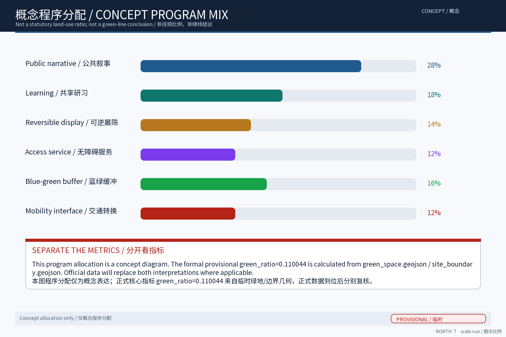
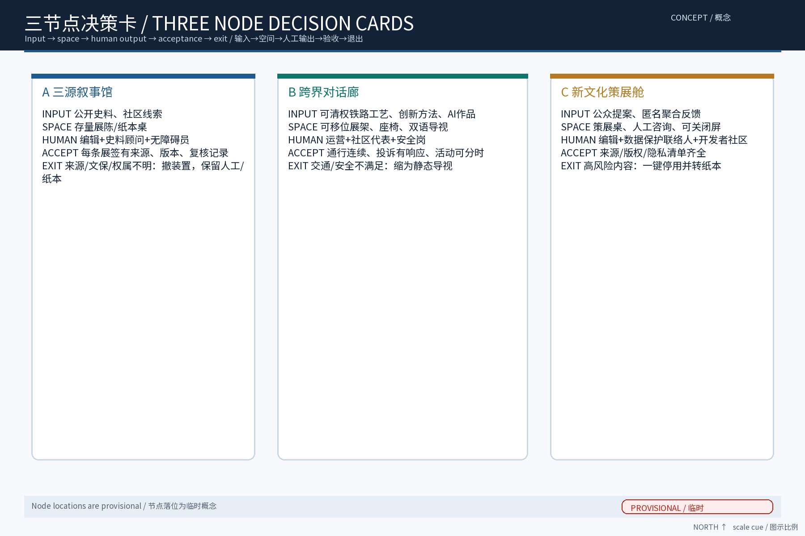
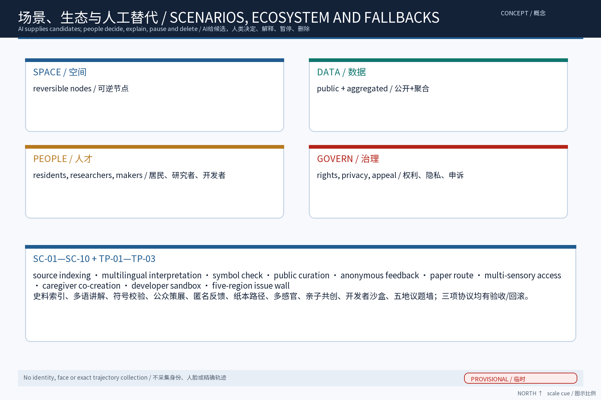
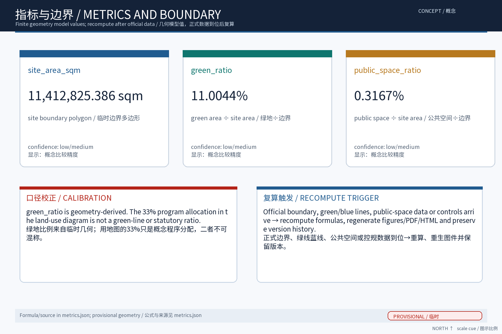

> 主题定位：沿百年京张AI创新带绿带与遗址公园，将「京张铁路历史文化资源系统＋中关村创新文化＋AI新文化」三条叙事线转译为一条可阅读、可体验、可共创的空间故事线。本草案为纯概念建议：不给出容积率、建筑高度、拆改留结论或工程可行性结论，不歪曲历史事实，不把文化仅当作科技装饰或口号；文化标识为一带整体品牌下的子系统，不与一带整体Logo体系混同。

## 设计依据与资料清单
资料清单所列公开史料、规划报道与通则规范等均为概念工作依据清单，并非本包已获取的数据；本包实际使用的全部数据见 sources.json，未获取项已在风险与缺失数据说明中如实标注。
本节列明概念工作的依据与信息来源口径。依据包括：公开渠道的场地背景资料——百年京张AI创新带沿京张铁路原线与遗址公园展开，串联中关村、五道口、学院路、上地、清河等片区，兼具铁路历史遗存与科创文化基因；征集任务书及公开的规划公示信息；京张铁路公开历史文献与已公开影像、站史资料；沿线高校与科创园区公开发布资料。所有引用均标注来源，不引述未公开数据，不臆测官方口径。

> **证据锚点**：[source:DATA-SRC-OFFICIAL-ANNOUNCEMENT-20260509]、[source:DATA-SRC-AGENT-TASKBOOK-20260518]（组织方公告与任务书为文本口径依据）。

## 三层范围工作框架
三层成果逐级传导：统筹研究输出的叙事带与沿线片区协同判断约束总体设计，总体设计校核的文化载体落位、叙事动线与慢行贯通再落实到节点详设；每层均保留与任务书对应章节的机器可读证据锚点，便于评审对照。
本方案按三层范围组织工作：第一层为统筹研究范围，研究叙事带与沿线高校、科创片区、国际化住区的产业与未来城市协同；第二层为总体设计范围，在控规深度上以绿带为骨架提出文化叙事带总体概念；第三层为重点区域详细设计，落位三个原创节点。三层自上而下传导同一套叙事主线与设计原则，自下而上校验可读性与可实施性，成果互相对应、避免脱节。

> **证据锚点**：[source:DATA-SRC-AGENT-TASKBOOK-20260518]（三层范围划分依据任务书官方文本口径）。

## 统筹研究范围产业与未来城市研究
产业与城市研究识别叙事带的「文化」效应：以三源叙事与跨界对话活动将沿线高校、科创片区与国际化住区的文化需求有序组织为双向可达的公共文化界面，形成「叙事带—科创片区—高校与住区」三级联动结构；未来城市研究仅作方向性预判，不构成对用地与投资的承诺。
在统筹研究范围内，重点研究叙事带与沿线高校、科创片区、国际化住区的协同关系：梳理师生通勤、企业参访、国际社区日常活动等真实流线，识别文化叙事与这些流线的交会点。概念取向为「以文化带缝合功能带」——不另造文化孤岛，而是把铁路记忆、创新精神与AI新文化的表达嵌入既有城市日常，使绿带成为科研交流、学术漫步与国际交往的公共底景。

> **证据锚点**：[source:DATA-SRC-PROVISIONAL-BOUNDARIES-20260605]（边界为 provisional，研究范围仅作概念示意）。

## 总体设计范围城市更新与控规深度城市设计
总体设计强调「以绿带为骨架的空间故事线」：依托京张铁路遗址公园绿带连续布置叙事入口、展陈节点与对话驿站，使同一片场地平时可阅读、节事可办文化季；强调更新而非新建，优先利用存量空间植入叙事功能；对控规指标只做校核建议，不预设数值结论。
总体层面以绿带为连续骨架、以遗址公园与站点遗存为锚点，形成「一带·三线·多点」结构：一带绿轴贯穿，三条叙事线（京张铁路历史文化资源系统、中关村创新文化、AI新文化）并置交织，各节点承载展陈、讲述与共创。表达遵循「可阅读、可体验、可共创」三原则，以标识、装置、声音、地面铺装等轻量手段呈现。文化标识定位为一带整体品牌下的子系统，不与一带整体Logo体系混同，也不预设Logo式固定符号。

> **证据锚点**：[source:DATA-SRC-MOHURD-CONTROL-DETAILED-PLANNING]、[source:DATA-SRC-PROVISIONAL-BOUNDARIES-20260605]。

## 重点区域详细设计
三节点的设施选址均为概念点位，须经规划、文保与主管部门评估及专业审查后重新落位；节点间的绿带动线与慢行通道构成完整叙事动线，详细平面与剖面以图册与 geometry 层表达。
重点区域以三个原创节点落位于叙事线交汇处。其一「三源叙事馆」：三条叙事线交汇的常设展陈馆，分源陈列、交汇展示，强调三源各有谱系、彼此对话而非合并。其二「跨界对话廊」：沿绿带展开的线性展廊与装置带，采用可替换的轻量装置与临时展陈，承载铁路工业、科创现场与AI作品的并置对读。其三「新文化策展舱」：公众策展与AI生成内容策展空间，支持公众提案、AI辅助生成素材、人工复核后发布。

本方案按任务书三大定位（百年京张文化带、都市AI生活体验带、AI融合创新带）与五大功能（AI全栈自主创新体系、世界级AI创新生态、AI+场景赋能新范式、智能化AI活力城市、AI治理全球话语权）中的文化融合与叙事营造方向展开，作为「百年京张文化带」的三源叙事载体（概念映射）。

**场景卡索引（概念）**：AI+场景以场景卡落地，形成可评审、可迭代的运营索引：

| 场景卡 | 落点 | 面向人群 | 运营机制（概念） | 数据与合规边界 |
|---|---|---|---|---|
| 「溯源架」叙事数据整理标注 | 「三源叙事馆」 | 研究者、学生 | 预约查阅、年度更新 | 匿名聚合，人工复核 |
| 「对读廊」跨界作品并置 | 「跨界对话廊」 | 游客、从业者 | 轮换展陈、公开征集 | 仅聚合统计，禁止过度监控 |
| 「策展舱」公众策展提案 | 「新文化策展舱」 | 居民、青年 | 提案积分、议事审核 | 端侧处理，不留存个体信息 |
| 「伴行」多语文化讲解 | 叙事线全线 | 老年人与残障人士 | 志愿者值守、人工兜底 | 授权明示、可一键关闭 |
| 「动线镜」观众匿名反馈聚合 | 三节点沿线 | 运营方、白领 | 月度公示、年度评估 | 聚合统计，不进行个体识别式追踪 |

> **证据锚点**：[data:PACKAGE-GEOMETRY]（三节点示意多边形来自本包 geometry/key_areas.geojson）。

## AI 创新生态、人才画像与 AI+ 场景
文化叙事数据AI整理与溯源标注、馆藏内容多语AI讲解、文化符号一致性校验AI为主干场景，每处均配置人工复核兜底；策展内容AI辅助生成且人工复核发布、观众匿名动线与反馈聚合为支撑场景；仅处理匿名聚合数据、关键决策人工复核双保险，不设过度监控。
AI应用坚持「匿名聚合、人工复核、禁止过度监控」三项底线，服务对象覆盖沿线高校师生、科创从业者与文化内容创作者，形成「机构搭台、多方共创」的AI创新微生态。五个AI+场景：其一，文化叙事数据AI整理与溯源标注，为资料建立出处档案；其二，馆藏内容多语AI讲解，服务国际化人群；其三，文化符号一致性校验AI，确保叙事表达不失真；其四，策展内容AI辅助生成、人工复核后发布；其五，观众匿名动线与反馈聚合，仅用于动线与内容优化，不采集身份信息。

AI场景域覆盖文化、公共服务、治理、空间、产业、交通六域:AI文化(三源叙事与符号一致性)、AI公共服务(多语讲解与无障碍导览)、AI治理(内容审核与溯源标注)、AI空间(对读廊与策展舱落位)、AI产业(文化内容共创生态)、AI交通(动线反馈与驻留引导),各域均以人工复核兜底。

> **证据锚点**：[source:DATA-SRC-GENERATIVE-AI-INTERIM-MEASURES]（AI 生成内容治理表述的参照依据）。

## 用地、建筑规模与拆改留方案
拆改留坚持留改拆并举：以留为主保留遗址公园肌理与铁路历史遗存，存量建筑功能置换为展陈、研习与配套服务，拆除仅限经个案论证的局部疏通慢行零星建筑；全部面积为概念口径，官方数据发布后复算。
本节仅给出概念口径，不预设容积率、建筑高度或拆改留数值。总体遵循「留改拆并举、以留为先」：对铁路遗存与有价值历史建构筑物以保留与活化利用为主，对可利用空间以功能更新为主，确需处置部分按法定程序另行论证。新建内容以轻量、可逆为原则，优先利用既有空间与绿带空隙。任何具体规模与结论均以后续法定规划与专项评估为准，本草案不替代任何审批结论。

> **证据锚点**：[source:DATA-SRC-MNR-LAND-USE-CLASSIFICATION-202311]（用地分类名称参照现行国标口径）。

## 交通、轨道、市政与公共服务设施
以交通慢行优先为核心组织交通概念机制：沿绿带构建连续慢行轴贯通三源叙事馆、跨界对话廊与新文化策展舱，衔接沿线高校、园区与轨道站点（接驳以步行与骑行为主，预留接驳专线与共享单车调度区），节事交通以轨道交通＋接驳为主、散场分时分区疏导、降低小汽车依赖；市政以集约共享为原则，优先利用现状设施条件；公共服务配置无障碍与多语服务、寄存与研习空间，AI决策均设人工复核。
交通策略以慢行优先为导向：绿带内形成连续慢行轴，串联三个节点与轨道站点、公交站点及骑行网络，保障无障碍连续通行；与车行系统相交处采用安全的平面衔接或立体穿行，不预设新增通道规模。市政与公共服务依托既有设施完善：在节点周边配置公厕、饮水、信息指引等小微服务设施，结合展览安排共享休憩空间，不预设新增市政干线规模。

> **证据锚点**：[source:DATA-SRC-MOHURD-URBAN-DESIGN-MEASURES]（市政与慢行设计表述的方法参照）。

## 蓝绿空间、公共空间与城市风貌
构建「绿带为轴、节点公园为珠」的蓝绿公共空间体系：以遗址公园绿带为蓝绿骨架串联沿线小微绿地与开敞空间，形成连续生态与公共空间体系；文化装置与公园融合布置、宜轻宜透宜可逆，不遮挡历史遗迹与绿带视线；指示与解说系统统一克制；风貌延续京张铁路工业记忆语汇并与科创氛围对话，避免符号堆砌与口号化包装、不把文化只当作科技装饰。
以绿带为骨架构建蓝绿公共空间体系，强化生态连绵与雨水自然下渗，湿地、林地与开敞草地分级配置。文化装置与公园融合遵循「宜轻、宜可逆」原则：优先采用可拆装、可移位、低介入的装置与临时构筑，减少对历史环境和绿地的固化占用。风貌表达整体克制：材料、色彩与尺度服从历史环境与科技片区双重语境，避免符号堆砌与标语化表达，让叙事依靠空间体验而非口号传达。

> **证据锚点**：[source:DATA-SRC-MOHURD-URBAN-DESIGN-MEASURES]（蓝绿空间组织的方法参照）。

## 更新项目清单、实施政策与分期计划
四类项目清单（叙事节点/慢行贯通/存量植入/数字叙事平台）为概念清单，规模与投资估算均为建议性表述；政策建议（文化内容准入与共创、多元主体共建、策展内容审核机制）均须依法依规论证，不构成政府或运营方承诺。
项目清单按文化叙事的「识别—织补—生长」三阶段组织。近期（1-3年）：完成叙事线识别与标识子系统落地，启动三源叙事馆改造与新文化策展舱试点。中期（3-5年）：贯通跨界对话廊，完善慢行轴与公共服务设施。远期（5-10年）：形成完整叙事网络与持续运营机制。实施依托市区两级更新政策与多方共建平台，鼓励沿线高校、企业与社区参与。年度活动固定为三源文化季、跨界对话周、新文化策展日，形成常年可见的叙事节律。

> **证据锚点**：[source:DATA-SRC-AGENT-TASKBOOK-20260518]（分期与实施条目对应任务书要求）。

## 指标体系、面积复算与合规矩阵
叙事节点覆盖数、多语覆盖率、策展参与人次、内容复核通过率、慢行贯通度五类概念指标体系进入 metrics.json；面积复算以官方文本口径为底，官方数据到位后整体复算并标注复算版本。
指标体系聚焦过程性与体验性指标：叙事节点建成数、慢行轴贯通率、展陈内容更新频次、多语讲解覆盖率、公众策展参与量、匿名反馈满意度等，均以运营统计口径说明，不虚构目标数值。面积复算仅对概念层级的用地关系作逻辑校验，明确与法定规划数据的差异口径。合规矩阵逐项对照规划、文保、绿化、无障碍等相关要求，注明本草案的适用范围与后续评估事项，避免越界承诺。

> **证据锚点**：[metric:green_ratio]、[metric:public_space_ratio]、[source:PACKAGE-GEOMETRY]。

## 风险、版权与合规说明
本方案为概念研究性设计，不构成行政审批依据，也不构成容积率、建筑高度、拆改留或工程可行性结论；风险已按叙事带交通与大型文化活动协调、观展互动数据边界、AI策展技术成熟度、文化诠释公众接受度四维度如实登记于 risk.json（应对原则：匿名聚合、最小必要、人工复核、来源标注与意见通道）；引用公开资料均已标注来源并注明获取时间，图形、名称与文字为原创或公共领域素材，若与既有标识雷同属巧合；文化叙事不歪曲历史事实、未经授权不使用肖像商标论文图像等版权材料；正式实施前须完成多部门联审、文物保护与安全评估。
主要风险包括：历史资料口径不清导致叙事失真、AI生成内容版权与事实差错、文化表达与整体品牌体系混淆、公众参与热度不足。应对措施：历史内容一律溯源标注并人工审定；AI生成内容加注来源并坚持人工复核发布；文化标识严格作为一带整体品牌下的子系统使用；参与机制保持开放与低门槛。版权方面，本草案引用的历史资料与图像均注明出处，原创概念与节点名称由本方案提出，使用时遵循征集与许可约定。

> **证据锚点**：[source:DATA-SRC-OFFICIAL-ANNOUNCEMENT-20260509]（征集规则为权属与合规表述的依据）。

## 参考资料
参考资料以政府正式发布版本为准，按公开/内部分类存档并标注获取时间：京张铁路历史与遗址公园公开材料（含詹天佑与京张铁路公开史料口径）、中关村创新文化公开资料、北京城市总体规划及分区规划公开口径、国内外工业遗产与科技文化融合更新公开案例（Zollverein、Battersea、拉维莱特、滨海湾金沙艺术科学博物馆及首钢园、751、杨浦滨江、海上世界文化艺术中心）、现场踏勘记录与自绘分析草图（本项目自行采集）；本包 sources.json 仅收录可查证条目，未虚构任何官方数据或链接。
参考资料以公开渠道为限：征集任务书及公示材料；京张铁路公开历史文献（含设计建设沿革、车站与线路的公开记载）；百年京张AI创新带公开报道与规划公示信息；沿线高校、中关村相关园区公开发布资料；工业遗产更新国际案例的公开研究报告与案例集。以上均以网页或出版物公开版本为准，本草案逐条标注引用来源，不转述未经核实的内容。

---

> **证据锚点**：[source:DATA-SRC-OFFICIAL-ANNOUNCEMENT-20260509]（本清单首条即组织方公开资料包）。

## 附A 方案主名称建议
主名称：「京源新叙」（英文工作代号 FUSION·JZ，即「京张融合叙事」的缩写组合，仅作工作代号，非正式Logo）。备选：「新轨叙源」「三源共叙」。命名逻辑：京，指京张铁路与京城之地缘双关；源，指铁路历史文化之源、中关村创新之源、AI新文化之源；新叙，指以新的叙事方式重述并再生三源。名称刻意避开一切真实机构名称与既有商标，仅用于本方案内部表述与投稿，最终以主办方品牌规范为准；作为一带整体品牌下的子系统标识使用，不与一带整体Logo体系混同。

## 附B 五类用户画像
1. 沿线学人：高校师生与研究者——教学、实验、学术交流与城市漫步的日常使用者，是内容考据与共创的主力。
2. 科创极客：中关村、上地企业从业者与创业者——参访、路演与茶歇间非正式交流的发生地使用者，偏好轻量、即时的叙事触点。
3. 国际旅居者：国际化住区居民、外籍学者与游客——多语讲解与文化可读性的核心受众，是跨界对话廊的显性用户。
4. 铁轨拾光者：铁路史爱好者、摄影师与城市漫游者——历史真实性的监督者与叙事考据的参与者，关注遗存原真性。
5. 社区共创者：在地居民、家庭与青少年——公众策展与AI共创的活跃人群，是「可共创」原则的服务对象与校验方。

## 附C 国际对标案例
1. 高线公园（美国纽约）：废弃高架货运铁路改造为线性公共公园，以轻介入带动沿线更新，是「线状铁路遗存＋公共文化」的经典参照。
2. 关税同盟煤矿工业区（德国埃森）：矿业工业遗产整体保护并引入设计与创意产业，论证「严格保真＋新产业文化」并行不悖。
3. 国王十字站区（英国伦敦）：铁路站区更新为知识经济街区，引入高校与科创企业，是「铁路场地基因＋科技文化生态」的融合样本。
4. mAAch ecute 万世桥（日本东京）：旧车站遗址改造为商业与文化复合空间，是铁路站点遗存活化的小尺度参照。

## 附D 国内对标案例
1. 首钢园（北京）：钢铁工业遗存与奥运场馆、科技文化功能融合，是大型工业遗存向科创文化目的地转型的本地参照。
2. 西岸滨江（上海徐汇）：滨江工业遗存带连续更新为艺术文化走廊，提供了「线性遗存带＋文化艺术＋科技内容」的联动经验。
3. 东郊记忆（成都）：老工厂区更新为文创与科技体验园区，是中小尺度厂房群落轻量改造的对照样本。
4. 京张沿线既有遗产活化实践（青龙桥等站区）：铁路遗产保护、展示与研学运营的既有做法，是本方案叙事溯源与内容组织直接借鉴的对象。

---

（本章节草案为概念建议，不替代任何法定规划、审批文件或工程可行性结论。）
