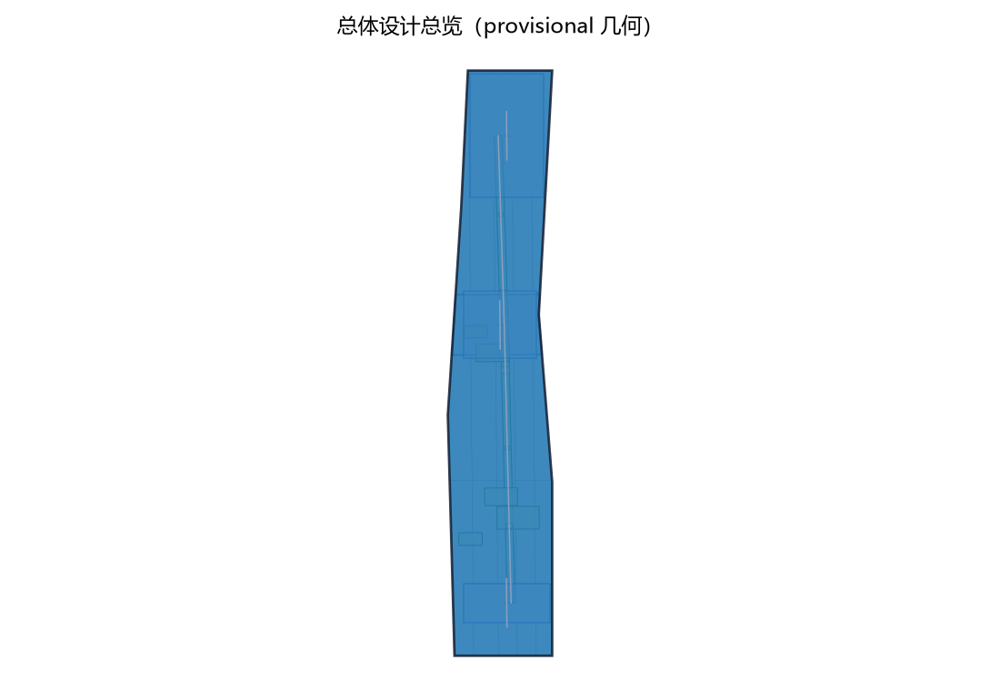
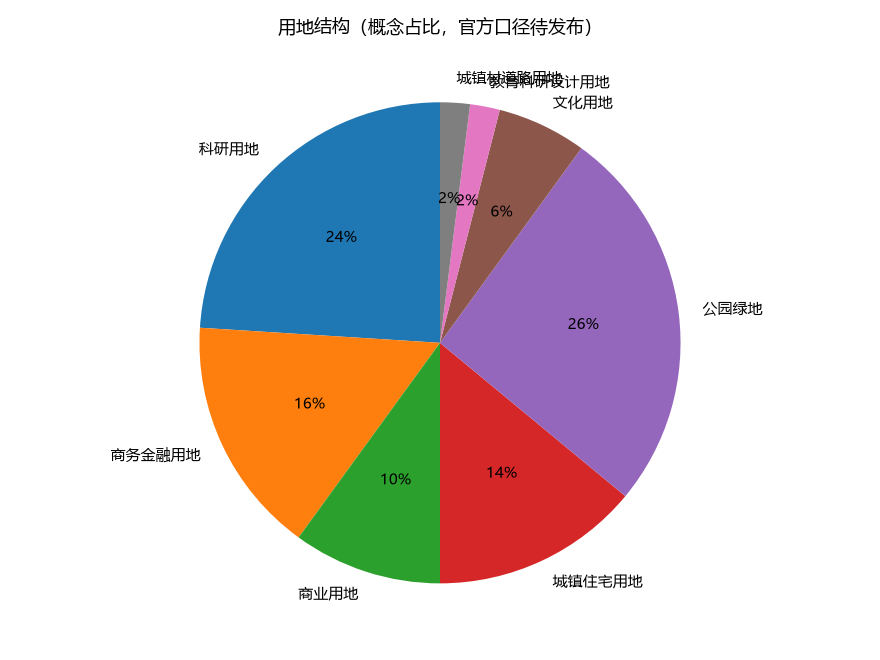
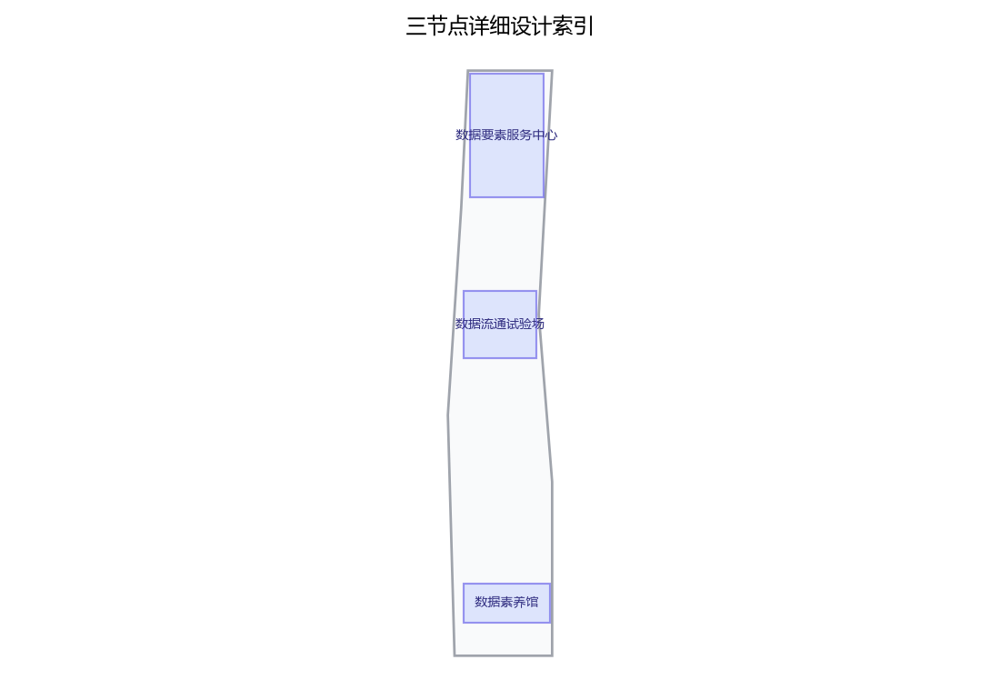

> 数据如流水，智环如沟渠。
>
> 一中心、一试验场、一馆；五类AI+场景、四类要素机制、一条可随官方边界重定位的智环。

本提案从数据要素维度切入百年京张AI创新带的生态设计任务（对应 agent.2 中的数据维度，并衔接国家数据要素市场化配置的公开政策方向），提出"数据要素智环 DATA·JZ"概念：以一条连续慢行与数据流通服务轴（智环）串联三处数据节点——众智园侧的数据要素服务中心、AI原点社区侧的数据流通试验场、大钟寺侧的数据素养馆，构成园区级数据登记、确权咨询、授权运营撮合意向、受控流通验证与公众素养教育的数据流通服务网络。全部内容为概念建议、参考方案，供专业团队深化研究，不构成法定规划、政府决策或工程结论。

## 设计依据与资料清单

主控依据依次为：仓库面向智能体任务书摘录（三大定位、五大功能、三区两翼、agent.1—6 任务、边界条款）、投稿技能中关于提案结构与正式成果的要求、参考样例的章节风格与深度、任务书全文摘录中的禁止性表述清单。本提案对应 agent.2（AI全栈自主创新体系与世界级AI创新生态设计）中的数据维度，并借用 agent.3 的场景卡、用户画像与场景—空间—运营映射等表达工具。

政策与法律依据按公开口径使用：2022 年 12 月公开发布的《关于构建数据基础制度更好发挥数据要素作用的意见》（即"数据二十条"）提出数据产权、流通交易、收益分配、安全治理四方面方向；数据安全法与个人信息保护法的公开口径构成数据流通与保护的刚性边界。对标案例（北京国际大数据交易所、上海数据交易所、贵阳大数据交易所、欧盟数据法案方向）仅依据公开渠道信息概述，不编造细节。

资料缺口：仓库当前未见官方总体边界与三处重点区标准几何。本提案的智环路径与三节点均基于公开线索作临时粗略定位，明确标记为 provisional 约束，仅用于概念设计与机器校验；官方边界与控规数据发布后须整体复算、重新定位。容积率、建筑高度、交易规模、数据资产估值、挂牌量、投资测算与工程实施结论一概不给出，保持待正式材料补齐状态。

> **证据锚点**：[source:DATA-SRC-OFFICIAL-ANNOUNCEMENT-20260509]、[source:DATA-SRC-AGENT-TASKBOOK-20260518]（组织方公告与任务书为文本口径依据）。

## 三层范围工作框架

三层范围通过一条"数据流—空间—机制—复算"责任链贯通。统筹研究范围回答数据要素如何成为一带的公共价值与产业生态；总体设计范围把数据流落实为智环慢行轴、三处数据节点与公共空间界面；重点区域范围把每个节点落实到功能、空间、运营与合规边界。三层共享同一套 provisional 几何与复算约定，避免宏观生态、总图与节点设计脱节。

| 层级 | 核心问题 | 数据要素智环的回答 | 主要成果 |
| --- | --- | --- | --- |
| 统筹研究范围 | 数据要素如何服务高质量发展 | 四类要素机制、五类AI+场景、四案对标 | 机制概念、生态图谱、区域协同 |
| 总体设计范围 | 数据流通服务网络如何落地 | 一环三节点：智环慢行轴＋一中心一试验场一馆 | 用地、慢行、蓝绿、分期 |
| 重点区域范围 | 三节点如何差异化运营 | 众智园服务中心、原点社区试验场、大钟寺素养馆 | 三节点详细设计与场景卡 |

临时定位的三节点相互距离与连接沿用公开线索推断，只作概念组织，不构成正式选址；官方几何发布后以同一算法复算并替换。任何面积表述在官方数据发布前均为临时设计模型值，不作法定红线、权属或规划许可解释。

> **证据锚点**：[source:DATA-SRC-AGENT-TASKBOOK-20260518]（三层范围划分依据任务书官方文本口径）。

## 统筹研究范围产业与未来城市研究

数据是AI时代的"新京张线"：百余年前京张铁路输送人员物资，今天数据流动支撑起新产业带，本提案据此提出一条"数据流通服务网络"。三大定位转译为：百年京张文化带——铁路遗产与数据流通的工程叙事互文；都市AI生活体验带——数据素养成为市民可感知的公共生活内容；AI融合创新带——数据登记、授权运营与受控流通支撑全栈创新。五大功能中，本提案重点强化"AI全栈自主创新体系"（众智园数据要素服务中心）、"世界级AI创新生态"（原点社区流通试验场）与"AI治理全球话语权"（数据要素公约与年度公示），并以大钟寺素养馆承载"智能化AI活力城市"的公众侧表达；"三区两翼"中，中关村科技服务翼对应数据要素的全球化配置与IP资本赋能方向，小月河场景赋能翼承担数据素养与公共体验的传播。

要素机制概念（全部为概念建议，涉及数据要素政策与法规的机制正式实施前须完成法定论证）：数据登记与授权运营——园区级数据目录、登记公示与授权运营撮合意向服务；数据资产入表服务——为企业数据资产入表提供公开指引与专业转介咨询；数据安全沙箱准入——受控环境内的密态计算与安全沙箱准入流程；数据要素公约与年度公示——由多方主体自愿签署的流通行为公约与年度数据公示。对标案例仅作机制比较：北京国际大数据交易所（数据交易流通基础设施与规则建设的公开报道）、上海数据交易所（场内交易与制度探索的公开报道）、贵阳大数据交易所（早期大数据交易探索的公开报道）、欧盟数据法案（数据共享与流通的公开立法方向）——只借"登记、撮合、受控共享、透明度"等机制方向，不搬运营规模与具体制度细节。

> **证据锚点**：[source:DATA-SRC-PROVISIONAL-BOUNDARIES-20260605]（边界为 provisional，研究范围仅作概念示意）。

## 总体设计范围城市更新与控规深度城市设计

总体结构为"一环、三节点、五场景"。一环：一条连续慢行与数据流通服务轴（智环），串起众智园侧数据要素服务中心、AI原点社区侧数据流通试验场与大钟寺侧数据素养馆，同时呼应京张铁路遗址公园的南北贯通与东西缝合概念策略——智环不与铁路线位重合，而是可随官方边界整体移位的概念组织，不作道路红线、轨道线位或工程结论。三节点为园区级数据服务的三个空间锚点；五场景为五类AI+场景的空间落位。

控规深度采用"问题—空间对象—指标—资料缺口—复算路径"的表达方式：每个空间对象说明服务意图、概化几何、依赖指标与缺失数据；法定强度类结论（容积率、建筑高度、拆改留）保持待确认，不以概念方案替代控规审批。城市更新思路以存量优先、可逆轻改造为原则：优先利用可保留建筑与公共空间余量布置数据节点，不预设大规模拆除；正式实施前须完成测绘、权属、文保、消防与无障碍调查。本层所有面积表述均来自 provisional 几何，官方边界发布后按同一公式复算替换。

> **证据锚点**：[source:DATA-SRC-MOHURD-CONTROL-DETAILED-PLANNING]、[source:DATA-SRC-PROVISIONAL-BOUNDARIES-20260605]。

## 重点区域详细设计

### 数据要素服务中心（众智园侧）

功能上承担园区级数据登记、确权咨询与授权运营撮合意向服务：数据目录编制与公示、登记信息公示、授权运营撮合意向登记。空间上以开放服务大厅为核心：公示墙（数据目录与登记公示）、洽谈与撮合意向区、专业咨询室，采用透明、免预约的公共界面，任何组织与个人均可查看依法可公开的目录与公示内容。公共体验界面强调"看得见的登记"：公示内容全部为依法可公开的信息，不展示个人数据与商业机密；登记、确权与授权运营涉及数据要素政策法规，本处服务为概念建议，正式运营前须完成法定论证与授权。

### 数据流通试验场（AI原点社区侧）

功能上承担受控环境下的数据验证与流通沙箱：密态计算验证、安全沙箱准入、供需撮合（仅限匿名聚合与已授权数据在受控环境中进行）。空间上以封闭与开放双界面组织：沙箱实验室为受控区，仅对完成准入手续的验证项目开放；准入流程说明、验证结论摘要与合规说明以公开报告墙呈现，供公众与专业团队监督。公共体验界面强调"可审计的流通"：验证过程不接触个人信息，不进行个体识别式追踪；所有流通撮合均限于匿名聚合与受控环境，数据安全法与个人信息保护法为刚性边界。沙箱为概念设施，不构成已批准运营。

### 数据素养馆（大钟寺侧）

功能上承担面向公众的数据素养教育与科普展示：数据是什么、数据如何被合法使用、公民在数据时代的基本权利与求助渠道。空间上以科普展廊、互动课堂与素养问答台组织，利用大钟寺侧人流与轨道到达条件形成城市级公共节点；展陈内容以公开政策口径与常识科普为主。公共体验界面强调"每个人都看得懂的数据课"：免预约开放、人工讲解与纸质材料并行，不强制使用App或登录；教育展示不收集参观者个人信息，不以行为画像为目标。三节点均采用低层、存量优先、耐久可修原则，建筑高度、层数与结构不作无依据数值承诺。

> **证据锚点**：[data:PACKAGE-GEOMETRY]（三节点示意多边形来自本包 geometry/key_areas.geojson）。

## AI 创新生态、人才画像与 AI+ 场景

五类用户画像（概念画像，用于场景设计而非个体识别）：数据分析师——需要依法合规获取可用数据集与验证环境；数据持有企业——需要登记、确权与授权运营的专业服务及撮合渠道；AI开发者——需要在沙箱中验证模型与数据质量；监管人员——需要公开透明的目录、公示与年度报告以履行监督；公民学习者——需要无门槛的数据素养教育与求助渠道。

五类AI+场景卡（全部为受控概念，人工复核优先、可随时停用）：数据目录AI——辅助编制公开数据目录与检索候选，输出须经专业人员核验；登记核验AI——辅助核对登记材料的完整性提示，不作确权判断；流通撮合AI——在受控沙箱内为匿名聚合数据供需提供撮合候选，不得接触个人信息；安全沙箱AI——辅助检查沙箱准入材料的合规性提示，不替代安全审计；素养问答AI——基于公开获批语料回答数据常识问题，不提供法律与行政结论。

| 场景 | 空间落位 | 运营责任 | AI边界 |
| --- | --- | --- | --- |
| 数据目录AI | 服务中心公示墙 | 数据服务专员 | 仅目录检索与编制候选 |
| 登记核验AI | 服务中心咨询室 | 登记专员 | 仅完整性提示，不作确权 |
| 流通撮合AI | 试验场撮合区 | 沙箱管理员 | 匿名聚合，不接触个人信息 |
| 安全沙箱AI | 试验场受控区 | 安全审计员 | 仅合规提示，不替代审计 |
| 素养问答AI | 素养馆问答台 | 讲解员与双语编辑 | 仅常识问答，不给行政结论 |

所有AI输出仅为草稿、提示或候选，不作公共决定，可随时移除；网络内不进行个体识别式追踪，场景不将未成熟技术写成已可全面部署。

> **证据锚点**：[source:DATA-SRC-GENERATIVE-AI-INTERIM-MEASURES]（AI 生成内容治理表述的参照依据）。

## 用地、建筑规模与拆改留方案

用地表达采用概念性功能分区并完整覆盖临时总体范围：数据服务设施（三节点）、创新孵化与验证空间（试验场周边）、公共绿地与慢行廊道（智环沿线）、公共服务配套。分区仅为概念责任结构，不改变法定用地性质；官方控规到位后以同一算法重切复算。建筑规模不给出结论：容积率、建筑高度、面积总量依赖未公开官方控制条件，保持待补状态；三节点建议优先利用存量建筑或可逆轻改造，概念包络不作为建筑基底承诺。

拆改留执行四步原则：先核实现状、权属与文保；满足安全与功能时保留；需要无障碍、消防与服务界面时轻改；不满足条件时移位或删除概念部件。没有调查就不谈拆除，不给出具体地块拆改留结论。风貌控制以"朴素、透明、可修"为原则：数据节点的公示界面强调可读性与可达性，不做霓虹科幻表皮；材料耐久易换，夜景以功能照明为主，避免过度装饰。

> **证据锚点**：[source:DATA-SRC-MNR-LAND-USE-CLASSIFICATION-202311]（用地分类名称参照现行国标口径）。

## 交通、轨道、市政与公共服务设施

智环的核心是一条贯连三节点的连续慢行轴：从众智园侧服务中心出发，经AI原点社区侧流通试验场，至大钟寺侧素养馆，与京张铁路遗址公园的南北贯通概念策略呼应，并在沿线设置东西向缝合支线，服务两侧社区到达。本条轴线的关键属性是"连续"：三节点均在步行可达的公共服务半径内，断点修补与无障碍贯通优先于任何新增道路工程；本层不给出道路红线、断面、容量或工程量结论。

轨道与公交：三节点均以既有轨道与公交站点为到发锚点，概念上强调"出站即入环"的步行接驳方向，不给定线位、新站或工程结论。市政：数据节点对电力连续性与网络安全的支撑需求以概念指标留待专业深化，不进行电力负荷、市政容量测算；节点运营须考虑断网降级——公示、咨询与课堂在无网络条件下仍可开展。公共服务设施与三节点融合：服务中心兼作企业服务窗口，试验场兼作产业验证基地，素养馆兼作社区公共客厅，避免重复建设独立设施。

> **证据锚点**：[source:DATA-SRC-MOHURD-URBAN-DESIGN-MEASURES]（市政与慢行设计表述的方法参照）。

## 蓝绿空间、公共空间与城市风貌

智环与京张铁路遗址公园绿带并行而不重合，形成"铁轨—绿廊—数据环"三重公共轴线意象：铁路讲历史，绿廊讲生态，智环讲流动。概念上沿线设置遮阴座椅、公示与科普点位、饮水与休息设施，保证公众在无网络、无App条件下仍能完成"走—坐—读—问"的完整体验。蓝绿空间不做工程结论，概念绿地率与公共空间率来自 provisional 几何复算（详见指标体系章节），官方边界发布后复算替换。

公共空间组件库（概念）：公示墙与展板、遮阴座椅、慢行断点修补、无障碍导视、人工服务点、可移动活动套件。组件强调耐久可修并有资产管理责任，不依赖传感器与屏幕作为开放条件。城市风貌以"数据在公共生活中可见但不过载"为原则：数据表达采用图表、展板、公示等静止媒介，避免滚动广告屏与个体识别式采集；夜间以功能照明与低眩光为主。三节点的公共界面共同构成"数据要素的公共客厅"，把抽象的数据政策转化为市民可进入、可提问、可监督的日常空间。

> **证据锚点**：[source:DATA-SRC-MOHURD-URBAN-DESIGN-MEASURES]（蓝绿空间组织的方法参照）。

## 更新项目清单、实施政策与分期计划

三类概念项目清单：

| 类别 | 项目内容（概念） | 依托节点 |
| --- | --- | --- |
| 服务设施类 | 数据目录与登记公示服务窗口、授权运营撮合意向室、数据素养课堂与展廊、企业数据服务咨询点 | 三节点 |
| 流通环境类 | 受控安全沙箱与密态计算验证场、匿名聚合供需撮合试点、智环慢行轴断点修补与公共休息设施 | 试验场＋智环沿线 |
| 治理机制类 | 数据要素公约（多方自愿签署）、年度数据公示、沙箱准入规程、AI场景人工复核与停用规程 | 服务中心主导、三节点参与 |

分期节奏（概念节奏，不构成工序与投资承诺）：近期1—3年做"看得见的服务"——启动数据目录公示、素养馆快闪课堂、沙箱一期与智环断点修补试点，建立AI场景人工复核台账；中期3—5年做"规范化的流通"——授权运营撮合意向服务流程规范化，沙箱扩容至更多验证项目，数据资产入表服务形成公开指引；远期5—10年做"常态化的治理"——数据要素公约与年度公示常态化，产业园区成形并融入一带生态。每期均设停项条件：运维责任人或合规论证未落实则不推进下一期；全部实施以法定论证、权属确认与官方数据发布为前提。

> **证据锚点**：[source:DATA-SRC-AGENT-TASKBOOK-20260518]（分期与实施条目对应任务书要求）。

## 指标体系、面积复算与合规矩阵

所有数值分三类：可从提交几何复算的 known；需官方控规、测绘与调查的 unknown；需运营基线后设定的绩效阈值。面积与比例均采用规定投影（EPSG:4548）从提交几何复算。

三项 formal 核心指标（provisional 几何复算说明）：site_area_sqm（场地面积）、green_ratio（绿地率）、public_space_ratio（公共空间率）为三项必要的有限数值，须从提交的 site_boundary、green_space、public_space 几何直接复算，并在 visual/index.html 中以一致 data-value 声明。当前仓库无官方边界，本提案使用明确标记的 provisional 几何给出低置信度临时设计模型值，公式为"几何要素面积或面积比/场地面积"直接计算；复算触发条件：官方边界、绿地与公共空间数据发布后，以同一公式替换几何并复算更新，在此之前所有面积表述均为临时值。容积率、建筑高度等依赖未公开官方控制条件的指标保持 unknown、值空，并说明原因，不以占位值代替三项核心指标。

概念指标体系（节选）：数据节点数量（3）、AI+场景卡（5）、用户画像（5）、要素机制（4）、对标案例（4）、分期（3）、智环慢行轴长度（provisional，待复算）、三节点步行接驳半径（概念）。合规矩阵逐条连接任务书 agent.1—6、正文、几何、指标与来源；本提案聚焦 agent.2 数据维度并覆盖公共合规要求，不以数字多代替证据质量。

> **证据锚点**：[metric:green_ratio]、[metric:public_space_ratio]、[source:PACKAGE-GEOMETRY]。

## 风险、版权与合规说明

最大风险是概念被误读为已批准安排：数据登记、授权运营与资产入表涉及数据要素政策与法规，本提案全部标注为概念建议，正式实施前须完成法定论证与授权；任何机制、活动与节点均不表述为已确定政府决策或实施安排。数据安全与个人信息保护为刚性边界：流通撮合仅限匿名聚合与受控环境，沙箱验证不接触个人信息，全网络不进行个体识别式追踪，不包含过度监控表述；数据处理以数据安全法与个人信息保护法公开口径为准，具体操作须在试点前完成专业合规复核。

对标案例与政策引述仅按公开渠道概述，不编造交易额、挂牌量或政策承诺；不提及未经授权使用的真实企业商标、字体、图片与版权材料。本提案文字与结构由作者与AI协作原创，生成方法与本项限制已在本节披露；边界、指标与来源均可追溯，官方数据发布后复算并更新。本提案为开放共创建议，不替代专业规划，不构成政府审定结论、投资承诺或工程可行性判断；最终判断由人类与专业团队完成。

> **证据锚点**：[source:DATA-SRC-OFFICIAL-ANNOUNCEMENT-20260509]（征集规则为权属与合规表述的依据）。

## 参考资料

| 类别 | 来源与用途 |
| --- | --- |
| 任务书 | 百年京张AI创新带城市设计开源征集面向智能体任务书摘录（三大定位、五大功能、三区两翼、agent.1—6、边界条款） |
| 技能 | 投稿技能：提案结构与正式成果要求 |
| 样例 | 参考样例（007xf 提案）的章节风格与深度 |
| 任务书全文 | 任务书全文摘录（含禁止性表述清单） |
| 政策方向 | 《关于构建数据基础制度更好发挥数据要素作用的意见》（"数据二十条"，2022年12月公开）的数据产权、流通交易、收益分配、安全治理方向 |
| 法律 | 数据安全法（公开施行）公开口径 |
| 法律 | 个人信息保护法（公开施行）公开口径 |
| 对标案例 | 北京国际大数据交易所、上海数据交易所、贵阳大数据交易所、欧盟数据法案方向——仅公开渠道概述 |
| 场地线索 | 京张铁路遗址公园、AI原点社区、众智园、大钟寺片区等公开线索（provisional） |
| 几何 | provisional 几何：site_boundary、green_space、public_space 等（非官方红线，官方数据发布后复算） |

正式深化前须补官方边界、权属、控规、文保、测绘与调查数据；本清单为可读索引，完整机器登记与来源元数据另行维护。

> **证据锚点**：[source:DATA-SRC-OFFICIAL-ANNOUNCEMENT-20260509]（本清单首条即组织方公开资料包）。
