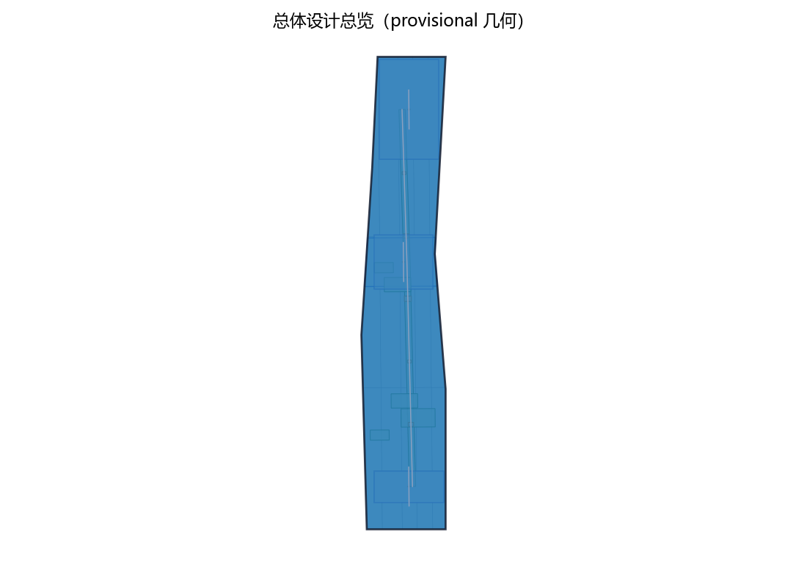

> 本草案为概念建议：不给出容积率、建筑高度、拆改留结论与工程可行性结论，不编造碳排放实测数据与官方减排指标；行文克制，所有引用均为公开口径清单。

## 设计依据与资料清单
资料清单所列公开史料、规划报道与通则规范等均为概念工作依据清单，并非本包已获取的数据；本包实际使用的全部数据见 sources.json，未获取项已在风险与缺失数据说明中如实标注。

本方案所列依据为公开口径引用清单，而非已获取数据：征集公告与任务书（其中明确要求营造国际化、低碳绿色的创新交往环境，探索绿色空间服务人工智能发展的功能场景设计）；《无障碍环境建设法》关于公共空间全龄友好与无障碍的要求；《节能与绿色建筑通则》等绿色建筑与节能标准；京张铁路遗址公园及带内众智园、AI原点社区、大钟寺等重点区域存量更新的公开资料。以上仅作引用，不据此推断任何官方指标。

> **证据锚点**：[source:DATA-SRC-OFFICIAL-ANNOUNCEMENT-20260509]、[source:DATA-SRC-AGENT-TASKBOOK-20260518]（组织方公告与任务书为文本口径依据）。

## 三层范围工作框架
三层成果逐级传导：统筹研究输出的低碳创新环境与沿线协同判断约束总体设计，总体设计校核的碳汇空间布局、低碳单元与时序生长落实到节点详设；每层均保留与任务书对应章节的机器可读证据锚点，便于评审对照。

采用「统筹研究—总体设计—重点区域」三层递进框架。统筹研究层研判带内产业与未来城市趋势；总体设计层以京张铁路遗址公园绿带为骨架，形成低碳绿色创新环境总体概念；重点区域层选取三个概念节点深化。三层边界一律标注 provisional（暂定），随征集官方口径与资料完善滚动校核，不预设最终范围与面积。

> **证据锚点**：[source:DATA-SRC-AGENT-TASKBOOK-20260518]（三层范围划分依据任务书官方文本口径）。

## 统筹研究范围产业与未来城市研究
产业与城市研究识别低碳绿色创新环境的「适配」效应：以碳服务与绿色空间把沿线高校、科创片区与国际化住区的低碳需求有序组织为双向可达的创新环境单元，形成「低碳网络—科创片区—住区」三级联动结构；未来城市研究仅作方向性预判，不构成对用地与投资的承诺。

带内沿线分布高校、科创片区与国际化住区，天然具备「创新人群＋绿色空间」协同条件。研究低碳绿色创新环境与高校科研转化、科创企业集聚、国际化交往需求的相互支撑关系：绿色空间承载研发交流、成果展示与低碳生活场景，科创片区为技术提供应用场域。本层仅作趋势性概念判断，不涉及具体产业指标承诺。

> **证据锚点**：[source:DATA-SRC-PROVISIONAL-BOUNDARIES-20260605]（边界为 provisional，研究范围仅作概念示意）。

## 总体设计范围城市更新与控规深度城市设计
总体设计强调「以绿带为骨架的低碳绿色创新环境」：依托京张铁路遗址公园绿带组织碳汇空间、低碳单元与慢行骨架，碳服务设施可逆生长、街道可分时响应；强调更新而非新建，优先利用存量空间植入低碳单元；对控规指标只做校核建议，不预设数值结论。

以京张铁路遗址公园绿带为骨架构建三大概念：其一，片区碳核算公共数据服务体系（概念性）；其二，绿色空间碳汇网络，串联带内绿地基质形成连续碳汇体系；其三，低碳慢行骨架，贯通绿带与周边功能。对控规指标（用地、强度等）仅作校核性建议，即按某口径测算是否协调的判断，不给出容积率结论。

> **证据锚点**：[source:DATA-SRC-MOHURD-CONTROL-DETAILED-PLANNING]、[source:DATA-SRC-PROVISIONAL-BOUNDARIES-20260605]。

## 重点区域详细设计
三节点的设施选址均为概念点位，须经规划、文保与主管部门评估及专业审查后重新落位；节点间的绿带动线与慢行通道构成完整低碳动线，详细平面与剖面以图册与 geometry 层表达。

设三个原创概念节点：①「绿碳坊」——低碳绿色创新街坊示范单元，示范存量街坊低碳化改造与创新功能混合；②「碳智亭」——片区碳核算与能碳数据服务节点，承载概念性公共数据服务与公众展示；③「绿能环」——绿色能源与低碳出行复合环，组织绿电设施与骑行慢行。三节点选址均为概念点位，供后续深化比选，不构成拆改留结论。

> **证据锚点**：[data:PACKAGE-GEOMETRY]（三节点示意多边形来自本包 geometry/key_areas.geojson）。

## AI 创新生态、人才画像与 AI+ 场景
片区碳核算AI、绿色空间碳汇感知AI、能耗负荷预测AI为主干场景，每处均配置人工复核兜底；低碳出行流量AI、公众低碳反馈AI为支撑场景；仅处理匿名聚合数据、关键决策人工复核双保险，不设过度监控；碳核算为概念性公共数据服务建议，不替代官方统计。
五类用户画像：创业者、AI开发者、社区居民、学生、老年邻里。五个AI+场景：片区碳核算AI、绿色空间碳汇感知AI、能耗负荷预测AI、低碳出行流量AI、公众低碳反馈AI。全部数据匿名聚合并人工复核，禁止过度监控；碳核算仅作概念性公共数据服务建议，不替代官方统计口径，不承诺数据精度。

> **证据锚点**：[source:DATA-SRC-GENERATIVE-AI-INTERIM-MEASURES]（AI 生成内容治理表述的参照依据）。

## 用地、建筑规模与拆改留方案
拆改留坚持留改拆并举：以留为主保留遗址公园肌理与铁路历史遗存，存量建筑功能置换并预留低碳化改造方向（围护、能耗、绿电接口），拆除仅限经个案论证的局部疏通慢行零星建筑；全部面积为概念口径，官方数据发布后复算。

按「留改拆并举」概念口径：保留有价值的历史遗存与形态完整的建筑；改造低效存量建筑，置换为创新交往、低碳服务等功能；仅对确需处置的危旧简陋构筑物作个别处置建议。存量建筑以围护、机电、绿电接入等低碳化改造为方向。本方案不预设用地比例、建筑规模与拆改数量，结论留待后续法定程序。

> **证据锚点**：[source:DATA-SRC-MNR-LAND-USE-CLASSIFICATION-202311]（用地分类名称参照现行国标口径）。

## 交通、轨道、市政与公共服务设施
以交通慢行优先为核心组织交通概念机制：沿绿带构建连续慢行轴贯通绿碳坊、碳智亭与绿能环，街道断面按活动需求分时响应（早市、节事、日常模式），衔接沿线高校、园区与轨道站点（接驳以步行与骑行为主），绿色出行优先、降低小汽车依赖、节事散场分时分区疏导；市政以集约共享为原则，绿电接口与能碳数据设施建筑一体化概念、优先利用现状设施条件；公共服务配置无障碍与多语服务、社区低碳服务与研习空间，AI决策均设人工复核。

交通遵循慢行优先：沿绿带构建连续慢行主轴，贯通绿碳坊、碳智亭、绿能环三节点；强化轨道与公交接驳，绿色出行优先，降低小汽车依赖，不预设道路断面与工程数值。市政以集约共享为原则，建议绿电、储能、水循环等设施就近共享布局，具体规模与路由留待专项研究确定。

> **证据锚点**：[source:DATA-SRC-MOHURD-URBAN-DESIGN-MEASURES]（市政与慢行设计表述的方法参照）。

## 蓝绿空间、公共空间与城市风貌
构建「绿带为轴、节点公园为珠」的蓝绿公共空间体系：以遗址公园绿带为蓝绿骨架串联沿线小微绿地与开敞空间，碳汇绿地与蓝绿空间融合布置，形成连续生态与公共空间体系；碳服务设施与公园融合布置、宜轻宜透宜可逆，不遮挡历史遗迹与绿带视线；指示与解说系统统一克制；风貌延续京张铁路工业记忆语汇并与低碳新生境氛围对话，整体风貌导控克制统一，避免符号堆砌与口号化包装。

构建连续的蓝绿公共空间体系：碳汇绿地、滨水蓝绿空间与京张铁路遗址等历史遗迹协调共生，形成「绿带为脊、蓝绿成网」格局。公共空间强调全龄友好与无障碍贯通。风貌克制统一：低干预的材质、统一的标识与绿植语言，突出绿色低碳环境本身，避免符号化堆砌。

> **证据锚点**：[source:DATA-SRC-MOHURD-URBAN-DESIGN-MEASURES]（蓝绿空间组织的方法参照）。

## 更新项目清单、实施政策与分期计划
四类项目清单（低碳示范单元试点/慢行贯通/碳服务设施植入/碳核算平台上线）为概念清单，规模与投资估算均为建议性表述；政策建议（低碳功能准入与统筹、多元主体共建、意见复核机制）均须依法依规论证，不构成政府或运营方承诺。

项目清单按「环境提升—节点示范—体系运营」三类编排。分期：近期1—3年绿带贯通与三节点启动示范；中期3—5年低碳改造推广与AI+场景运营；远期5—10年形成片区级低碳绿色创新网络。年度活动设低碳开放日、低碳市集、绿环骑行季，以激励引导为主培养公众低碳习惯，不作强制约束建议。

> **证据锚点**：[source:DATA-SRC-AGENT-TASKBOOK-20260518]（分期与实施条目对应任务书要求）。

## 指标体系、面积复算与合规矩阵
碳核算覆盖率、绿色空间碳汇估算、低碳出行分担率、绿电共享设施覆盖数、低碳活动参与人次五类概念指标体系进入 metrics.json；面积复算以官方文本口径为底，官方数据到位后整体复算并标注复算版本。

概念指标体系：碳核算覆盖率、绿色空间碳汇估算、低碳出行分担率、绿电共享设施覆盖数、低碳活动参与人次。均为方向性、非约束性指标，不作数值承诺。面积复算以官方文本口径为底，凡官方未公布之处标注「待确认」。合规矩阵逐项对应法规与征集要求，明确概念建议属性，避免越界表述。

> **证据锚点**：[metric:green_ratio]、[metric:public_space_ratio]、[source:PACKAGE-GEOMETRY]。

## 风险、版权与合规说明
本方案为概念研究性设计，不构成行政审批依据，也不构成容积率、建筑高度、拆改留或工程可行性结论；风险已按碳核算数据质量与统计口径、低碳感知与公众数据边界、碳核算模型与绿电匹配技术成熟度、低碳约束与街区活力接受度四维度如实登记于 risk.json（应对原则：匿名聚合、最小必要、人工复核、来源标注与意见通道）；引用公开资料均已标注来源并注明获取时间，图形、名称与文字为原创或公共领域素材，若与既有标识雷同属巧合；低碳表达不歪曲历史事实，未经授权不使用肖像商标论文图像等版权材料；正式实施前须完成多部门联审、文物保护与安全评估。

如实登记风险：碳数据统计口径或随官方更新而变化；隐私边界须在匿名聚合前提下审慎设定；AI与碳核算技术成熟度有限，精度与可靠性存不确定性；公众参与存在接受度不足的可能。本方案原创内容版权归作者所有，引用公开资料均标注出处，不构成对任何官方数据的替代、承诺或背书。

> **证据锚点**：[source:DATA-SRC-OFFICIAL-ANNOUNCEMENT-20260509]（征集规则为权属与合规表述的依据）。

## 参考资料
参考资料以政府正式发布版本为准，按公开/内部分类存档并标注获取时间：京张铁路历史与遗址公园公开材料（含詹天佑与京张铁路公开史料口径）、中关村创新文化公开资料、北京城市总体规划及分区规划公开口径、低碳与绿色建筑公开规范口径（节能与绿色建筑通则类）、国内外低碳社区与绿色创新环境公开案例（Vauban、Hammarby Sjöstad、BedZED、哥本哈根Nordhavn及深圳国际低碳城、中新生态城、临港新片区、首钢园）、现场踏勘记录与自绘分析草图（本项目自行采集）；本包 sources.json 仅收录可查证条目，未虚构任何官方数据或链接。

引用口径清单：征集公告与任务书；《无障碍环境建设法》（2023）；《节能与绿色建筑通则》等绿色建筑标准；京张铁路遗址公园公开资料；带内重点区域更新公开信息；国际低碳社区案例文献与国内低碳城区公开资料。所有条目均为公开来源引用清单，定稿前按官方最终文本复核更新。

> **证据锚点**：[source:DATA-SRC-OFFICIAL-ANNOUNCEMENT-20260509]（本清单首条即组织方公开资料包）。

## 附 国际案例与国内对标

**国际案例（3—4个）：**

- **德国弗莱堡 Vauban**：低汽车依赖街区典范，被动式住宅、太阳能利用与街区级能源设施结合，社区参与式规划支撑低碳生活方式共建。
- **瑞典斯德哥尔摩 Hammarby Sjöstad**：片区级「废物—能源—水」循环闭环，绿色交通与滨水公共空间一体设计，示范资源循环与碳减排协同。
- **英国伦敦 BedZED**：零能耗社区典范，被动式设计、屋顶绿化与光伏、可持续建材及共享低碳生活设施集成。
- **丹麦哥本哈根（自行车优先城市）**：以骑行网络与气候适应性蓝绿空间实现低碳出行与公共生活融合，支撑碳中和目标的城市运营范式。

**国内对标（3—4个）：**

- **深圳国际低碳城**：低碳产业集聚与低碳技术示范结合的城区实践，会展与社区场景互促。
- **天津中新生态城**：指标体系导向的生态城区，绿色建筑与慢行系统全程管控的样本。
- **上海临港新片区**：低碳韧性街道与规模化绿色能源应用，面向未来城市的新城探索。
- **北京首钢园绿色转型**：存量工业遗存更新与赛后绿色利用，与京张带「存量更新为主」的语境最为贴近。

---

以上全部内容为概念建议，不构成工程、规划或政策结论，亦不替代任何官方统计与法定程序。
