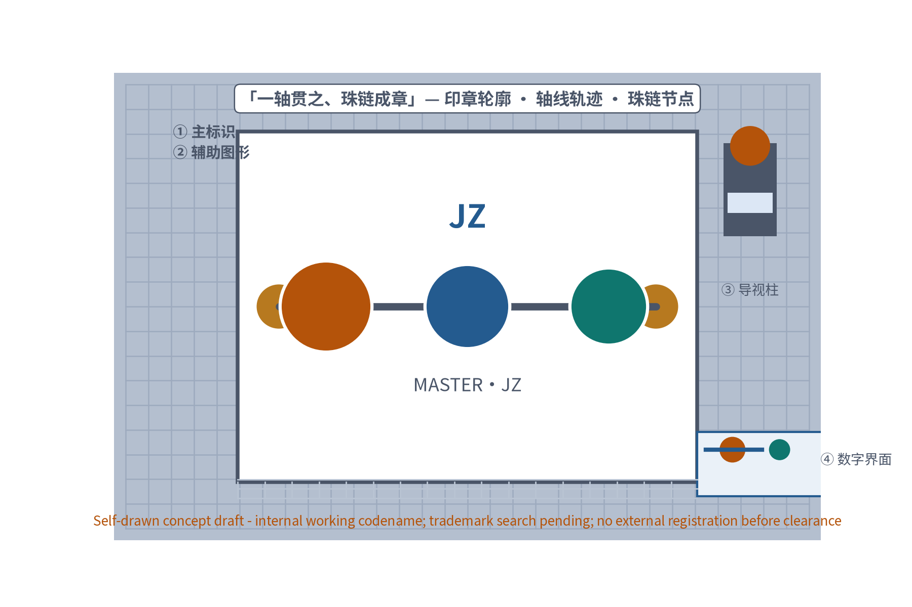
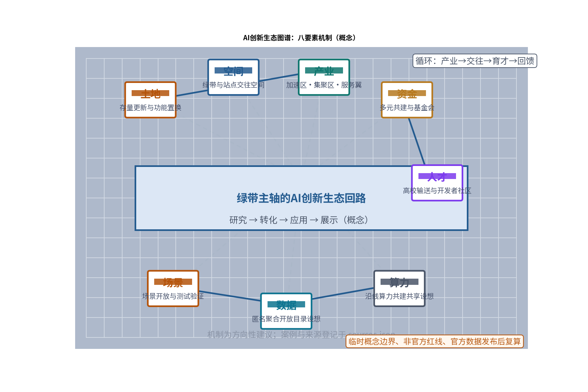
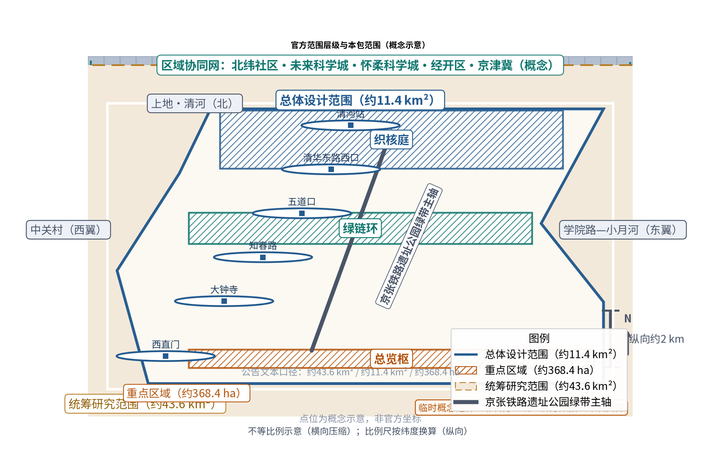
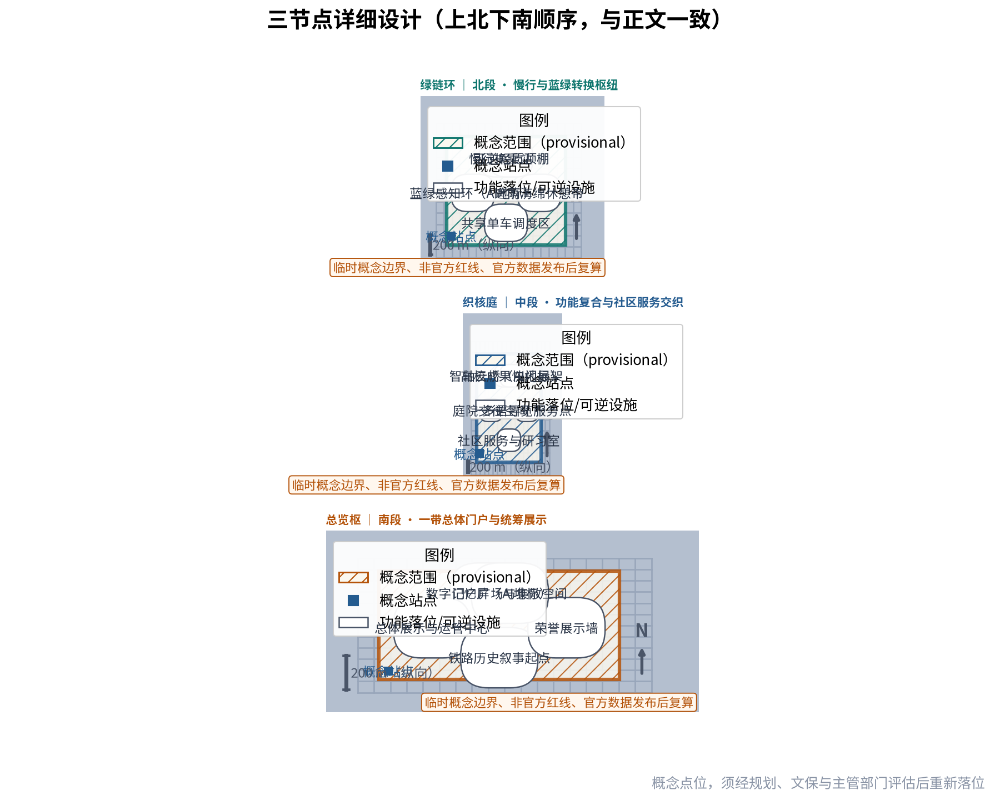
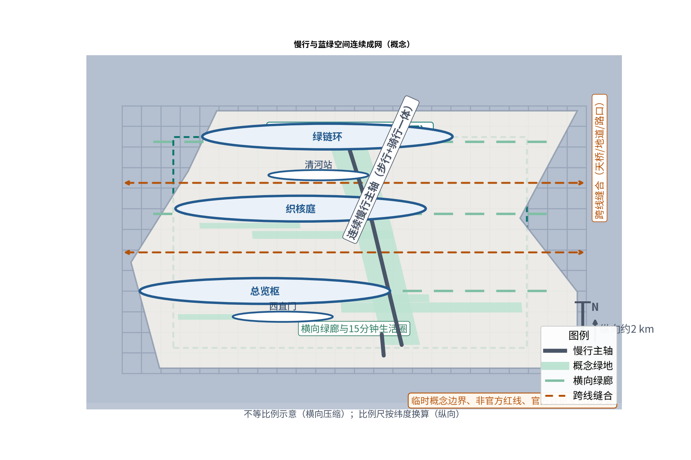
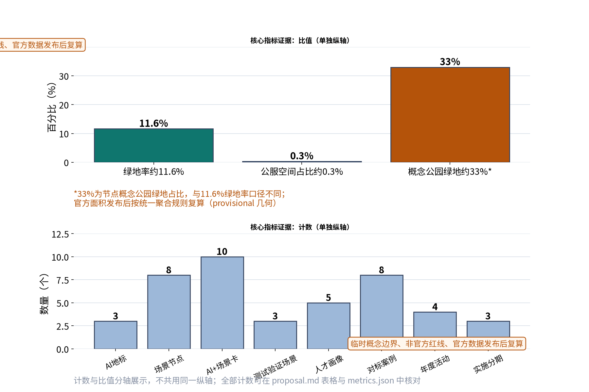

## 方案名称与总体构想（概念）

**总体概念**：京章智轴（MASTER·JZ，Metropolitan Axis of Smart Technology, Ecology & Rail）——以京张铁路遗址公园绿带为轴的一带总体概念：一条贯通南北的记忆之轴、创新之轴、宜居之轴；以珠链状结构串联站点与片区，以绿带为轴的协同回路组织"产—学—城—人"的循环流动。**主名称**「京章智轴」谐音"京张"（Jing-Zhang，首字母JZ），兼取"篇章/印章"双关：京张铁路是中国自主设计施工铁路的开端之章，海淀是当代创新之章，一带如一方长印钤于城市；「智轴」指AI创新之智与绿带主轴。统一母题：汉字体系（枢、庭、环、章）与JZ编号体系（JZ-01…）并行；节点命名总览枢、织核庭、绿链环；年度活动冠「京章+」前缀。

**三大定位**：① 百年铁路记忆的公共活化之轴；② 全球AI创新协同的交往展示之轴；③ 蓝绿慢行宜居的未来示范之轴。**五大功能**：① 文化记忆与遗产展示；② 创新交往与发布展示；③ 商业服务与生活配套；④ 蓝绿生态与康体游憩；⑤ 交通接驳与慢行转换。

**三区两翼与任务书空间单元显式映射**：北段文化记忆区对应任务书「AI原点社区」的北向延伸（清河—清华东路段）；中段创新活力区锚定「众智园AI自主创新加速区」（五道口—学院路段）并服务「北京AI原点社区」；南段生态宜居区衔接「大钟寺AI产业集聚区」（知春路—西直门段）与既有站城界面；两翼为「中关村科技服务翼」（西翼，中关村西—上地科创街区）与「小月河场景赋能翼」（东翼，学院路—小月河高校街区）。回路以绿带为轴、站点为阀、片区为器：西翼产业创新→绿带与站点交往转换→东翼高校转化育才→回馈西翼，形成"产—学—城—人"闭环。

**官方范围层级与本包子范围定位**：征集公告文本口径为统筹研究范围约43.6平方公里、总体设计范围约11.4平方公里、重点区域约368.4公顷；本包全部几何与面积均为 provisional 临时约束下的概念示意，位于上述官方层级之下，官方GIS/CAD数据发布后整体复算。

**区域协同**：一带绿带与中关村、五道口、学院路、上地、清河诸片区形成放射状协同网，并向北纬社区、未来科学城、怀柔科学城、经开区及京津冀区域延伸，构成"带—城—区域"三级协同关系，均为概念判断。

```
一带总体空间结构示意：一轴 · 三区 · 多珠 · 两翼（珠链状，上北下南）

                    北端：清河 · 上地（片区协同）· 北纬社区方向
                            │
                  北段 ● 文化记忆区（AI原点社区北延）──「绿链环」慢行与蓝绿转换枢纽
                            ‖
    中关村科技服务翼 ◀──跨线缝合──‖ 绿带主轴：京张铁路遗址公园绿带 ──跨线缝合──▶ 小月河场景赋能翼
  （西翼：中关村西·上地科创）      ‖ 连续慢行轴 + 珠链节点      （东翼：学院路·小月河高校街区）
                            ‖
                  中段 ● 创新活力区（众智园AI自主创新加速区）──「织核庭」功能复合与社区服务交织
                            ‖
                  南段 ● 生态宜居区（衔接大钟寺AI产业集聚区）──「总览枢」一带总体门户与统筹展示
                            │
                    南端：西直门 · 中关村（片区协同）

协同：主轴串联站点与片区，两翼跨线缝合联动；
区域：北纬社区、未来科学城、怀柔科学城、经开区、京津冀协同网（概念示意）。
```

> **证据锚点**：[source:DATA-SRC-OFFICIAL-ANNOUNCEMENT-2026-0509]、[source:DATA-SRC-AGENT-TASKBOOK-2026-0518]（范围层级与空间单元均为任务书文本口径）。

## 品牌识别与视觉系统（Logo 草案与 VI 规范）

品牌识别以「一轴贯之、珠链成章」为母题：贯穿性水平轴线（兼具铁轨与绿带意象）串联节点圆珠，整体轮廓如一方"城市之印"；辅助图形取连续线、圆点与律动网格（轨枕/等高线意象）。下方为本包自绘的Logo草案（概念方向，非成品标识）。



**品牌在先权利与使用边界（诚实声明）**：本包未就「京章智轴」「MASTER·JZ」「京章+」等名称与标识完成官方商标检索，不构成也不主张任何在先权利；现阶段全部名称与标识一律按**内部工作代号**处理，在完成检索与清权前，不得用于对外注册、正式发布或商业使用；如有第三方在先商标雷同，则以清权结论为准。Logo、图形与规范均为参与方自绘原创，登记于 sources.json 与资产台账，不复制任何机构现成标识。

| VI要素 | 规范方向（概念） | 应用范围 |
| --- | --- | --- |
| 主标识 | 印章母题＋水平轴＋珠链圆点；字标与图形组合比例建议 3:7 至 5:5 | 导览、活动、数字界面 |
| 中英文组合 | 中文「京章智轴」+ 拉丁「MASTER·JZ」上下组合，禁止拉伸变形 | 门户与发布场景 |
| 色彩体系 | 钢灰、锈红（铁路记忆）＋海淀蓝、青绿（科创生态），低饱和克制 | 全带统一版式 |
| 辅助图形 | 连续线、圆点、律动网格、轨枕纹样 | 铺装、标识底纹、界面 |
| 应用样例 | 导视柱、活动主视觉、数字屏框架三件套方向 | 试点先行验证 |

> **证据锚点**：[metric:landmark_count]（视觉应用与地标系统协同），[source:PACKAGE-GEOMETRY]（图件为参与方自绘）。

## 设计依据与资料清单

设计依据：征集任务书及agent.1一带层面成果要求（官方公告与任务书为文本口径依据）；京张铁路遗址公园公开建设信息与沿线地区既有规划公开摘要；京张铁路历史公开文献。资料清单按公开/内部分类存档并标注获取时间：任务书文件、公告与公开报道图纸、历史文献与照片、开源地图与开放数据说明、现场踏勘记录与自绘分析草图。原则：只引用可查证资料，不编造官方数据；组织方尚未提供可验证坐标系的正式范围GIS/CAD polygon、正式绿线蓝线、铁路安全保护范围、文物保护范围、道路红线、控规用地及开发强度等法定控制条件与权威现状基线，本包如实标注缺失，不得从概念图推定；统筹框架不替代沿线各片区既有规划。全部数据来源、许可与复用边界逐条登记于 sources.json。

| 资料类别 | 已获口径 | 缺口（待官方提供） |
| --- | --- | --- |
| 范围与用地 | 公告文本面积（43.6/11.4km²、368.4ha） | 官方polygon、控规用地与开发强度 |
| 控制条件 | 无 | 绿线、蓝线、铁路安全保护、文保范围、道路红线 |
| 现状基线 | 无 | 用地权属、建筑、公服、慢行断点、客流停车、市政生态无障碍基线 |
| 历史与产业 | 公开史料与公开报道 | 京张历史资源清单与遗产价值分级；片区AI企业/算力/数据/资本/人才可核验基线 |
| 运营基线 | 无 | 活动参与、满意度、维护成本、投诉处置基线 |

> **证据锚点**：[source:DATA-SRC-OFFICIAL-ANNOUNCEMENT-2026-0509]、[source:DATA-SRC-AGENT-TASKBOOK-2026-0518]。

## 三层范围工作框架

三层成果逐级传导、双向校核：第一层统筹研究范围（约43.6平方公里文本口径）回答"带与城"协同命题，识别绿带、中关村、五道口、学院路、上地、清河、北纬社区、未来科学城、怀柔科学城、经开区与京津冀的协同关系；第二层总体设计范围（约11.4平方公里文本口径）以绿带为主轴组织三区两翼空间结构与功能界面，达到控规深度城市设计的衔接深度（仅方法层面，不替代法定控规）；第三层重点区域（约368.4公顷文本口径）落实总览枢、织核庭、绿链环三个原创节点的详细设计。本包在其下采用 provisional 几何做概念示意，三层传导方向自上而下、校核反馈自下而上，边界均为概念建议，随法定规划动态衔接；组织方正式几何发布后，三层范围与全部指标按官方口径整体复算并更新图件与矩阵。

> **证据锚点**：[source:DATA-SRC-AGENT-TASKBOOK-2026-0518]（三层范围划分依据任务书官方文本口径）、[source:DATA-SRC-PROVISIONAL-BOUNDARIES-2026-0605]（边界为 provisional，正式数据发布后复算）。

## 统筹研究范围产业与未来城市研究

产业研究识别一带的「统筹」效应：以绿带为轴把沿线高校、科创片区、国际化住区与功能园区的需求有序组织为双向可达的协同回路，形成「一带—片区—街区」三级联动结构；梳理"基础研究—技术转化—企业应用—公众体验"AI创新链在沿线的空间落位，将一带定位为创新要素流动的"城市基础设施"。机制上形成**土地、空间、产业、资金、人才、算力、数据、场景**八要素生态图谱：土地（存量更新与功能置换）、空间（绿带与站点交往空间）、产业（加速区、集聚区、服务翼错位协同）、资金（多元共建与基金会模式建议）、人才（高校输送与开发者社区）、算力（沿线算力设施共建共享设想）、数据（匿名聚合开放目录设想）、场景（场景开放与测试验证）；以上均为方向性机制建议。未来城市方向：产业社区化、空间复合化、绿色低碳化、数实融合化，突出韧性与弹性。区域协同向北纬社区、未来科学城、怀柔科学城、经开区及京津冀延伸，均为概念判断，不构成对用地与投资的承诺。



> **证据锚点**：[source:DATA-SRC-PROVISIONAL-BOUNDARIES-2026-0605]（研究范围仅作概念示意）、[source:DATA-SRC-GENERATIVE-AI-INTERIM-MEASURES]（能力与治理边界参照）。

## 总体设计范围城市更新与控规深度城市设计

总体设计以绿带为骨架组织「一轴、三区、多珠、两翼、一环」总体结构，并按任务书单元显式映射：文化记忆区（AI原点社区北延）、创新活力区（众智园AI自主创新加速区）、生态宜居区（衔接大钟寺AI产业集聚区）、中关村科技服务翼与 小月河场景赋能翼；分段明确主导功能与兼容方向，更新方式为留改拆并举的概念口径。控规深度上输出城市设计导则方向（界面、体量关系、慢行、蓝绿底线、风貌），不预设容积率、高度等数值结论。**东西缝合与南北贯通策略**：东西两翼以跨线缝合（天桥、地道、路口改造）联结，南北以绿带连续慢行轴贯通三节点，缝合节点与贯通断点列入项目清单滚动管理。**大钟寺智能原生业态（概念）**：依托大钟寺AI产业集聚区提出智能原生商业与展示业态方向——AI原生零售快闪、多语智能导览、数字艺术展陈与数据可视餐叙空间等，均以匿名聚合数据运行、人工复核兜底、可逆轻量设施承载，不预设具体面积与客流数字。




> **证据锚点**：[source:DATA-SRC-MOHURD-CONTROL-DETAILED-PLANNING]（控规深度仅作方法参照）、[source:DATA-SRC-PROVISIONAL-BOUNDARIES-2026-0605]。

## 重点区域详细设计

三个原创节点自南向北为**总览枢**（南段门户，西直门—知春路方向：一带总体门户与统筹展示节点，集总体展示、运营统筹与铁路历史叙事起点于一体）、**织核庭**（中段五道口—学院路段：功能复合与社区服务交织节点，交叠站点、大学与社区服务，以庭院式交往空间组织多样功能）、**绿链环**（北段绿带与横向绿廊交汇处：慢行与蓝绿系统转换枢纽节点，承担慢行换乘与蓝绿系统转换衔接）。三节点的设施选址均为概念点位，须经规划、文保与主管部门评估后重新落位；节点详细平面与剖面以图册与 geometry 层表达，配套**可逆组件库**（轻量顶棚、可拆展架、模块化座椅花箱、临时铺地等，均宜轻宜透、可逆可撤）与**荣誉展示体系**（「荣誉墙/成就屏」方向：面向开发者、志愿者、共建企业与居民贡献的公开展示与年度授誉机制，匿名聚合、不采集个体识别信息）。AI公共空间设计以三处AI地标为线索：总览枢「数字记忆屏」（历史与运行态势可视化，人工复核发布）、织核庭「智轴云桥」（跨线缝合与交往发布界面）、绿链环「蓝绿感知环」（微气候与绿量感知的可逆装置）。



> **证据锚点**：[data:PACKAGE-GEOMETRY]（三节点示意多边形来自本包 geometry/key_areas.geojson）、[metric:landmark_count]（AI地标3处）。

## AI 创新生态、人才画像与 AI+ 场景

AI治理三句式：全部AI应用**仅处理匿名聚合数据**、**关键决策人工复核**、**禁止过度监控**，不采集个体身份与轨迹级信息，AI输出均为参考不替代专业判断。AI创新生态依托沿线高校与AI企业形成研究、转化、应用、展示的完整生态圈，一带提供交往、发布与体验空间；五类人才画像见附录A。十张AI+场景卡覆盖产业、空间、交通、公共服务、文化、治理六域（见下表），每卡均明确空间触点、输入输出、模型或规则边界、误差处理、人工接管、运营责任与成效指标；三张产业测试验证场景卡给出测试目标、验证协议与通过准则。AI技术协议：场景上线前须过**模型评测**（基准集与回归测试）、**数据质量**（匿名聚合质量检查与缺失率门槛）、**误差分群**（按时段/人群/区域分群评估**误报率**）与**运行监测**（上线后持续监测、人工接管台账与年度复评）四步。

| 场景卡 | 空间触点 | 输入→输出（均匿名聚合） | 规则边界与误差处理 | 人工接管与运营责任 | 成效指标 |
| --- | --- | --- | --- | --- | --- |
| S-01 运行态势AI可视化 | 总览枢运管中心 | 聚合运行数据→态势总览屏 | 仅展示趋势与分级，不显示个体 | 值班员复核后发布 | 态势屏有效运行率 |
| S-02 功能区匹配度AI评估 | 总体设计层面 | 功能与服务覆盖聚合数据→匹配度报告 | 只作参考，不作审批结论 | 专业团队复核 | 功能匹配度得分 |
| S-03 绿带慢行流量AI预测 | 全带慢行轴 | 聚合流量时序→错峰引导建议 | 预测区间输出，误差分群回检 | 运管部门人工确认 | 错峰引导采纳率 |
| S-04 蓝绿空间感知AI | 绿链环及横向绿廊 | 微气候绿量声环境聚合感知→舒适度提示 | 传感器异常自动降级 | 维护团队复核 | 感知数据有效率 |
| S-05 公众参与意见AI聚合 | 意见通道与议事厅 | 匿名化建议聚类→公开回应清单 | 聚类仅作汇总，不识别个人 | 议事会人工复核回应 | 建议办结率 |
| S-06 AI导览与多语解说 | 织核庭、大钟寺 | 公共服务内容聚合→多语导览 | 内容库人工审定 | 志愿服务+人工热线 | 导览使用率 |
| S-07 无障碍路径AI辅助 | 三节点及全带 | 无障碍设施分布聚合→路径建议 | 线下人工服务兜底 | 公服窗口人工服务 | 无障碍路径覆盖率 |
| S-08 节事人流AI疏导 | 节事交通节点 | 聚合人流时序→分时分区疏导建议 | 不采集个体轨迹 | 现场指挥人工决策 | 散场用时 |
| S-09 文化叙事AI策展 | 记忆展陈空间 | 公开史料聚合→展陈文案草稿 | 史实人工审定后发布 | 策展团队复核 | 展项更新周期 |
| S-10 场景使用效益AI评估 | 运营层面 | 场景使用聚合数据→效益报告 | 年报口径公开 | 运营联席会复核 | 场景使用率 |

| 产业测试验证场景 | 测试目标 | 验证协议 | 通过准则 | 责任主体与复算触发 |
| --- | --- | --- | --- | --- |
| T-01 无人接驳小巴试验 | 慢行轴接驳可行性 | 封闭段试运行+安全员随车 | 连续试运行无安全事故 | 交通部门牵头、运营方协作；官方客流口径发布后复算 |
| T-02 数字孪生态势屏试验 | 态势可视化有效性 | 双轨并行比对+人工复核台账 | 复核一致率达标 | 运营牵头、高校协作；数据基线发布后复算 |
| T-03 AI多语导览试验 | 多语服务可用性 | 抽样体验评测+人工热线并行 | 满意度达标 | 文化部门牵头、企业协作；用户基线发布后复算 |

| 人才画像（五类） | 场景—空间—运营映射 |
| --- | --- |
| 创新从业者（园区AI企业员工） | 西翼产业→织核庭交往发布→S-02/S-10 |
| 高校师生（学院路/五道口师生） | 东翼育才→织核庭研习服务→S-06 |
| 社区居民（沿线及国际化住区） | 15分钟生活圈→绿链环康体→S-04/S-05 |
| 来访访客（会展旅游国际交流） | 总览枢门户→导览展陈→S-01/S-09 |
| 运营与公众参与者（政府、运营、市民） | 运管中心+议事厅→全带→S-05/S-08 |

> **证据锚点**：[source:DATA-SRC-GENERATIVE-AI-INTERIM-MEASURES]（AI生成内容治理表述的参照依据）、[metric:scenario_card_count]、[metric:persona_count]。

## 用地、建筑规模与拆改留方案

拆改留坚持留改拆并举（概念口径）：**留**——保留铁路遗存、历史建筑与街坊肌理；**改**——以功能植入与空间提升转化既有建筑，优先承载创新交往与社区服务；**拆**——仅限经个案论证确无保留价值者，按法定程序推进。全部面积为概念口径、不预设容积率、建筑规模与拆改量等数值，不出工程可行性结论。**口径差异说明（复算规则）**：图件与附录中的"约33%概念公园绿地"指三处重点区域推荐绿化开敞包络占节点概念范围的比例（provisional 几何聚合值），与"绿地率约11.6%"（指概念总体设计范围内绿地多边形面积占该范围面积之比，provisional 几何聚合值）口径不同，两者不可混用；本方案以官方文本口径为底建立面积台账，官方面积与红线数据发布后按同一聚合规则整体复算并更新全部图件与指标。投资与成本仅以定性层级（低/中/高）表述并附估算方法与复算触发，不给出精确金额。

> **证据锚点**：[source:DATA-SRC-MNR-LAND-USE-CLASSIFICATION-202311]（用地分类名称参照现行国标口径）、[metric:green_ratio]、[source:PACKAGE-GEOMETRY]。

## 交通、轨道、市政与公共服务设施

交通慢行优先：以既有轨道与公交站点为锚（不新增线路建议），绿带连续慢行轴自南向北贯通总览枢、织核庭与绿链环；东西两翼以跨线缝合（天桥、地道、路口改造）联结两翼街区与沿线高校、园区，实现**东西缝合**；预留接驳专线与共享单车调度区，节事交通以轨道交通＋接驳为主、散场分时分区疏导、降低小汽车依赖。**南北贯通**由绿带慢行轴与绿链环蓝绿转换共同完成。市政以集约共享为原则：管线集约、绿带段地下化与海绵化布置为方向建议。公共服务结合站点配置社区服务、文化、卫生、便民设施，构建15分钟生活圈；无障碍与多语服务参照无障碍环境建设法第39条边界（医疗、社保、金融、生活缴费等明确列举的公共服务场所才要求现场指导与人工服务，不泛化到所有空间与数字界面），提出连续无障碍路线、信息替代、线下人工渠道与参与反馈闭环方向，全龄友好与适老化、儿童友好在铺装、照明、标识、设施尺度四要素中同步落实。AI辅助决策均设人工复核。

> **证据锚点**：[source:DATA-SRC-MOHURD-URBAN-DESIGN-MEASURES]（市政与慢行设计表述的方法参照）、[source:DATA-SRC-BARRIER-FREE-ENVIRONMENT-LAW]（无障碍人工服务条款的使用边界）。

## 蓝绿空间、公共空间与城市风貌

构建「绿带为轴、节点公园为珠」的蓝绿公共空间体系：以遗址公园绿带为蓝绿骨架串联沿线小微绿地与开敞空间，形成连续成网的生态与公共空间体系；文化装置与公园融合布置、宜轻宜透宜可逆，不遮挡历史遗迹与绿带视线；指示与解说系统统一克制，作为一带整体品牌体系下的**导视与符号子系统**，不与整体Logo体系混同。**文化叙事**按"京张历史记忆—中关村创新精神—AI新文化空间"三段式展开：铁路站房语汇与锈色记忆讲历史之章，高校院所与科创面孔讲创新之章，数字艺术与互动展陈讲未来之章，叙事文案中文为主并配套英文提要用于国际传播。风貌导控克制统一：色彩、材质、标识、街道家具统一母题，夜景、公共艺术与导览系统遵循同一版式语言，不指定具体样式；以遮荫、海绵、降噪提升舒适度，全龄友好与无障碍要素同步纳入。



> **证据锚点**：[source:DATA-SRC-MOHURD-URBAN-DESIGN-MEASURES]（蓝绿空间组织的方法参照）、[metric:public_space_ratio]。

## 更新项目清单、实施政策与分期计划

四类项目清单（统筹平台/慢行贯通/存量植入/蓝绿织补）为概念清单，规模与成本均为建议性表述，不构成政府或运营方承诺；政策建议（功能准入与统筹、多元主体共建、意见复核机制）均须依法依规论证。分期实施（见下表），每期均设责任主体（牵头/协作）、前置条件与决策门，并明确**试点退出条件**：试点未达预设评估阈值、出现安全或合规风险、或官方控制条件变化导致原方案不成立时，按**停止条件**启动**退出机制**（终止试点、撤收可逆设施、公示评估结果），可逆组件库保证低损耗退出。成本按低/中/高定性层级估算，全部年度活动与公示通过「京章+」品牌体系发布。

| 分期 | 主要任务 | 牵头/协作 | 前置条件与决策门 | 维护成本与退出条件 |
| --- | --- | --- | --- | --- |
| 近期1-3年 | 贯通绿带断点、总览枢试点与门户界面、统筹展示平台上线、年度活动启动 | 区级统筹部门牵头；街道、运营企业、高校协作 | 试点方案公示通过；决策门：年度评估达标 | 维护成本中；试点未达标即停止并退出 |
| 中期3-5年 | 织核庭、绿链环实施；主要跨线缝合与风貌导则落地；测试验证场景开放 | 建设单位牵头；交通、园林、文保部门协作 | 专题研究与法定程序完成；决策门：中期评估达标 | 维护成本中；缝合节点按评估结果滚动调整 |
| 远期5-10年 | 全线功能生长、两翼联动深化、开发者社区与运营协同机制常态化 | 多方运营联席会牵头；企业、高校、社区协作 | 五年复评；官方数据发布后同步复算指标 | 维护成本低（可逆设施为主）；常态化评估 |

| 年度活动品牌 | 内容方向 | 责任与机制 |
| --- | --- | --- |
| 京章+一带总体开放日 | 全带开放、导览与成果发布 | 运营牵头；志愿讲解、预约轮换 |
| 京章+功能统筹工作坊 | 部门、企业、高校、居民议事 | 「京章议事厅」机制；年度公示 |
| 京章+慢行蓝绿体验季 | 慢行、蓝绿、康体与公众体验 | 「绿链共建公约」；共建积分兑换 |
| 京章+开发者黑客周 | AI场景开放与开发者社区竞赛 | 「智轴共创积分」+「京章+开发者联盟」；备案与评审 |

居民意见通道：线上匿名聚合意见入口＋线下「京章议事厅」＋**年度公示**（活动、试点、指标年报公开），形成参与—反馈—公示闭环；机制词统一为「公约/议事/积分/公示/备案/联盟/志愿/预约/轮换/分级」十类工具箱，关键决策人工复核。

| 成本定性层级 | 估算方法 | 价格基期 | 包含范围 | 置信等级与复算触发 |
| --- | --- | --- | --- | --- |
| 低 | 同类项目单价类比 | 概念阶段（未指定基期） | 可逆组件、活动、导视 | 低置信；官方投资口径发布后复算 |
| 中 | 同类项目单价类比 | 概念阶段 | 缝合节点、节点设施 | 低置信；批复概算后复算 |
| 高 | 同类项目单价类比 | 概念阶段 | 市政地下化等大型工程 | 低置信；可行性研究后复算 |

> **证据锚点**：[source:DATA-SRC-AGENT-TASKBOOK-2026-0518]（分期与实施条目对应任务书要求）、[metric:phase_count]、[metric:annual_program_count]。

## 指标体系、面积复算与合规矩阵

指标体系为概念框架，每项指标登记数据来源、公式、置信等级、用途限制与复算触发（见下表），全部数值按 provisional 边界以降低精度展示（如面积约1141公顷、绿地率约11.6%、公服空间占比约0.3%），避免产生高于证据等级的精确感。面积复算以官方文本口径为底建立台账，官方数据到位后整体复算并标注复算版本与复算人（本包作者）。合规矩阵逐项核对上位规划、片区既有规划、生态与文保要求，明确"统筹不替代、衔接不冲突"；列出需后续专题与法定程序确认的事项清单（控规指标、文保评估、安全评估、多部门联审等）。

| 指标 | 数据来源与公式 | 置信等级 | 用途限制 | 复算触发 |
| --- | --- | --- | --- | --- |
| 概念总体范围面积 | provisional 几何聚合 | 中 | 仅概念示意 | 官方polygon发布 |
| 绿地率约11.6% | 绿带多边形面积/范围面积 | 低 | 与33%概念公园绿地口径不同，不可混用 | 官方面积发布 |
| 公园绿地占比约33% | 节点绿化包络/节点范围 | 低 | 概念聚合值 | 节点红线发布 |
| 公服空间占比约0.3% | 公服多边形面积/范围面积 | 低 | 概念示意 | 官方公服基线发布 |
| 场景卡与测试场景数 | 本方案场景卡清单计数 | 高 | 概念交付物计数 | 场景清单调整 |
| AI地标与节点数 | geometry 层计数 | 高 | 概念点位 | 选址审定后更新 |



> **证据锚点**：[metric:green_ratio]、[metric:public_space_ratio]、[source:PACKAGE-GEOMETRY]（全部计数见 metrics.json 与正文表格）。

## 风险、版权与合规说明

本方案为概念研究性设计，不构成行政审批依据，不给出容积率、建筑高度、拆改留、投资、客流、容量等结论性数字，不构成政府或运营方承诺。风险按边界精度、一带整体交通组织与跨线慢行衔接、运行感知与公众参与数据边界、AI可视化与评估技术成熟度、统筹口径与公众接受度五维度如实登记于 risk.json；应对原则：匿名聚合、最小必要、人工复核、来源标注、意见通道与年度公示。版权与来源：本包文字、命名与概念为作者原创；全部图形为参与方自绘；引用公开资料均已登记来源、许可、获取时间与复用边界于 sources.json（含案例、字体、地图、图标、代码、名称、Logo与生成式资产台账），无未清权素材直接入库；不歪曲历史事实、不替代沿线规划；未经授权不使用肖像、商标、论文图像等版权材料；正式实施前须完成多部门联审、文物保护与安全评估。全部为概念建议，若与既有标识雷同属巧合，标识使用以清权结论为准。

> **证据锚点**：[source:DATA-SRC-OFFICIAL-ANNOUNCEMENT-2026-0509]（征集规则为权属与合规表述的依据）。

## 参考资料

参考资料以政府正式发布版本为准，按公开/内部分类存档并标注获取时间；本包 sources.json 仅收录可查证条目（含发布机构、页面URL、发布与访问日期、复用边界），未虚构任何官方数据或链接。组织方侧数据缺口（正式范围GIS/CAD、法定控制条件、现状基线、历史资源清单、产业与运营基线）已在设计依据节如实标注，不代为编造。

| 全球与国内对标案例 | 类型 | 机制要点 | 来源 |
| --- | --- | --- | --- |
| 纽约高线公园 | 全球·线性遗产公园 | 分期建设+公共艺术带动更新 | [source:CASE-HIGHLINE] |
| 首尔清溪川 | 全球·蓝绿复兴 | 拆高架复河道带动中心区统筹 | [source:CASE-CHEONGGYECHEON] |
| 巴黎绿荫步道 | 全球·铁路改造慢行 | 低干预长距离慢行贯通 | [source:CASE-PROMENADE-PLANTEE] |
| 新加坡铁道走廊 | 全球·铁路绿廊 | 公众参与式连续绿廊规划 | [source:CASE-RAIL-CORRIDOR] |
| 波士顿肯德尔广场 | 全球·AI创新生态 | 高校+企业+资本生态集聚 | [source:CASE-KENDALL-SQUARE] |
| 新加坡榜鹅数码园区 | 全球·AI数码园区 | 产业+社区+场景一体布局 | [source:CASE-PUNGGOL-DIGITAL] |
| 法国Station F | 全球·AI创业生态 | 大型创业园区+开放生态 | [source:CASE-STATION-F] |
| 北京首钢园/上海杨浦滨江 | 国内·工业遗存活化 | 大型事件带动+锈带转秀带 | [source:CASE-SHOUGANG]/[source:CASE-YANGPU-RIVERSIDE] |

以公开可查版本为准，引用注明出处；本草案不引用未公开信息，不编造数据。参与方自绘分析草图与踏勘记录为本包自行采集。

> **证据锚点**：[source:DATA-SRC-OFFICIAL-ANNOUNCEMENT-2026-0509]（本清单首条即组织方公开资料包）。

## 附录A：五类用户画像

| 画像 | 人群 | 核心需求 | 独立验证路径（含弱势群体） |
| --- | --- | --- | --- |
| 创新从业者 | 中关村、上地等园区及沿线AI企业员工 | 通勤慢行、交往发布、午间游憩 | 通勤时段使用测试 |
| 高校师生 | 学院路、五道口周边高校师生 | 慢行通学、自习交往、平价服务 | 学期/假期双季测试 |
| 社区居民 | 沿线住区及国际化住区居民 | 日常游憩、社区服务、蓝绿景观 | 全龄家庭单元测试 |
| 来访访客 | 会展、旅游及国际交流访客 | 文化体验、导览服务、门户形象 | 多语与数字设备替代测试 |
| 运营与公众参与者 | 政府、运营机构、市民 | 数据决策、参与共建、活动供给 | 意见通道与议事测试 |

老年人、儿童、残障人士、数字技能不足者、低收入使用者与夜间使用者的需求并入上述五类画像的独立验证路径，并以无障碍与适老设施、儿童友好空间、线下人工渠道、低门槛数字界面及夜间照明安全为通用底线，纳入年度公示的评估内容。

## 附录B：机制工具箱与「」原创机制名

| 机制词 | 应用 |
| --- | --- |
| 公约 | 「绿链共建公约」：共建行为约定 |
| 议事 | 「京章议事厅」：居民意见通道与议事会 |
| 积分 | 「智轴共创积分」：志愿与共建积分 |
| 公示 | 年度公示、试点公示 |
| 备案 | 场景备案与AI应用备案 |
| 联盟 | 「京章+开发者联盟」 |
| 志愿 | 志愿讲解与导览 |
| 预约 | 场地与设备预约 |
| 轮换 | 节事与展陈轮换 |
| 分级 | 监控与信息分级管控 |