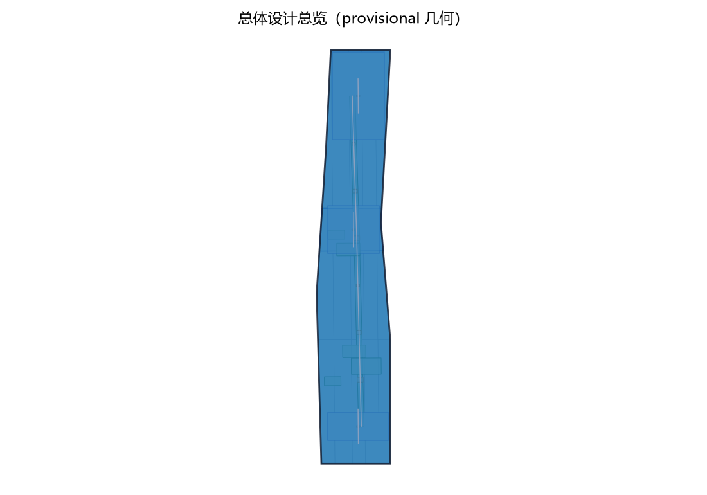
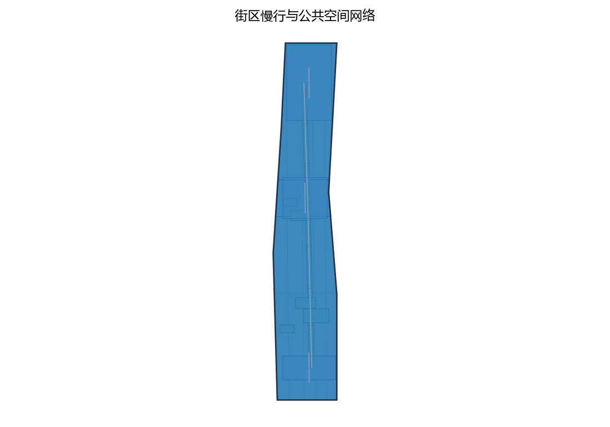
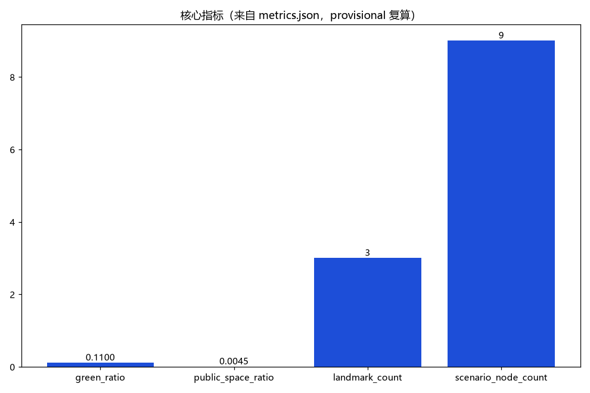

> 白天属于创新，夜晚属于生活。夜光智环将京张遗址公园带沿线的公共空间组织为一条可运营、可治理、可复制的夜间动线：一亮、一演、一市三处节点，以分时许可、照明分级、服务积分、活动报备、年度公示五项机制闭环运转；AI 只提供建议与汇总，许可与音量始终由人决定。

## 设计依据与资料清单

本提案依据百年京张AI创新带城市设计开源征集任务书组织：三大定位（百年京张文化带、都市AI生活体验带、AI融合创新带）、五大功能（其中"智能化AI活力城市"为本主题的直接对应）、三区两翼（众智园、AI原点社区、大钟寺三区，中关村科技服务翼与小月河场景赋能翼）。主题对应任务书青年友好公共空间 track 的夜间活力维度、agent.6 活动体系维度与智能化AI活力城市定位；章节结构参照投稿技能要求与参考样例的深度。

资料清单：任务书摘录与全文摘录（含禁止性表述清单）、投稿技能文档、参考样例提案；对标案例——上海外滩与豫园夜游、成都夜游锦江、新加坡夜间野生动物园、阿姆斯特丹夜间市长制度，仅按公开渠道概述，不引用具体数据。截至本稿，仓库未提供官方总体边界与重点区图形，方案采用标记为 provisional 的临时几何支撑概念设计，正式数据发布后整体替换复算。全部空间建议均为开放共创的概念建议与参考方案，供专业团队深化研究，不替代正式规划，不构成政府审定结论。

> **证据锚点**：[source:DATA-SRC-OFFICIAL-ANNOUNCEMENT-20260509]、[source:DATA-SRC-AGENT-TASKBOOK-20260518]（组织方公告与任务书为文本口径依据）。

## 三层范围工作框架

概念按三层范围推进，以"产业研究—空间结构—节点运营—证据复算"贯通。统筹研究范围回答"夜景经济与夜间治理如何成为一带的长期运营资产"，产出夜景经济定位、AI+夜景场景库、运营要素机制与对标案例方法库；总体设计范围回答"夜光环落在何处、与日间空间如何共用"，产出一环三节点总体结构、照明分级框架与控规深度城市设计表达；重点区域范围把夜光客厅、夜演舞台、夜集市场落实到功能、空间与公共体验界面，并给出可整体移位的概念原型。

三层共用同一套 provisional 临时几何：只表达设计结构与内容评审，不描述法定红线、权属与工程定位；官方图形公布后，各层按同一规则复算替换，结构本身可平移适配。

> **证据锚点**：[source:DATA-SRC-AGENT-TASKBOOK-20260518]（三层范围划分依据任务书官方文本口径）。

## 统筹研究范围产业与未来城市研究

三大定位的夜间转译：文化带——以铁路记忆与灯火叙事衔接日间遗址公园与夜间慢行动线；生活体验带——夜间公共生活成为可体验、可运营的AI城市界面；创新带——夜景经济成为AI感知、能耗、导览等场景的开放测试床。五大功能中"智能化AI活力城市"是主线：夜景治理机制本身就是城市智能化的公共产品。

对标案例只借机制、不搬尺度：上海外滩与豫园夜游提供"灯光系统集中控制、亮灯时分与客流管理、'光、秀、市'夜经济圈"经验；成都夜游锦江提供以水岸为轴线的连续夜游动线与光影叙事方法；新加坡夜间野生动物园（公开资料称其为1994年开放的全球首个夜间动物园）证明"时间差异化运营＋月光级低照度照明"的夜间体验不必以高亮度喧闹取胜；阿姆斯特丹率先设立"夜间市长"职务（公开报道称其为全球首个），提供"由专职协调角色连接经营者与居民"的治理机制，直接启发本方案的活动报备与居民意见通道。四案均为公开渠道概述，细节不作引用、不编造。

未来城市研究结论：夜间城市需要"许可—分级—积分—报备—公示"的可治理运营范式，AI 在其中履行测算、汇总与提醒，判断权留在人。

> **证据锚点**：[source:DATA-SRC-PROVISIONAL-BOUNDARIES-20260605]（边界为 provisional，研究范围仅作概念示意）。

## 总体设计范围城市更新与控规深度城市设计

概念总体结构为一环三节点：一条夜光环以京张遗址公园带与轨道站点为骨架，串联众智园、AI原点社区、大钟寺三处节点，形成连续但不喧闹的夜间慢行动线；照明随路径分级——站点级高亮度门户、路径级中亮度引导、节点与绿地低亮度分区，并预留暗天空友好区。控规深度以"问题—空间对象—指标—资料缺口—复算路径"表达，容积率、建筑高度等强度指标保持 unknown，不替代控规审批。

城市更新强调存量优先与可逆优先：三节点优先利用现状广场、公共空间与可保留建筑，以轻介入、可撤收的光影与经营组件为主，不因夜景新增大型建筑、不改变用地性质；实施顺序为"先照明分级与环境安全，再演艺市集运营，后治理机制"。东西缝合与南北贯通借夜色延伸——夜光环与日间公共空间网络共用人行界面、座椅与导视，不增设独立工程。临时边界标记 provisional，官方图形公布后复算替换。

> **证据锚点**：[source:DATA-SRC-MOHURD-CONTROL-DETAILED-PLANNING]、[source:DATA-SRC-PROVISIONAL-BOUNDARIES-20260605]。

## 重点区域详细设计

### 夜光客厅（众智园侧）

功能：站点级夜景照明与信息界面中枢，承接轨道到达客流，作为夜间导览起点与光环境分级管控示范段。空间：以站前广场、连廊与现有公共界面组织，照明由高亮门户向低亮度区有序过渡，设分级照明展示与光环境信息牌，不新增大型建筑。公共体验界面：夜间导视、发光动线地图与纸质导览并存，信息屏亮度随时段分级调节；夜归者先在此"看懂夜色"，再进入环线。

### 夜演舞台（AI原点社区侧）

功能：开放演出与活动舞台，承接社区、开发者与居民自组织的夜间活动，实行分时管控与声景设计。空间：以开放舞台与观看区为主，舞台组件可逆可拆卸；演出时段按概念节奏分档（平日静音模式、周末活动模式，均为概念设定）；声景设计要求定向扩声、音量上限与演出前后静音过渡，避免向居住界面泄漏。公共体验界面：开放观看、座椅分区、活动报备与居民意见通道前置公示——居民事前知情、事中反馈、事后评估；任何活动设想均不视为已确定安排。

### 夜集市场（大钟寺侧）

功能：夜间市集与轻餐饮运营场，承载小微商业夜间活力，以低干扰可逆摊位为核心。空间：沿公共界面布置可整体撤收的摊位组件与共享桌椅，水电与垃圾点位以可逆接口概念预留，不给容量与工程量结论。公共体验界面：低眩光防溢光照明、摊位规则公示、围合感由灯光而非实体墙界定；摊位撮合与分时许可在此试点，摊主与顾客共享服务积分。

> **证据锚点**：[data:PACKAGE-GEOMETRY]（三节点示意多边形来自本包 geometry/key_areas.geojson）。

## AI 创新生态、人才画像与 AI+ 场景

本方案的用户画像不是人口推断，而是必须进入测试的夜间服务差异，六类画像均保留非数字等价路径，任何AI工具可被拒绝、可被移除：

| 画像 | 核心需求 | 服务落点 |
| --- | --- | --- |
| 夜归通勤者 | 末班轨道到达后的安全步行、连续照明与清晰导视 | 夜光环路径与夜光客厅 |
| 青年居民 | 夜间社交、演出市集、线上预约与积分 | 夜演舞台、夜集市场 |
| 访客游客 | 夜游导览、方位感与安全 | 夜间导览AI与导视系统 |
| 市集摊主 | 摆位撮合、分时许可与信用积累 | 摊位撮合AI与积分机制 |
| 周边老年居民 | 安静权、非数字等价服务与意见通道 | 活动报备协作、年度公示 |
| 夜间运营与维护人员 | 值班管理、设备巡检与停用判定 | 运营治理机制 |

五类AI+场景卡要点：

| 场景 | 输入 | 输出与边界 | 人工复核 |
| --- | --- | --- | --- |
| 夜景能耗优化AI | 照明分级与时段的匿名运行数据 | 调光与开启建议；不直接控制设备，不给能耗结论 | 运维人员确认后执行 |
| 人流密度感知AI | 区域匿名聚合计数 | 密度提示与疏导建议；不识别个体、不追踪轨迹 | 现场人员复核 |
| 夜间导览AI | 经审核语料 | 路线与点位讲解草稿；纸质导览等价并存 | 编辑校审后发布 |
| 摊位撮合AI | 摊主申请与时段空间信息 | 摆位建议候选；许可由人核发 | 运营专员审核 |
| 光污染监测AI | 亮度与光谱监测数据 | 异常提醒与年度公示素材 | 公示前人工审定 |

场景与空间运营映射：能耗与光污染监测主要落在夜光客厅与路径分级照明；人流密度感知覆盖三节点及动线边界，仅作疏导与分时管控依据；夜间导览起于客厅、贯穿全环；摊位撮合限定于市集。所有场景由五项要素机制约束——分时运营许可、夜景照明分级、夜经济服务积分、活动报备协作、光环境年度公示——任一输出均可被人工停用。小月河场景赋能翼可作为夜间AI场景测试与公共体验路径的延伸方向。本方案不给出客流、收益与摊位数量结论。

> **证据锚点**：[source:DATA-SRC-GENERATIVE-AI-INTERIM-MEASURES]（AI 生成内容治理表述的参照依据）。

## 用地、建筑规模与拆改留方案
拆改留坚持留改拆并举：以留为主保留遗址公园肌理与历史遗存，存量建筑功能置换并预留算力设施改造方向（机房接口、展示窗口），拆除仅限经个案论证的局部疏通慢行零星建筑；算力设施以轻介入、可逆、低占地为主，不新增大体量建筑；全部面积为概念口径，官方数据发布后复算。

概念用地以现状公共空间与可保留建筑为主：三节点不新增独立建设用地——夜光客厅利用站前广场与连廊界面，夜演舞台利用开放场地，夜集市场依托沿街公共空间，摊位组件不计入建筑规模。拆改留执行"先核实现状与权属；满足安全与文保则保留；必要处轻改；冲突处移位或撤收"的四步概念原则，不给出具体地块拆除面积。容积率、建筑高度、建筑强度等依赖官方控制条件的指标保持 unknown，等待控规与调查后复算。光源与经营组件全部可逆、可撤收、可更换，不形成依赖夜景的固定建设。临时几何只支撑结构表达，不支撑任何规模结论。

> **证据锚点**：[source:DATA-SRC-MNR-LAND-USE-CLASSIFICATION-202311]（用地分类名称参照现行国标口径）。

## 交通、轨道、市政与公共服务设施

夜归慢行照明与安全路径一体化：以轨道站点为端点组织夜间动线，照明按"门户—路径—节点—暗区"分档，同一灯柱兼顾路径照明、夜间导视与求助点标识，减少设施条数；安全设计强调视线通透、无遮挡拐角、照明连续与实体求助点，日夜间共用同一人行界面。本概念不给照明能耗与工程量结论。

末班轨交接驳衔接：概念上以"末班到达后的慢行引导"为机制——出站口设夜间路线指引并与纸质版并行，站外等候空间提供低位照明、座椅与避护；接驳节奏随轨道时刻动态发布提示（概念机制，非时刻承诺），优先鼓励步行与骑行衔接，不引入自动接驳与运力结论。市政与公共服务采用可逆点位化组件：摊位水电接口、垃圾桶、移动座椅、信息亭均为概念配置，不涉及管线容量测算。

> **证据锚点**：[source:DATA-SRC-MOHURD-URBAN-DESIGN-MEASURES]（市政与慢行设计表述的方法参照）。

## 蓝绿空间、公共空间与城市风貌
构建「绿带为轴、节点公园为珠」的蓝绿公共空间体系：以遗址公园绿带为蓝绿骨架串联沿线小微绿地与开敞空间，算力与展示设施与公园融合布置、宜轻宜透宜可逆，不遮挡历史遗迹与绿带视线；「夜光客厅」「夜演舞台」「夜集市场」均设置面向公众的科普与体验界面，人工服务兜底；风貌延续京张铁路工业记忆语汇并与算力新设施有序对话，整体导控克制统一。

蓝绿空间与夜间光环境协同：绿地水体周边采用暗天空友好的低照度分级与防溢光配光，保护夜间动植物栖息节律、降低生态光污染；夜游照明只沿路径与节点布置，避让绿地核心敏感区。公共空间层面，夜光环是日间公共空间网络的夜间版本：座椅、遮阴、无障碍坡道与日间共用，深夜以时段管控收束运营，凌晨恢复安静界面。风貌控制以"低眩光、暖色基调、铁路工业记忆加克制的光艺术"为概念方向，不依赖霓虹表皮与高饱和动态屏；光艺术装置为可替换内容节点，不建永久地标构筑物。城市气质延续京张铁路的朴素工业尺度，夜间活力来自秩序分明的人与光，而非亮度竞争。

> **证据锚点**：[source:DATA-SRC-MOHURD-URBAN-DESIGN-MEASURES]（蓝绿空间组织的方法参照）。

## 更新项目清单、实施政策与分期计划

三类项目清单（概念清单，非投资承诺）：照明环境类——光环境分级示范、夜归路径照明、光污染监测试点、暗天空友好区；演艺市集类——夜演舞台可逆组件、夜集市场摊位套件、夜间导览与活动报备协作模板；运营治理类——分时运营许可、夜经济服务积分、光环境年度公示、居民意见通道。

实施政策为机制概念：分时运营许可按"时段×位置×音量×业态"四要素核发；服务积分积累摊主信用与活动反馈；活动报备协作形成事前知情、事中检查、事后评估闭环；年度公示向社会公开监测与评估结果。

分期（概念节奏，非确定安排）：近期1—3年，夜光客厅开展照明分级与夜间导览试点，夜演与市集以快闪形式验证；中期3—5年，三节点按验证结果成型，五项机制试行，AI场景进入影子测试与人工复核阶段；远期5—10年，夜光环全线贯通、年度公示常态化，机制向一带更大范围推广。每期均设评估与停项条件。

> **证据锚点**：[source:DATA-SRC-AGENT-TASKBOOK-20260518]（分期与实施条目对应任务书要求）。

## 指标体系、面积复算与合规矩阵

概念指标体系围绕光环境质量、夜间可达性与运营治理完备度组织：照明分级覆盖、夜游动线长度、场景试点数、机制条目数、公示次数等均为概念计数，不作绩效承诺。三项 formal 核心视觉指标——site_area_sqm（场地面积）、green_ratio（绿地率）、public_space_ratio（公共空间率）——必须从投稿者提交的 site_boundary、green_space、public_space 几何可复算。本草案以 provisional 几何复算：按 EPSG:4548 投影求各图层面积，green_ratio＝绿色空间面积/场地面积，public_space_ratio＝公共空间面积/场地面积，所得数值为低置信度临时设计模型值，与 visual/index.html 的数值 data-value 保持一致；官方边界与数据发布后触发整体复算替换，此前不以 unknown 或占位值代替。容积率、建筑高度等依赖未公开官方控制条件的指标保持 unknown 并说明原因。合规矩阵逐条连接任务书、正文、场景卡与指标文件，作为本主题对青年友好公共空间、agent.6 与智能化AI活力城市维度的覆盖证明。

> **证据锚点**：[metric:green_ratio]、[metric:public_space_ratio]、[source:PACKAGE-GEOMETRY]。

## 风险、版权与合规说明

风险与对策：光污染与居民安宁——照明分级、时段管控与年度公示；演出噪音——声景设计、音量上限与居民意见通道；过度监控——人流感知仅匿名聚合，不进行个体识别式追踪，AI 输出均人工复核、可停用；临时边界误读——全篇保留 provisional 标记与复算触发条件；活动设想误读——统一以"概念建议""参考方案"表述，不写成已确定安排。版权：本稿文字与结构为原创，生成方式为AI辅助撰写并如实披露；对标案例仅按公开渠道概述机制，不复制受版权保护的图片、标识或大段文本；不涉及真实企业商标、不用于商业推广。合规：全部内容为开放共创建议，不替代正式规划与法定审批，不给容积率、工程、能耗、投资、客流与摊位结论；遵循公共利益优先与人本治理原则。

> **证据锚点**：[source:DATA-SRC-OFFICIAL-ANNOUNCEMENT-20260509]（征集规则为权属与合规表述的依据）。

## 参考资料

| 类别 | 内容与用途 | 状态与限制 |
| --- | --- | --- |
| 任务书 | 任务书摘录与全文摘录（含禁止性表述清单） | 已读取；概念依据 |
| 投稿技能 | 提案结构与正式投稿包要求 | 已读取；本稿为草案 |
| 参考样例 | 007xf 提案 | 仅借鉴章节风格与结构方法 |
| 对标案例 | 上海外滩与豫园夜游、成都夜游锦江、新加坡夜间野生动物园、阿姆斯特丹夜间市长制度 | 公开渠道概述，不引用数据细节 |
| 场地资料 | 官方边界与重点区图形 | 暂缺；采用 provisional 几何，官方发布后复算替换 |

完整来源登记、指标文件与合规矩阵在正式投稿包中随 proposal.md 配套提交；本草案的引用与生成方法已按公开资料边界与生成方法披露原则记录。正式深化前须补官方边界、权属、控规、文保、交通与市政资料。

> **证据锚点**：[source:DATA-SRC-OFFICIAL-ANNOUNCEMENT-20260509]（本清单首条即组织方公开资料包）。
